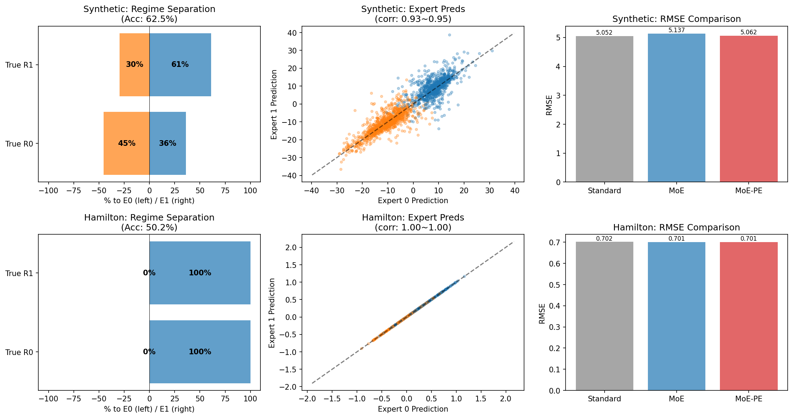

LightGBM-MoE
============

**A regime-switching / Mixture-of-Experts extension of LightGBM.**

[English](#english) | [Japanese (日本語)](#japanese)

---

<a name="english"></a>
## English

### Overview

LightGBM-MoE is a fork of [Microsoft LightGBM](https://github.com/microsoft/LightGBM) that implements **Mixture-of-Experts (MoE) / Regime-Switching GBDT** natively in C++.

```
ŷ(x) = Σₖ gₖ(x) · fₖ(x)
```

Where:
- `fₖ(x)`: Expert k's prediction (K regression GBDTs)
- `gₖ(x)`: Gate's routing probability for expert k (softmax output)
- `K`: Number of experts (hyperparameter)

### Requirements

- **Python**: 3.10 or later
- **OS**: Linux (x86_64, aarch64), macOS (Intel, Apple Silicon)
- **Dependencies**: numpy, scipy (automatically installed)

### Installation

**Recommended: Install directly from GitHub** (builds from source, requires CMake):

```bash
pip install git+https://github.com/kyo219/LightGBM-MoE.git
```

**Alternative: Build manually from source**:

```bash
git clone https://github.com/kyo219/LightGBM-MoE.git
cd LightGBM-MoE
pip install ./python-package
```

**For development (editable install)**:

```bash
git clone https://github.com/kyo219/LightGBM-MoE.git
cd LightGBM-MoE/python-package
pip install -e .
```

> **Note**: Building from source requires CMake (3.16+) and a C++ compiler (GCC, Clang, or Apple Clang).

### Quick Start

```python
import lightgbm_moe as lgb

params = {
    'boosting': 'mixture',           # Enable MoE mode
    'mixture_num_experts': 2,        # Number of experts
    'mixture_r_smoothing': 'ema',    # Smoothing method
    'mixture_smoothing_lambda': 0.5, # Smoothing strength
    'objective': 'regression',
}

train_data = lgb.Dataset(X_train, label=y_train)
model = lgb.train(params, train_data, num_boost_round=100)

# Predictions
y_pred = model.predict(X_test)                     # Weighted mixture
regime = model.predict_regime(X_test)              # Regime index (argmax)
regime_proba = model.predict_regime_proba(X_test)  # Gate probabilities (N, K)
expert_preds = model.predict_expert_pred(X_test)   # Expert predictions (N, K)
```

### Training with Validation & Early Stopping

```python
import lightgbm_moe as lgb

params = {
    'boosting': 'mixture',
    'mixture_num_experts': 2,
    'objective': 'regression',
    'metric': 'rmse',
    'verbose': 1,
}

train_data = lgb.Dataset(X_train, label=y_train)
valid_data = lgb.Dataset(X_valid, label=y_valid, reference=train_data)

model = lgb.train(
    params,
    train_data,
    num_boost_round=100,
    valid_sets=[valid_data],
    valid_names=['valid'],
    callbacks=[lgb.early_stopping(stopping_rounds=10)]
)

print(f"Best iteration: {model.best_iteration}")
```

---

## API Reference

### MoE Parameters

| Parameter | Type | Default | Range | Description |
|-----------|------|---------|-------|-------------|
| `boosting` | string | `"gbdt"` | `"gbdt"`, `"mixture"` | Set to `"mixture"` to enable MoE mode |
| `mixture_num_experts` | int | 4 | 2-10 | Number of expert models (K). Each expert is a separate GBDT that specializes in different data regimes. |
| `mixture_e_step_alpha` | float | 1.0 | 0.1-5.0 | Weight for loss term in E-step responsibility update. Higher = more weight on prediction accuracy vs gate probability. |
| `mixture_e_step_mode` | string | `"em"` | `"em"`, `"loss_only"` | E-step mode. `"em"`: use gate probability + loss (standard EM). `"loss_only"`: use only loss (simpler, assigns to best-fitting expert). |
| `mixture_warmup_iters` | int | 10 | 0-50 | Number of warmup iterations. During warmup, responsibilities are uniform (1/K) to allow experts to learn before specialization. |
| `mixture_balance_factor` | int | 10 | 2-20 | Load balancing aggressiveness. Minimum expert usage = 1/(factor × K). Lower = more aggressive balancing. Recommended: 5-7. |
| `mixture_r_smoothing` | string | `"none"` | `"none"`, `"ema"`, `"markov"`, `"momentum"` | Responsibility smoothing method for time-series stability. |
| `mixture_smoothing_lambda` | float | 0.0 | 0.0-1.0 | Smoothing strength. Only used when `mixture_r_smoothing` is not `"none"`. Higher = more smoothing (slower regime transitions). |

### Early Stopping

MoE supports validation-based early stopping, useful for hyperparameter tuning with Optuna.

| Parameter | Type | Default | Description |
|-----------|------|---------|-------------|
| `early_stopping_round` | int | 0 | Stop training if validation metric doesn't improve for N rounds. Set via `lgb.early_stopping()` callback. |
| `first_metric_only` | bool | False | Only use the first metric for early stopping (when multiple metrics specified). |

**Usage with callbacks:**

```python
model = lgb.train(
    params,
    train_data,
    valid_sets=[valid_data],
    callbacks=[
        lgb.early_stopping(stopping_rounds=10),  # Stop after 10 rounds without improvement
        lgb.log_evaluation(period=10),           # Log every 10 iterations
    ]
)
```

**Usage with Optuna:**

```python
def objective(trial):
    params = {
        'boosting': 'mixture',
        'mixture_num_experts': trial.suggest_int('num_experts', 2, 4),
        'objective': 'regression',
        'metric': 'rmse',
        'verbose': -1,
    }

    train_data = lgb.Dataset(X_train, label=y_train)
    valid_data = lgb.Dataset(X_valid, label=y_valid, reference=train_data)

    model = lgb.train(
        params,
        train_data,
        num_boost_round=500,
        valid_sets=[valid_data],
        callbacks=[lgb.early_stopping(stopping_rounds=20)]
    )

    return model.best_score['valid_0']['rmse']
```

### Per-Expert Hyperparameters (Advanced)

These parameters allow each expert to have different tree **structural** configurations. If not specified, all experts share the same hyperparameters.

| Parameter | Type | Default | Description |
|-----------|------|---------|-------------|
| `mixture_expert_max_depths` | string | `""` | Comma-separated max_depth for each expert. Must have exactly K values if specified. |
| `mixture_expert_num_leaves` | string | `""` | Comma-separated num_leaves for each expert. Must have exactly K values if specified. |
| `mixture_expert_min_data_in_leaf` | string | `""` | Comma-separated min_data_in_leaf for each expert. Controls tree granularity. |
| `mixture_expert_min_gain_to_split` | string | `""` | Comma-separated min_gain_to_split for each expert. Controls split aggressiveness. |

#### Same Hyperparameters for All Experts (Default)

When per-expert parameters are not specified, all experts share the base hyperparameters:

```python
params = {
    'boosting': 'mixture',
    'mixture_num_experts': 3,
    'max_depth': 5,           # All 3 experts use max_depth=5
    'num_leaves': 31,         # All 3 experts use num_leaves=31
    'min_data_in_leaf': 20,   # All 3 experts use min_data_in_leaf=20
}
```

#### Different Hyperparameters per Expert

Specify comma-separated values (one per expert) to customize each expert:

```python
params = {
    'boosting': 'mixture',
    'mixture_num_experts': 3,
    # Expert 0: coarse (high min_data), Expert 1: medium, Expert 2: fine (low min_data)
    'mixture_expert_max_depths': '3,5,7',
    'mixture_expert_num_leaves': '8,16,32',
    'mixture_expert_min_data_in_leaf': '50,20,5',      # coarse → fine
    'mixture_expert_min_gain_to_split': '0.1,0.01,0.001',  # conservative → aggressive
}
```

This allows experts to have different structural capacities:
- **Coarse expert** (high min_data_in_leaf): captures broad patterns, less prone to overfitting
- **Fine expert** (low min_data_in_leaf): captures detailed patterns, good for complex regimes

#### Training Behavior with Per-Expert Hyperparameters

**EM iteration structure**: Each boosting iteration adds ONE tree to each expert:

```
TrainOneIter() {
  1. Forward()      → Compute predictions from all experts
  2. EStep()        → Update responsibilities
  3. MStepExperts() → Each expert adds 1 tree (sequential)
  4. MStepGate()    → Gate adds 1 tree
}
```

**What changes / doesn't change with different hyperparameters:**

| Aspect | Deep Expert | Shallow Expert |
|--------|-------------|----------------|
| EM iterations | Same | Same |
| Number of trees | Same | Same |
| Time per tree | Longer | Shorter |
| Expressiveness per tree | Higher | Lower |

**Key insight**: `num_boost_round=100` means each expert builds 100 trees, regardless of depth settings. The per-expert hyperparameters control **expressiveness per tree**, not the number of trees.

```
num_boost_round = 100:
  Expert 0 (shallow): 100 shallow trees → simple patterns
  Expert 1 (deep):    100 deep trees    → complex patterns
                ↓
        Same 100 EM iterations
```

**Training time**: Currently experts are trained sequentially in each iteration, so the deepest/most complex expert becomes the bottleneck. Total time ≈ sum of all expert tree build times per iteration.

#### Initialization and Symmetry Breaking

By default, MoE uses **uniform initialization**: all samples start with equal responsibility `1/K` for all experts.

```
Initial state (K=2):
  Sample 0: r = [0.5, 0.5]  (equal for both experts)
  Sample 1: r = [0.5, 0.5]
  ...
```

**Symmetry breaking** is achieved through per-expert random seeds:
```cpp
expert_configs_[k]->seed = config_->seed + k + 1;  // Different seed per expert
```

This means experts naturally differentiate as training progresses, without relying on label-based initialization (which could leak target information).

Available initialization modes (`mixture_init` parameter):
| Mode | Description |
|------|-------------|
| `uniform` (default) | Equal `1/K` responsibility, symmetry broken by per-expert seeds |
| `random` | Randomly assign each sample to one expert |
| `quantile` | Assign by label quantiles (y-dependent, use with caution) |

#### Optuna Optimization Examples

**Standard MoE** (shared hyperparameters across experts):

```python
import optuna
import lightgbm_moe as lgb
from sklearn.model_selection import cross_val_score

def objective(trial):
    params = {
        'boosting': 'mixture',
        'objective': 'regression',
        'verbose': -1,
        # Tree structure (shared by all experts)
        'num_leaves': trial.suggest_int('num_leaves', 8, 128),
        'max_depth': trial.suggest_int('max_depth', 3, 12),
        'min_data_in_leaf': trial.suggest_int('min_data_in_leaf', 5, 100),
        'learning_rate': trial.suggest_float('learning_rate', 0.01, 0.3, log=True),
        # MoE specific
        'mixture_num_experts': trial.suggest_int('mixture_num_experts', 2, 4),
        'mixture_e_step_alpha': trial.suggest_float('mixture_e_step_alpha', 0.1, 2.0),
        'mixture_warmup_iters': trial.suggest_int('mixture_warmup_iters', 5, 30),
        'mixture_balance_factor': trial.suggest_int('mixture_balance_factor', 2, 10),
        # Smoothing (optional, for time-series)
        'mixture_r_smoothing': trial.suggest_categorical(
            'mixture_r_smoothing', ['none', 'ema', 'markov']
        ),
    }
    if params['mixture_r_smoothing'] != 'none':
        params['mixture_smoothing_lambda'] = trial.suggest_float(
            'mixture_smoothing_lambda', 0.1, 0.9
        )

    # Train and evaluate
    train_data = lgb.Dataset(X_train, label=y_train)
    model = lgb.train(params, train_data, num_boost_round=100)
    pred = model.predict(X_val)
    return mean_squared_error(y_val, pred)

study = optuna.create_study(direction='minimize')
study.optimize(objective, n_trials=100)
```

**Per-Expert MoE** (different tree structure per expert):

```python
def objective_per_expert(trial):
    num_experts = trial.suggest_int('mixture_num_experts', 2, 4)

    # Per-expert tree structure
    max_depths = [trial.suggest_int(f'max_depth_{k}', 3, 12) for k in range(num_experts)]
    num_leaves = [trial.suggest_int(f'num_leaves_{k}', 8, 128) for k in range(num_experts)]
    min_data = [trial.suggest_int(f'min_data_{k}', 5, 100) for k in range(num_experts)]

    params = {
        'boosting': 'mixture',
        'objective': 'regression',
        'verbose': -1,
        'learning_rate': trial.suggest_float('learning_rate', 0.01, 0.3, log=True),
        # MoE specific
        'mixture_num_experts': num_experts,
        'mixture_e_step_alpha': trial.suggest_float('mixture_e_step_alpha', 0.1, 2.0),
        'mixture_warmup_iters': trial.suggest_int('mixture_warmup_iters', 5, 30),
        'mixture_balance_factor': trial.suggest_int('mixture_balance_factor', 2, 10),
        # Per-expert structure (comma-separated)
        'mixture_expert_max_depths': ','.join(map(str, max_depths)),
        'mixture_expert_num_leaves': ','.join(map(str, num_leaves)),
        'mixture_expert_min_data_in_leaf': ','.join(map(str, min_data)),
    }

    # Train and evaluate
    train_data = lgb.Dataset(X_train, label=y_train)
    model = lgb.train(params, train_data, num_boost_round=100)
    pred = model.predict(X_val)
    return mean_squared_error(y_val, pred)

# Note: Per-expert adds K×3 more hyperparameters, so needs more trials (e.g., 200+)
study = optuna.create_study(direction='minimize')
study.optimize(objective_per_expert, n_trials=200)
```

**Tip**: Start with standard MoE. Per-expert requires more trials to converge due to larger search space.

### Smoothing Methods

| Method | Formula | Use Case |
|--------|---------|----------|
| `none` | `r_t = r_t` (no change) | i.i.d. data, regime determinable from X |
| `ema` | `r_t = λ·r_{t-1} + (1-λ)·r_t` | Time-series with persistent regimes |
| `markov` | `r_t ∝ r_t · (A·r_{t-1})` | Regime transitions follow Markov chain |
| `momentum` | `r_t = λ·r_{t-1} + (1-λ)·r_t + β·Δr` | Trending regime changes |

### Prediction APIs

| Method | Output Shape | Description |
|--------|--------------|-------------|
| `predict(X)` | `(N,)` | Final prediction: weighted mixture of expert predictions |
| `predict_regime(X)` | `(N,)` int | Most likely regime index: `argmax_k(gate_proba)` |
| `predict_regime_proba(X)` | `(N, K)` | Gate probabilities for each expert (sums to 1) |
| `predict_expert_pred(X)` | `(N, K)` | Individual prediction from each expert |

---

## Benchmark

**Setup**: 200 Optuna trials, 5-fold time-series CV, early stopping (50 rounds).

### RMSE Comparison

| Dataset | Standard | MoE | MoE-PE | Best Improvement |
|---------|----------|-----|--------|------------------|
| Synthetic | 5.1032 | **4.3928** | 5.1410 | +13.9% |
| Hamilton | 0.7192 | **0.7127** | 0.7173 | +0.9% |
| VIX | 0.0117 | **0.0116** | 0.0116 | +0.5% |

### Expert Differentiation (Regime Separation)

| Dataset | MoE Corr | MoE-PE Corr | MoE Regime Acc | MoE-PE Regime Acc |
|---------|----------|-------------|----------------|-------------------|
| Synthetic | -0.28 | 0.98 | 96.2% | 58.6% |
| Hamilton | 0.91 | 0.95 | 50.8% | 50.2% |
| VIX | 0.94 | 0.99 | 52.0% | 52.4% |

- **Expert Corr**: Correlation between expert predictions (lower = more differentiated, negative = opposite predictions)
- **Regime Acc**: Classification accuracy of predicted regime vs true regime

**Key Findings**:
- MoE (shared structure) achieves best RMSE and expert differentiation
- On Synthetic data: Expert correlation of **-0.28** (opposite predictions!) with **96.2%** regime accuracy
- MoE-PE selects different tree structures per expert, but shared-structure MoE learns better Gate separation
- Latent regime data (Hamilton, VIX) shows limited improvement as expected

### Selected Hyperparameters (Synthetic Dataset)

**MoE (Shared Tree Structure):**
- num_experts: 2, max_depth: 6, num_leaves: 10, learning_rate: 0.079

**MoE-PerExpert (Per-Expert Tree Structure):**

| Expert | max_depth | num_leaves | min_data_in_leaf |
|--------|-----------|------------|------------------|
| E0 | 7 | 100 | 20 |
| E1 | 9 | 103 | 5 |
| E2 | 5 | 96 | 94 |

### Run Benchmark

```bash
# Full benchmark (Standard vs MoE vs MoE-PE, 100 trials default)
python examples/benchmark.py

# More trials for better optimization
python examples/benchmark.py --trials 200

# Quick test
python examples/benchmark.py --trials 10

# Output to markdown
python examples/benchmark.py --trials 200 --output-md BENCHMARK.md
```

### Visualization



- **Left**: Regime separation (% samples routed to each expert by true regime)
- **Center**: Expert prediction scatter (color = true regime)
- **Right**: RMSE comparison across methods

---

## When to Use MoE

**MoE is effective when:**
- Regime is determinable from features (X)
- Different regimes follow fundamentally different functions
- You have sufficient data for each regime

**MoE is NOT effective when:**
- Regime is latent (hidden Markov, unobserved states)
- Standard GBDT already captures the pattern
- Data has no clear regime structure

---

## Technical Deep Dive

### 1. How MoE is Achieved: Architecture

The MoE model consists of **K Expert GBDTs** and **1 Gate GBDT**:

```
                    ┌─────────────┐
                    │   Input X   │
                    └──────┬──────┘
           ┌───────────────┼───────────────┐
           ▼               ▼               ▼
    ┌────────────┐  ┌────────────┐  ┌────────────┐
    │  Expert 0  │  │  Expert 1  │  │    Gate    │
    │   (GBDT)   │  │   (GBDT)   │  │   (GBDT)   │
    │ Regression │  │ Regression │  │ Multiclass │
    └─────┬──────┘  └─────┬──────┘  └─────┬──────┘
          │               │               │
          │  f₀(x)        │  f₁(x)        │ logits
          ▼               ▼               ▼
    ┌─────────────────────────────────────────────┐
    │           Weighted Combination              │
    │  ŷ = Σₖ softmax(gate_logits)ₖ · fₖ(x)      │
    └─────────────────────────────────────────────┘
```

**Key implementation details** (`src/boosting/mixture_gbdt.cpp`):

| Component | Implementation | Lines |
|-----------|----------------|-------|
| Expert GBDTs | `std::vector<std::unique_ptr<GBDT>> experts_` | Same objective as mixture |
| Gate GBDT | `std::unique_ptr<GBDT> gate_` | Multiclass with K classes |
| Responsibilities | `std::vector<double> responsibilities_` | N × K soft assignments |
| Load Balancing | `std::vector<double> expert_bias_` | Prevents expert collapse |

### 2. Gate Learning Mechanism

The Gate is trained as a **K-class classification GBDT** using LightGBM's multiclass objective:

```cpp
// Gate config setup (mixture_gbdt.cpp:86-93)
gate_config_->objective = "multiclass";
gate_config_->num_class = num_experts_;
gate_config_->max_depth = config_->mixture_gate_max_depth;      // default: 3
gate_config_->num_leaves = config_->mixture_gate_num_leaves;    // default: 8
gate_config_->learning_rate = config_->mixture_gate_learning_rate;  // default: 0.1
```

**Training process** (M-Step for Gate, `MStepGate()` at line 526):

1. **Create pseudo-labels**: `z_i = argmax_k(r_ik)` (hard assignment from responsibilities)
2. **Compute gradients**: Softmax cross-entropy gradients
   ```cpp
   // For each sample i and class k:
   if (k == label) {
       grad[i,k] = p_k - 1.0;   // Gradient for correct class
   } else {
       grad[i,k] = p_k;         // Gradient for other classes
   }
   hess[i,k] = p_k * (1 - p_k); // Hessian: softmax derivative
   ```
3. **Update Gate**: `gate_->TrainOneIter(gate_grad, gate_hess)`

The Gate learns to predict **which Expert should handle each sample**, based on features X.

### 3. EM-Style Training Algorithm

Each iteration follows an **Expectation-Maximization (EM)** style update:

```
┌─────────────────────────────────────────────────────────────┐
│                    TrainOneIter()                           │
├─────────────────────────────────────────────────────────────┤
│ 1. Forward()     → Compute expert_pred[N,K], gate_proba[N,K]│
│ 2. EStep()       → Update responsibilities r[N,K]           │
│ 3. Smoothing()   → Apply EMA/Markov/Momentum (optional)     │
│ 4. MStepExperts()→ Train experts with weighted gradients    │
│ 5. MStepGate()   → Train gate with pseudo-labels            │
└─────────────────────────────────────────────────────────────┘
```

**E-Step** (line 350-383): Update responsibilities based on how well each expert fits each sample:

```cpp
// Score calculation depends on mixture_e_step_mode:

// Mode "em" (default): use gate probability + loss
s_ik = log(gate_proba[i,k] + ε) - α × loss(y_i, expert_pred[k,i])
//     ↑ Gate's belief          ↑ Expert's prediction quality

// Mode "loss_only": use only loss (simpler, more intuitive)
s_ik = -α × loss(y_i, expert_pred[k,i])
//     ↑ Simply: lower loss = higher score

// Convert scores to responsibilities via softmax:
r_ik = softmax(s_ik)  // Σₖ r_ik = 1
```

**When to use `loss_only`**: If you want the Expert with the lowest prediction error to always get the highest responsibility, regardless of what the Gate currently predicts. This avoids the "self-reinforcing loop" problem where the Gate's initial beliefs get locked in.

**M-Step for Experts** (line 481-523): Train each expert with responsibility-weighted gradients:

```cpp
// For expert k, gradient at sample i:
grad_k[i] = r_ik × ∂L(y_i, f_k(x_i)) / ∂f_k
//          ↑ Responsibility weight (soft assignment)

// High r_ik → Expert k learns more from sample i
// Low r_ik  → Expert k ignores sample i
```

**Why EM works**: Responsibilities `r_ik` act as soft cluster assignments. Each Expert specializes on samples where it has high responsibility. The Gate learns to route samples to the appropriate Expert.

### 4. Per-Expert Hyperparameters (Implemented)

Each Expert can have different tree **structural** configurations via per-expert hyperparameters:

**Implementation** (`src/boosting/mixture_gbdt.cpp`):

```cpp
// Each expert has its own config
std::vector<std::unique_ptr<Config>> expert_configs_;  // One per expert

// Per-expert structural parameters (comma-separated in config)
std::vector<int> mixture_expert_max_depths;           // e.g., "3,5,7"
std::vector<int> mixture_expert_num_leaves;           // e.g., "8,16,32"
std::vector<int> mixture_expert_min_data_in_leaf;     // e.g., "50,20,5"
std::vector<double> mixture_expert_min_gain_to_split; // e.g., "0.1,0.01,0.001"
```

**How it works**:

| Specification | Behavior |
|---------------|----------|
| Not specified | All experts use base structural hyperparameters |
| Comma-separated list | Each expert uses its corresponding value (must have exactly K values) |

**Example use cases**:

```python
# Use case 1: Coarse vs Fine experts
# Expert 0 captures broad patterns, Expert 1 captures detailed patterns
params = {
    'mixture_num_experts': 2,
    'mixture_expert_min_data_in_leaf': '50,5',    # coarse vs fine
    'mixture_expert_min_gain_to_split': '0.1,0.001',  # conservative vs aggressive
}

# Use case 2: Shallow vs Deep experts
# Different tree depths for different regime complexities
params = {
    'mixture_num_experts': 2,
    'mixture_expert_max_depths': '3,7',
    'mixture_expert_num_leaves': '8,64',
}
```

**Symmetry breaking**: Even with shared hyperparameters, experts differentiate through:
1. Per-expert random seeds (automatic, no config needed)
2. Uniform initialization with different initial predictions due to seeds

---

<a name="japanese"></a>
## Japanese (日本語)

### 概要

LightGBM-MoE は [Microsoft LightGBM](https://github.com/microsoft/LightGBM) のフォークで、**Mixture-of-Experts (MoE) / レジームスイッチング GBDT** をC++でネイティブ実装しています。

```
ŷ(x) = Σₖ gₖ(x) · fₖ(x)
```

### 動作環境

- **Python**: 3.10以上
- **OS**: Linux (x86_64, aarch64), macOS (Intel, Apple Silicon)
- **依存関係**: numpy, scipy（自動インストール）

### インストール

**推奨: GitHubから直接インストール**（ソースからビルド、CMake必須）:

```bash
pip install git+https://github.com/kyo219/LightGBM-MoE.git
```

**別方法: 手動ビルド**:

```bash
git clone https://github.com/kyo219/LightGBM-MoE.git
cd LightGBM-MoE
pip install ./python-package
```

**開発者向け（編集可能インストール）**:

```bash
git clone https://github.com/kyo219/LightGBM-MoE.git
cd LightGBM-MoE/python-package
pip install -e .
```

> **注意**: ソースからビルドするにはCMake（3.16以上）とC++コンパイラ（GCC、Clang、Apple Clang）が必要です。

### クイックスタート

```python
import lightgbm_moe as lgb

params = {
    'boosting': 'mixture',           # MoEモード有効化
    'mixture_num_experts': 2,        # エキスパート数
    'mixture_r_smoothing': 'ema',    # 平滑化手法
    'mixture_smoothing_lambda': 0.5, # 平滑化強度
    'objective': 'regression',
}

train_data = lgb.Dataset(X_train, label=y_train)
model = lgb.train(params, train_data, num_boost_round=100)

# 予測
y_pred = model.predict(X_test)                     # 重み付きミクスチャ
regime = model.predict_regime(X_test)              # レジームインデックス
regime_proba = model.predict_regime_proba(X_test)  # ゲート確率 (N, K)
expert_preds = model.predict_expert_pred(X_test)   # 各エキスパート予測 (N, K)
```

### バリデーション & Early Stopping

```python
import lightgbm_moe as lgb

params = {
    'boosting': 'mixture',
    'mixture_num_experts': 2,
    'objective': 'regression',
    'metric': 'rmse',
    'verbose': 1,
}

train_data = lgb.Dataset(X_train, label=y_train)
valid_data = lgb.Dataset(X_valid, label=y_valid, reference=train_data)

model = lgb.train(
    params,
    train_data,
    num_boost_round=100,
    valid_sets=[valid_data],
    valid_names=['valid'],
    callbacks=[lgb.early_stopping(stopping_rounds=10)]
)

print(f"Best iteration: {model.best_iteration}")
```

---

## API リファレンス

### MoE パラメータ

| パラメータ | 型 | デフォルト | 範囲 | 説明 |
|-----------|------|---------|-------|-------------|
| `boosting` | string | `"gbdt"` | `"gbdt"`, `"mixture"` | MoEモードを有効にするには `"mixture"` を指定 |
| `mixture_num_experts` | int | 4 | 2-10 | エキスパート数 (K)。各エキスパートは異なるデータレジームに特化する独立したGBDT。 |
| `mixture_e_step_alpha` | float | 1.0 | 0.1-5.0 | E-stepでの損失項の重み。高いほど予測精度を重視、低いほどゲート確率を重視。 |
| `mixture_e_step_mode` | string | `"em"` | `"em"`, `"loss_only"` | E-stepモード。`"em"`: ゲート確率+損失（標準EM）。`"loss_only"`: 損失のみ（シンプル、最も適合するExpertに割り当て）。 |
| `mixture_warmup_iters` | int | 10 | 0-50 | ウォームアップ回数。この期間中、責務は均等 (1/K) で、専門化前にエキスパートが学習できる。 |
| `mixture_balance_factor` | int | 10 | 2-20 | 負荷分散の強度。最小エキスパート使用率 = 1/(factor × K)。小さいほど積極的なバランシング。推奨: 5-7。 |
| `mixture_r_smoothing` | string | `"none"` | `"none"`, `"ema"`, `"markov"`, `"momentum"` | 時系列安定化のための責務平滑化手法。 |
| `mixture_smoothing_lambda` | float | 0.0 | 0.0-1.0 | 平滑化強度。`mixture_r_smoothing` が `"none"` 以外の場合のみ使用。高いほど平滑化が強い（レジーム遷移が遅い）。 |

### Early Stopping

MoEはバリデーションベースのearly stoppingをサポート。Optunaでのハイパーパラメータ最適化に便利です。

| パラメータ | 型 | デフォルト | 説明 |
|-----------|------|---------|-------------|
| `early_stopping_round` | int | 0 | N回連続でバリデーション指標が改善しない場合に学習を停止。`lgb.early_stopping()` コールバックで設定。 |
| `first_metric_only` | bool | False | 複数のmetricを指定した場合、最初のmetricのみでearly stoppingを判定。 |

**コールバックでの使用:**

```python
model = lgb.train(
    params,
    train_data,
    valid_sets=[valid_data],
    callbacks=[
        lgb.early_stopping(stopping_rounds=10),  # 10ラウンド改善なしで停止
        lgb.log_evaluation(period=10),           # 10イテレーションごとにログ
    ]
)
```

**Optunaでの使用:**

```python
def objective(trial):
    params = {
        'boosting': 'mixture',
        'mixture_num_experts': trial.suggest_int('num_experts', 2, 4),
        'objective': 'regression',
        'metric': 'rmse',
        'verbose': -1,
    }

    train_data = lgb.Dataset(X_train, label=y_train)
    valid_data = lgb.Dataset(X_valid, label=y_valid, reference=train_data)

    model = lgb.train(
        params,
        train_data,
        num_boost_round=500,
        valid_sets=[valid_data],
        callbacks=[lgb.early_stopping(stopping_rounds=20)]
    )

    return model.best_score['valid_0']['rmse']
```

### Expertごとのハイパーパラメータ（上級者向け）

各Expertに異なるツリー**構造**設定を持たせることができます。指定しない場合、全Expertは同じハイパーパラメータを共有します。

| パラメータ | 型 | デフォルト | 説明 |
|-----------|------|---------|-------------|
| `mixture_expert_max_depths` | string | `""` | カンマ区切りの各Expertのmax_depth。指定する場合はK個の値が必要。 |
| `mixture_expert_num_leaves` | string | `""` | カンマ区切りの各Expertのnum_leaves。指定する場合はK個の値が必要。 |
| `mixture_expert_min_data_in_leaf` | string | `""` | カンマ区切りの各Expertのmin_data_in_leaf。木の粒度を制御。 |
| `mixture_expert_min_gain_to_split` | string | `""` | カンマ区切りの各Expertのmin_gain_to_split。分割の積極性を制御。 |

#### 全Expertで同じハイパーパラメータ（デフォルト）

Expertごとのパラメータを指定しない場合、全Expertはベースのハイパーパラメータを共有します：

```python
params = {
    'boosting': 'mixture',
    'mixture_num_experts': 3,
    'max_depth': 5,           # 3つのExpert全てがmax_depth=5を使用
    'num_leaves': 31,         # 3つのExpert全てがnum_leaves=31を使用
    'min_data_in_leaf': 20,   # 3つのExpert全てがmin_data_in_leaf=20を使用
}
```

#### Expertごとに異なるハイパーパラメータ

カンマ区切りの値（Expertごとに1つ）を指定して各Expertをカスタマイズ：

```python
params = {
    'boosting': 'mixture',
    'mixture_num_experts': 3,
    # Expert 0: 粗い (高min_data), Expert 1: 中程度, Expert 2: 細かい (低min_data)
    'mixture_expert_max_depths': '3,5,7',
    'mixture_expert_num_leaves': '8,16,32',
    'mixture_expert_min_data_in_leaf': '50,20,5',      # 粗い → 細かい
    'mixture_expert_min_gain_to_split': '0.1,0.01,0.001',  # 保守的 → 積極的
}
```

これにより、異なる構造容量を持たせることができます：
- **粗いExpert** (高min_data_in_leaf): 大まかなパターンを捕捉、過学習しにくい
- **細かいExpert** (低min_data_in_leaf): 詳細なパターンを捕捉、複雑なレジームに適合

#### Expertごとのハイパラと学習の動作

**EMイテレーションの構造**: 各ブースティングイテレーションで、各Expertに1本ずつ木を追加：

```
TrainOneIter() {
  1. Forward()      → 全Expertの予測を計算
  2. EStep()        → 責務を更新
  3. MStepExperts() → 各Expertが1本ずつ木を追加（逐次実行）
  4. MStepGate()    → Gateが1本木を追加
}
```

**ハイパラで変わるもの / 変わらないもの:**

| 項目 | 深いExpert | 浅いExpert |
|------|------------|------------|
| EMイテレーション数 | 同じ | 同じ |
| 木の本数 | 同じ | 同じ |
| 1本あたりの構築時間 | 長い | 短い |
| 1本あたりの表現力 | 高い | 低い |

**重要なポイント**: `num_boost_round=100` は各Expertが100本の木を構築することを意味し、深さの設定に関係ありません。Expertごとのハイパラは**木1本あたりの表現力**を制御し、木の本数は変わりません。

```
num_boost_round = 100:
  Expert 0 (浅い): 100本の浅い木 → シンプルなパターン
  Expert 1 (深い): 100本の深い木 → 複雑なパターン
                ↓
        同じ100 EMイテレーション
```

**学習時間**: 現在の実装では各イテレーションでExpertは逐次的に学習されるため、最も深い/複雑なExpertがボトルネックになります。合計時間 ≈ 各イテレーションの全Expert木構築時間の合計。

#### 初期化と対称性の破壊

デフォルトでは **uniform初期化** を使用：全サンプルが全Expertに対して均等な責務 `1/K` で開始。

```
初期状態 (K=2):
  サンプル 0: r = [0.5, 0.5]  (両Expertに均等)
  サンプル 1: r = [0.5, 0.5]
  ...
```

**対称性の破壊** はExpertごとの乱数シードで実現：
```cpp
expert_configs_[k]->seed = config_->seed + k + 1;  // Expertごとに異なるseed
```

これにより、ラベルに基づく初期化（ターゲット情報のリークの可能性）に頼らず、学習が進むにつれてExpertが自然に分化します。

利用可能な初期化モード（`mixture_init` パラメータ）：
| モード | 説明 |
|--------|------|
| `uniform`（デフォルト） | 均等な `1/K` 責務、対称性はExpertごとのseedで破壊 |
| `random` | 各サンプルをランダムに1つのExpertに割り当て |
| `quantile` | ラベルのquantileで割り当て（y依存、注意して使用） |

#### Optuna最適化の例

**標準MoE**（全Expertで共通のハイパーパラメータ）：

```python
import optuna
import lightgbm_moe as lgb
from sklearn.metrics import mean_squared_error

def objective(trial):
    params = {
        'boosting': 'mixture',
        'objective': 'regression',
        'verbose': -1,
        # 木構造（全Expertで共通）
        'num_leaves': trial.suggest_int('num_leaves', 8, 128),
        'max_depth': trial.suggest_int('max_depth', 3, 12),
        'min_data_in_leaf': trial.suggest_int('min_data_in_leaf', 5, 100),
        'learning_rate': trial.suggest_float('learning_rate', 0.01, 0.3, log=True),
        # MoE固有
        'mixture_num_experts': trial.suggest_int('mixture_num_experts', 2, 4),
        'mixture_e_step_alpha': trial.suggest_float('mixture_e_step_alpha', 0.1, 2.0),
        'mixture_warmup_iters': trial.suggest_int('mixture_warmup_iters', 5, 30),
        'mixture_balance_factor': trial.suggest_int('mixture_balance_factor', 2, 10),
        # 平滑化（オプション、時系列向け）
        'mixture_r_smoothing': trial.suggest_categorical(
            'mixture_r_smoothing', ['none', 'ema', 'markov']
        ),
    }
    if params['mixture_r_smoothing'] != 'none':
        params['mixture_smoothing_lambda'] = trial.suggest_float(
            'mixture_smoothing_lambda', 0.1, 0.9
        )

    # 学習と評価
    train_data = lgb.Dataset(X_train, label=y_train)
    model = lgb.train(params, train_data, num_boost_round=100)
    pred = model.predict(X_val)
    return mean_squared_error(y_val, pred)

study = optuna.create_study(direction='minimize')
study.optimize(objective, n_trials=100)
```

**Per-Expert MoE**（Expertごとに異なる木構造）：

```python
def objective_per_expert(trial):
    num_experts = trial.suggest_int('mixture_num_experts', 2, 4)

    # Expertごとの木構造
    max_depths = [trial.suggest_int(f'max_depth_{k}', 3, 12) for k in range(num_experts)]
    num_leaves = [trial.suggest_int(f'num_leaves_{k}', 8, 128) for k in range(num_experts)]
    min_data = [trial.suggest_int(f'min_data_{k}', 5, 100) for k in range(num_experts)]

    params = {
        'boosting': 'mixture',
        'objective': 'regression',
        'verbose': -1,
        'learning_rate': trial.suggest_float('learning_rate', 0.01, 0.3, log=True),
        # MoE固有
        'mixture_num_experts': num_experts,
        'mixture_e_step_alpha': trial.suggest_float('mixture_e_step_alpha', 0.1, 2.0),
        'mixture_warmup_iters': trial.suggest_int('mixture_warmup_iters', 5, 30),
        'mixture_balance_factor': trial.suggest_int('mixture_balance_factor', 2, 10),
        # Expertごとの構造（カンマ区切り）
        'mixture_expert_max_depths': ','.join(map(str, max_depths)),
        'mixture_expert_num_leaves': ','.join(map(str, num_leaves)),
        'mixture_expert_min_data_in_leaf': ','.join(map(str, min_data)),
    }

    # 学習と評価
    train_data = lgb.Dataset(X_train, label=y_train)
    model = lgb.train(params, train_data, num_boost_round=100)
    pred = model.predict(X_val)
    return mean_squared_error(y_val, pred)

# 注意: Per-expertはK×3個のハイパラが追加されるため、より多くのtrial（200+）が必要
study = optuna.create_study(direction='minimize')
study.optimize(objective_per_expert, n_trials=200)
```

**Tip**: まず標準MoEを試す。Per-expertは探索空間が大きいため収束に多くのtrialが必要。

### 平滑化手法

| 手法 | 数式 | 用途 |
|------|------|------|
| `none` | `r_t = r_t` (変更なし) | i.i.d.データ、レジームがXから決定可能 |
| `ema` | `r_t = λ·r_{t-1} + (1-λ)·r_t` | 持続的レジームを持つ時系列 |
| `markov` | `r_t ∝ r_t · (A·r_{t-1})` | レジーム遷移がマルコフ連鎖に従う |
| `momentum` | `r_t = λ·r_{t-1} + (1-λ)·r_t + β·Δr` | トレンドのあるレジーム変化 |

### 予測API

| メソッド | 出力形状 | 説明 |
|---------|---------|------|
| `predict(X)` | `(N,)` | 最終予測: エキスパート予測の重み付きミクスチャ |
| `predict_regime(X)` | `(N,)` int | 最も可能性の高いレジーム: `argmax_k(gate_proba)` |
| `predict_regime_proba(X)` | `(N, K)` | 各エキスパートへのゲート確率（合計1） |
| `predict_expert_pred(X)` | `(N, K)` | 各エキスパートの個別予測 |

---

## ベンチマーク

**設定**: 200 Optunaトライアル、5分割時系列CV、early stopping (50 rounds)。

### RMSE比較

| データセット | Standard | MoE | MoE-PE | 改善率 |
|-------------|----------|-----|--------|--------|
| Synthetic | 5.1032 | **4.3928** | 5.1410 | +13.9% |
| Hamilton | 0.7192 | **0.7127** | 0.7173 | +0.9% |
| VIX | 0.0117 | **0.0116** | 0.0116 | +0.5% |

### Expert分化（レジーム分離）

| データセット | MoE相関 | MoE-PE相関 | MoE Regime精度 | MoE-PE Regime精度 |
|-------------|---------|-----------|----------------|-------------------|
| Synthetic | -0.28 | 0.98 | 96.2% | 58.6% |
| Hamilton | 0.91 | 0.95 | 50.8% | 50.2% |
| VIX | 0.94 | 0.99 | 52.0% | 52.4% |

- **Expert相関**: Expert間の予測相関（低い=分化している、負=逆の予測）
- **Regime精度**: 予測regimeと真のregimeの分類精度

**重要な発見**:
- MoE（共有構造）が最良のRMSEとExpert分化を達成
- Syntheticデータ: Expert相関 **-0.28**（逆相関！）、Regime精度 **96.2%**
- MoE-PEはExpertごとに異なる木構造を選択するが、共有構造MoEの方がGate分離がうまく学習される
- 潜在レジームデータ（Hamilton, VIX）では改善が限定的（想定通り）

### 選択されたハイパーパラメータ（Syntheticデータセット）

**MoE（共有木構造）:**
- num_experts: 2, max_depth: 6, num_leaves: 10, learning_rate: 0.079

**MoE-PerExpert（Expertごとの木構造）:**

| Expert | max_depth | num_leaves | min_data_in_leaf |
|--------|-----------|------------|------------------|
| E0 | 7 | 100 | 20 |
| E1 | 9 | 103 | 5 |
| E2 | 5 | 96 | 94 |

### ベンチマーク実行

```bash
# フルベンチマーク (Standard vs MoE vs MoE-PE、デフォルト100 trials)
python examples/benchmark.py

# より多くのtrials
python examples/benchmark.py --trials 200

# 軽めのテスト
python examples/benchmark.py --trials 10

# Markdown出力
python examples/benchmark.py --trials 200 --output-md BENCHMARK.md
```

### 可視化


- **左**: レジーム分離（真のレジームごとのExpertへのルーティング%）
- **中央**: Expert予測散布図（色=真のレジーム）
- **右**: 手法間のRMSE比較

---

## MoEを使うべき場面

**MoEが有効な条件:**
- レジームが特徴量(X)から決定可能
- 異なるレジームが根本的に異なる関数に従う
- 各レジームに十分なデータがある

**MoEが有効でない条件:**
- レジームが潜在的（隠れマルコフ、観測されない状態）
- 標準GBDTが既にパターンを捕捉できる
- データに明確なレジーム構造がない

---

## 技術的詳細

### 1. MoEの実現方法：アーキテクチャ

MoEモデルは **K個のExpert GBDT** と **1個のGate GBDT** で構成されます：

```
                    ┌─────────────┐
                    │   入力 X    │
                    └──────┬──────┘
           ┌───────────────┼───────────────┐
           ▼               ▼               ▼
    ┌────────────┐  ┌────────────┐  ┌────────────┐
    │  Expert 0  │  │  Expert 1  │  │    Gate    │
    │   (GBDT)   │  │   (GBDT)   │  │   (GBDT)   │
    │   回帰     │  │   回帰     │  │ 多クラス分類│
    └─────┬──────┘  └─────┬──────┘  └─────┬──────┘
          │               │               │
          │  f₀(x)        │  f₁(x)        │ logits
          ▼               ▼               ▼
    ┌─────────────────────────────────────────────┐
    │              重み付き結合                    │
    │  ŷ = Σₖ softmax(gate_logits)ₖ · fₖ(x)      │
    └─────────────────────────────────────────────┘
```

**主要な実装詳細** (`src/boosting/mixture_gbdt.cpp`):

| コンポーネント | 実装 | 説明 |
|---------------|------|------|
| Expert群 | `std::vector<std::unique_ptr<GBDT>> experts_` | 混合モデルと同じ目的関数 |
| Gate | `std::unique_ptr<GBDT> gate_` | K-クラス分類 |
| 責務 | `std::vector<double> responsibilities_` | N × K のソフト割り当て |
| 負荷分散 | `std::vector<double> expert_bias_` | Expert崩壊を防止 |

### 2. Gateの学習メカニズム

GateはLightGBMの多クラス分類として **K-クラス分類GBDT** で学習されます：

```cpp
// Gate設定 (mixture_gbdt.cpp:86-93)
gate_config_->objective = "multiclass";
gate_config_->num_class = num_experts_;
gate_config_->max_depth = config_->mixture_gate_max_depth;      // デフォルト: 3
gate_config_->num_leaves = config_->mixture_gate_num_leaves;    // デフォルト: 8
gate_config_->learning_rate = config_->mixture_gate_learning_rate;  // デフォルト: 0.1
```

**学習プロセス** (M-Step for Gate, `MStepGate()` 526行目):

1. **疑似ラベル作成**: `z_i = argmax_k(r_ik)` (責務からのハード割り当て)
2. **勾配計算**: Softmax交差エントロピー勾配
   ```cpp
   // 各サンプルi、クラスkに対して:
   if (k == label) {
       grad[i,k] = p_k - 1.0;   // 正解クラスの勾配
   } else {
       grad[i,k] = p_k;         // 他クラスの勾配
   }
   hess[i,k] = p_k * (1 - p_k); // ヘシアン: softmax微分
   ```
3. **Gate更新**: `gate_->TrainOneIter(gate_grad, gate_hess)`

Gateは特徴量Xに基づいて **どのExpertが各サンプルを処理すべきか** を予測するよう学習します。

### 3. EMスタイルの学習アルゴリズム

各イテレーションは **期待値最大化法 (EM)** スタイルの更新に従います：

```
┌─────────────────────────────────────────────────────────────┐
│                    TrainOneIter()                           │
├─────────────────────────────────────────────────────────────┤
│ 1. Forward()     → expert_pred[N,K], gate_proba[N,K]を計算  │
│ 2. EStep()       → 責務 r[N,K] を更新                       │
│ 3. Smoothing()   → EMA/Markov/Momentum適用（オプション）    │
│ 4. MStepExperts()→ 重み付き勾配でExpertを学習               │
│ 5. MStepGate()   → 疑似ラベルでGateを学習                   │
└─────────────────────────────────────────────────────────────┘
```

**E-Step** (350-383行目): 各Expertが各サンプルにどれだけ適合するかに基づいて責務を更新：

```cpp
// スコア計算は mixture_e_step_mode に依存:

// モード "em" (デフォルト): ゲート確率 + 損失
s_ik = log(gate_proba[i,k] + ε) - α × loss(y_i, expert_pred[k,i])
//     ↑ Gateの信念               ↑ Expertの予測品質

// モード "loss_only": 損失のみ（シンプル、より直感的）
s_ik = -α × loss(y_i, expert_pred[k,i])
//     ↑ 単純に: 損失が低い = スコアが高い

// スコアをsoftmaxで責務に変換:
r_ik = softmax(s_ik)  // Σₖ r_ik = 1
```

**`loss_only`を使う場面**: Gateの現在の予測に関係なく、常に予測誤差が最も小さいExpertに高い責務を与えたい場合。Gateの初期の信念が固定される「自己強化ループ」問題を回避できます。

**M-Step for Experts** (493-535行目): 責務重み付き勾配で各Expertを学習：

```cpp
// Expert kのサンプルiでの勾配:
grad_k[i] = r_ik × ∂L(y_i, f_k(x_i)) / ∂f_k
//          ↑ 責務の重み（ソフト割り当て）

// r_ikが高い → Expert kはサンプルiからより学習
// r_ikが低い → Expert kはサンプルiを無視
```

**EMが機能する理由**: 責務 `r_ik` はソフトクラスタ割り当てとして機能します。各Expertは高い責務を持つサンプルに特化します。Gateは適切なExpertにサンプルをルーティングするよう学習します。

### 4. Expertごとのハイパーパラメータ（実装済み）

各Expertはper-expertハイパーパラメータにより異なるツリー**構造**設定を持てます：

**実装** (`src/boosting/mixture_gbdt.cpp`):

```cpp
// 各Expertは独自の設定を持つ
std::vector<std::unique_ptr<Config>> expert_configs_;  // Expertごとに1つ

// Expertごとの構造パラメータ（設定でカンマ区切り）
std::vector<int> mixture_expert_max_depths;           // 例: "3,5,7"
std::vector<int> mixture_expert_num_leaves;           // 例: "8,16,32"
std::vector<int> mixture_expert_min_data_in_leaf;     // 例: "50,20,5"
std::vector<double> mixture_expert_min_gain_to_split; // 例: "0.1,0.01,0.001"
```

**動作**:

| 指定方法 | 動作 |
|---------|------|
| 未指定 | 全Expertがベースの構造ハイパーパラメータを使用 |
| カンマ区切りリスト | 各Expertが対応する値を使用（K個の値が必要） |

**使用例**:

```python
# 使用例1: 粗いExpert vs 細かいExpert
# Expert 0は大まかなパターン、Expert 1は詳細なパターンを担当
params = {
    'mixture_num_experts': 2,
    'mixture_expert_min_data_in_leaf': '50,5',    # 粗い vs 細かい
    'mixture_expert_min_gain_to_split': '0.1,0.001',  # 保守的 vs 積極的
}

# 使用例2: 浅いExpert vs 深いExpert
# 異なるレジーム複雑度に対応
params = {
    'mixture_num_experts': 2,
    'mixture_expert_max_depths': '3,7',
    'mixture_expert_num_leaves': '8,64',
}
```

**対称性の破壊**: 共有ハイパーパラメータでも、以下の方法でExpertは差別化されます：
1. Expertごとの乱数シード（自動、設定不要）
2. シードによる異なる初期予測を持つ均一初期化

---

## License

This project is licensed under the MIT license. Based on [Microsoft LightGBM](https://github.com/microsoft/LightGBM).
