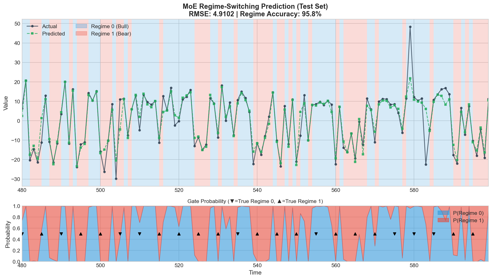

LightGBM-MoE
============

**A regime-switching / Mixture-of-Experts extension of LightGBM.**

[English](#english) | [Japanese (日本語)](#japanese)

---

<a name="english"></a>
## English

### Overview

LightGBM-MoE is a fork of [Microsoft LightGBM](https://github.com/microsoft/LightGBM) that implements **Mixture-of-Experts (MoE) / Regime-Switching GBDT** natively in C++.

```
ŷ(x) = Σₖ gₖ(x) · fₖ(x)
```

Where:
- `fₖ(x)`: Expert k's prediction (K regression GBDTs)
- `gₖ(x)`: Gate's routing probability for expert k (softmax output)
- `K`: Number of experts (hyperparameter)

### Installation

```bash
# Linux
pip install https://github.com/kyo219/LightGBM-MoE/releases/download/v0.1.0/lightgbm_moe-0.1.0-py3-none-manylinux_2_27_x86_64.manylinux_2_28_x86_64.whl

# macOS (Apple Silicon)
pip install https://github.com/kyo219/LightGBM-MoE/releases/download/v0.1.0/lightgbm_moe-0.1.0-py3-none-macosx_11_0_arm64.whl

# Windows
pip install https://github.com/kyo219/LightGBM-MoE/releases/download/v0.1.0/lightgbm_moe-0.1.0-py3-none-win_amd64.whl
```

Or build from source:
```bash
git clone https://github.com/kyo219/LightGBM-MoE.git
cd LightGBM-MoE && mkdir build && cd build
cmake .. && make -j4
cd ../python-package && pip install -e .
```

### Quick Start

```python
import lightgbm_moe as lgb

params = {
    'boosting': 'mixture',           # Enable MoE mode
    'mixture_num_experts': 2,        # Number of experts
    'mixture_r_smoothing': 'ema',    # Smoothing method
    'mixture_smoothing_lambda': 0.5, # Smoothing strength
    'objective': 'regression',
}

train_data = lgb.Dataset(X_train, label=y_train)
model = lgb.train(params, train_data, num_boost_round=100)

# Predictions
y_pred = model.predict(X_test)                     # Weighted mixture
regime = model.predict_regime(X_test)              # Regime index (argmax)
regime_proba = model.predict_regime_proba(X_test)  # Gate probabilities (N, K)
expert_preds = model.predict_expert_pred(X_test)   # Expert predictions (N, K)
```

---

## API Reference

### MoE Parameters

| Parameter | Type | Default | Range | Description |
|-----------|------|---------|-------|-------------|
| `boosting` | string | `"gbdt"` | `"gbdt"`, `"mixture"` | Set to `"mixture"` to enable MoE mode |
| `mixture_num_experts` | int | 4 | 2-10 | Number of expert models (K). Each expert is a separate GBDT that specializes in different data regimes. |
| `mixture_e_step_alpha` | float | 1.0 | 0.1-5.0 | Weight for loss term in E-step responsibility update. Higher = more weight on prediction accuracy vs gate probability. |
| `mixture_warmup_iters` | int | 10 | 0-50 | Number of warmup iterations. During warmup, responsibilities are uniform (1/K) to allow experts to learn before specialization. |
| `mixture_balance_factor` | int | 10 | 2-20 | Load balancing aggressiveness. Minimum expert usage = 1/(factor × K). Lower = more aggressive balancing. Recommended: 5-7. |
| `mixture_r_smoothing` | string | `"none"` | `"none"`, `"ema"`, `"markov"`, `"momentum"` | Responsibility smoothing method for time-series stability. |
| `mixture_smoothing_lambda` | float | 0.0 | 0.0-1.0 | Smoothing strength. Only used when `mixture_r_smoothing` is not `"none"`. Higher = more smoothing (slower regime transitions). |

### Smoothing Methods

| Method | Formula | Use Case |
|--------|---------|----------|
| `none` | `r_t = r_t` (no change) | i.i.d. data, regime determinable from X |
| `ema` | `r_t = λ·r_{t-1} + (1-λ)·r_t` | Time-series with persistent regimes |
| `markov` | `r_t ∝ r_t · (A·r_{t-1})` | Regime transitions follow Markov chain |
| `momentum` | `r_t = λ·r_{t-1} + (1-λ)·r_t + β·Δr` | Trending regime changes |

### Prediction APIs

| Method | Output Shape | Description |
|--------|--------------|-------------|
| `predict(X)` | `(N,)` | Final prediction: weighted mixture of expert predictions |
| `predict_regime(X)` | `(N,)` int | Most likely regime index: `argmax_k(gate_proba)` |
| `predict_regime_proba(X)` | `(N, K)` | Gate probabilities for each expert (sums to 1) |
| `predict_expert_pred(X)` | `(N, K)` | Individual prediction from each expert |

---

## Benchmark

**Setup**: 100 Optuna trials, 5-fold time-series CV, full hyperparameter search for both Standard and MoE.

| Dataset | Description | Std RMSE | MoE RMSE | Improvement |
|---------|-------------|----------|----------|-------------|
| **Synthetic (X→Regime)** | Regime determinable from features | 5.22 | **4.35** | **+16.7%** |
| Hamilton GNP | Latent Markov regime | 0.74 | 0.74 | +0.0% |
| VIX Volatility | Latent volatility state | 0.012 | 0.012 | -0.7% |

**Key Finding**: MoE excels when regime is determinable from features (X).

### Visualization



- **Top**: Actual vs Predicted values with background colored by predicted regime
- **Bottom**: Gate probability over time (▼▲ = true regime markers)
- **Result**: 95.8% regime accuracy on synthetic test set

---

## When to Use MoE

**MoE is effective when:**
- Regime is determinable from features (X)
- Different regimes follow fundamentally different functions
- You have sufficient data for each regime

**MoE is NOT effective when:**
- Regime is latent (hidden Markov, unobserved states)
- Standard GBDT already captures the pattern
- Data has no clear regime structure

---

<a name="japanese"></a>
## Japanese (日本語)

### 概要

LightGBM-MoE は [Microsoft LightGBM](https://github.com/microsoft/LightGBM) のフォークで、**Mixture-of-Experts (MoE) / レジームスイッチング GBDT** をC++でネイティブ実装しています。

```
ŷ(x) = Σₖ gₖ(x) · fₖ(x)
```

### インストール

```bash
# Linux
pip install https://github.com/kyo219/LightGBM-MoE/releases/download/v0.1.0/lightgbm_moe-0.1.0-py3-none-manylinux_2_27_x86_64.manylinux_2_28_x86_64.whl

# macOS (Apple Silicon)
pip install https://github.com/kyo219/LightGBM-MoE/releases/download/v0.1.0/lightgbm_moe-0.1.0-py3-none-macosx_11_0_arm64.whl

# Windows
pip install https://github.com/kyo219/LightGBM-MoE/releases/download/v0.1.0/lightgbm_moe-0.1.0-py3-none-win_amd64.whl
```

### クイックスタート

```python
import lightgbm_moe as lgb

params = {
    'boosting': 'mixture',           # MoEモード有効化
    'mixture_num_experts': 2,        # エキスパート数
    'mixture_r_smoothing': 'ema',    # 平滑化手法
    'mixture_smoothing_lambda': 0.5, # 平滑化強度
    'objective': 'regression',
}

train_data = lgb.Dataset(X_train, label=y_train)
model = lgb.train(params, train_data, num_boost_round=100)

# 予測
y_pred = model.predict(X_test)                     # 重み付きミクスチャ
regime = model.predict_regime(X_test)              # レジームインデックス
regime_proba = model.predict_regime_proba(X_test)  # ゲート確率 (N, K)
expert_preds = model.predict_expert_pred(X_test)   # 各エキスパート予測 (N, K)
```

---

## API リファレンス

### MoE パラメータ

| パラメータ | 型 | デフォルト | 範囲 | 説明 |
|-----------|------|---------|-------|-------------|
| `boosting` | string | `"gbdt"` | `"gbdt"`, `"mixture"` | MoEモードを有効にするには `"mixture"` を指定 |
| `mixture_num_experts` | int | 4 | 2-10 | エキスパート数 (K)。各エキスパートは異なるデータレジームに特化する独立したGBDT。 |
| `mixture_e_step_alpha` | float | 1.0 | 0.1-5.0 | E-stepでの損失項の重み。高いほど予測精度を重視、低いほどゲート確率を重視。 |
| `mixture_warmup_iters` | int | 10 | 0-50 | ウォームアップ回数。この期間中、責務は均等 (1/K) で、専門化前にエキスパートが学習できる。 |
| `mixture_balance_factor` | int | 10 | 2-20 | 負荷分散の強度。最小エキスパート使用率 = 1/(factor × K)。小さいほど積極的なバランシング。推奨: 5-7。 |
| `mixture_r_smoothing` | string | `"none"` | `"none"`, `"ema"`, `"markov"`, `"momentum"` | 時系列安定化のための責務平滑化手法。 |
| `mixture_smoothing_lambda` | float | 0.0 | 0.0-1.0 | 平滑化強度。`mixture_r_smoothing` が `"none"` 以外の場合のみ使用。高いほど平滑化が強い（レジーム遷移が遅い）。 |

### 平滑化手法

| 手法 | 数式 | 用途 |
|------|------|------|
| `none` | `r_t = r_t` (変更なし) | i.i.d.データ、レジームがXから決定可能 |
| `ema` | `r_t = λ·r_{t-1} + (1-λ)·r_t` | 持続的レジームを持つ時系列 |
| `markov` | `r_t ∝ r_t · (A·r_{t-1})` | レジーム遷移がマルコフ連鎖に従う |
| `momentum` | `r_t = λ·r_{t-1} + (1-λ)·r_t + β·Δr` | トレンドのあるレジーム変化 |

### 予測API

| メソッド | 出力形状 | 説明 |
|---------|---------|------|
| `predict(X)` | `(N,)` | 最終予測: エキスパート予測の重み付きミクスチャ |
| `predict_regime(X)` | `(N,)` int | 最も可能性の高いレジーム: `argmax_k(gate_proba)` |
| `predict_regime_proba(X)` | `(N, K)` | 各エキスパートへのゲート確率（合計1） |
| `predict_expert_pred(X)` | `(N, K)` | 各エキスパートの個別予測 |

---

## ベンチマーク

**設定**: 100 Optunaトライアル、5分割時系列CV、Standard/MoE両方で完全ハイパーパラメータ探索。

| データセット | 説明 | Std RMSE | MoE RMSE | 改善率 |
|-------------|------|----------|----------|--------|
| **合成 (X→Regime)** | レジームが特徴量から決定可能 | 5.22 | **4.35** | **+16.7%** |
| Hamilton GNP | 潜在マルコフレジーム | 0.74 | 0.74 | +0.0% |
| VIX Volatility | 潜在ボラティリティ状態 | 0.012 | 0.012 | -0.7% |

**重要な発見**: MoEはレジームが特徴量(X)から決定可能な場合に有効。

### 可視化


- **上段**: 実績値 vs 予測値（背景色=予測レジーム）
- **下段**: 時間経過でのゲート確率（▼▲=真のレジームマーカー）
- **結果**: 合成テストセットで95.8%のレジーム精度

---

## MoEを使うべき場面

**MoEが有効な条件:**
- レジームが特徴量(X)から決定可能
- 異なるレジームが根本的に異なる関数に従う
- 各レジームに十分なデータがある

**MoEが有効でない条件:**
- レジームが潜在的（隠れマルコフ、観測されない状態）
- 標準GBDTが既にパターンを捕捉できる
- データに明確なレジーム構造がない

---

## License

This project is licensed under the MIT license. Based on [Microsoft LightGBM](https://github.com/microsoft/LightGBM).
