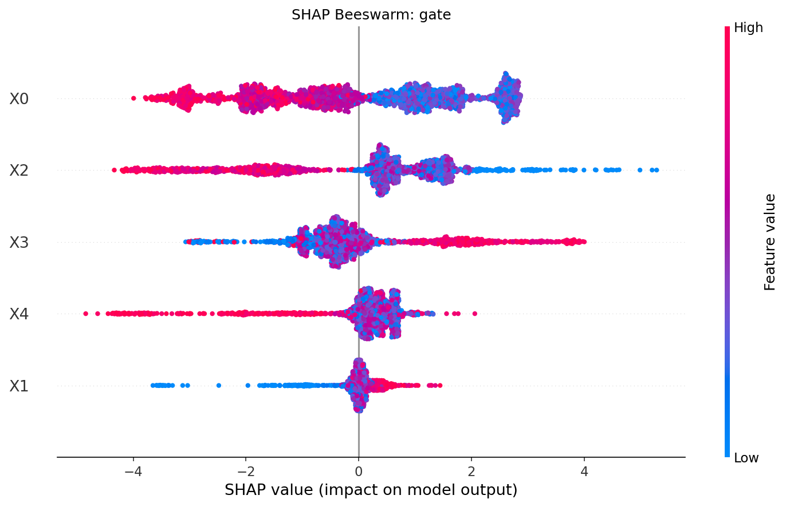
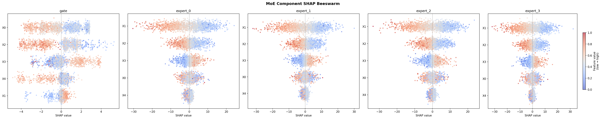
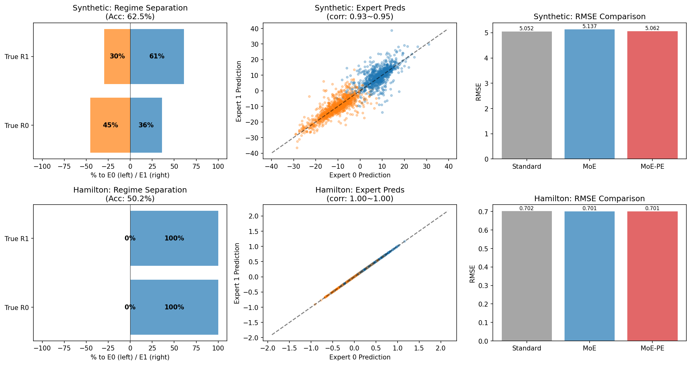

LightGBM-MoE
============

**A regime-switching / Mixture-of-Experts extension of LightGBM.**

[English](#english) | [Japanese (日本語)](#japanese)

---

<a name="english"></a>
## English

### Overview

LightGBM-MoE is a fork of [Microsoft LightGBM](https://github.com/microsoft/LightGBM) that implements **Mixture-of-Experts (MoE) / Regime-Switching GBDT** natively in C++.

```
ŷ(x) = Σₖ gₖ(x) · fₖ(x)
```

Where:
- `fₖ(x)`: Expert k's prediction (K regression GBDTs)
- `gₖ(x)`: Gate's routing probability for expert k (softmax output)
- `K`: Number of experts (hyperparameter)

### Requirements

- **Python**: 3.10 or later
- **OS**: Linux (x86_64, aarch64), macOS (Intel, Apple Silicon)
- **Dependencies**: numpy, scipy (automatically installed)

### Installation

**Recommended: Install directly from GitHub** (builds from source, requires CMake):

```bash
pip install git+https://github.com/kyo219/LightGBM-MoE.git
```

**Alternative: Build manually from source**:

```bash
git clone https://github.com/kyo219/LightGBM-MoE.git
cd LightGBM-MoE
pip install ./python-package
```

**For development (editable install)**:

```bash
git clone https://github.com/kyo219/LightGBM-MoE.git
cd LightGBM-MoE/python-package
pip install -e .
```

> **Note**: Building from source requires CMake (3.16+) and a C++ compiler (GCC, Clang, or Apple Clang).

### Quick Start

```python
import lightgbm_moe as lgb

params = {
    'boosting': 'mixture',           # Enable MoE mode
    'mixture_num_experts': 2,        # Number of experts
    'mixture_r_smoothing': 'ema',    # Smoothing method
    'mixture_smoothing_lambda': 0.5, # Smoothing strength
    'objective': 'regression',
}

train_data = lgb.Dataset(X_train, label=y_train)
model = lgb.train(params, train_data, num_boost_round=100)

# Predictions
y_pred = model.predict(X_test)                     # Weighted mixture
regime = model.predict_regime(X_test)              # Regime index (argmax)
regime_proba = model.predict_regime_proba(X_test)  # Gate probabilities (N, K)
expert_preds = model.predict_expert_pred(X_test)   # Expert predictions (N, K)
```

### Training with Validation & Early Stopping

```python
import lightgbm_moe as lgb

params = {
    'boosting': 'mixture',
    'mixture_num_experts': 2,
    'objective': 'regression',
    'metric': 'rmse',
    'verbose': 1,
}

train_data = lgb.Dataset(X_train, label=y_train)
valid_data = lgb.Dataset(X_valid, label=y_valid, reference=train_data)

model = lgb.train(
    params,
    train_data,
    num_boost_round=100,
    valid_sets=[valid_data],
    valid_names=['valid'],
    callbacks=[lgb.early_stopping(stopping_rounds=10)]
)

print(f"Best iteration: {model.best_iteration}")
```

---

## API Reference

### MoE Parameters

| Parameter | Type | Default | Range | Description |
|-----------|------|---------|-------|-------------|
| `boosting` | string | `"gbdt"` | `"gbdt"`, `"mixture"` | Set to `"mixture"` to enable MoE mode |
| `mixture_num_experts` | int | 4 | 2-10 | Number of expert models (K). Each expert is a separate GBDT that specializes in different data regimes. |
| `mixture_e_step_alpha` | float | 1.0 | 0.1-5.0 | Weight for loss term in E-step responsibility update. Higher = more weight on prediction accuracy vs gate probability. |
| `mixture_e_step_mode` | string | `"em"` | `"em"`, `"loss_only"`, `"gate_only"` | E-step mode. `"em"`: use gate probability + loss (standard EM). `"loss_only"`: use only loss (simpler, assigns to best-fitting expert). `"gate_only"`: use only gate probability (prevents Expert Collapse). |
| `mixture_e_step_loss` | string | `"auto"` | `"auto"`, `"l2"`, `"l1"`, `"quantile"` | Loss function for E-step. `"auto"`: infer from objective (fallback to L2). |
| `mixture_warmup_iters` | int | 5 | 0-50 | Number of warmup iterations. During warmup, responsibilities are uniform (1/K) to allow experts to learn before specialization. |
| `mixture_gate_iters_per_round` | int | 1 | ≥1 | Number of gate training iterations per boosting round. |
| `mixture_load_balance_alpha` | float | 0.0 | 0.0-10.0 | Auxiliary load balancing coefficient. Adds penalty: `s_ik -= α_lb * log(load_k * K)`. Recommended: 0.1-1.0 for Token Choice routing. |
| `mixture_balance_factor` | int | 10 | 2-20 | Load balancing aggressiveness. Minimum expert usage = 1/(factor × K). Lower = more aggressive balancing. Recommended: 5-7. |
| `mixture_r_smoothing` | string | `"none"` | `"none"`, `"ema"`, `"markov"`, `"momentum"` | Responsibility smoothing method for time-series stability. **Recommended: `"none"`** (see note below). |
| `mixture_smoothing_lambda` | float | 0.0 | 0.0-1.0 | Smoothing strength. Only used when `mixture_r_smoothing` is not `"none"`. Higher = more smoothing (slower regime transitions). |
| `mixture_gate_entropy_lambda` | float | 0.0 | 0.0-1.0 | Gate entropy regularization. Encourages gate to produce more uncertain predictions, preventing premature expert collapse. **Recommended: 0.01-0.1**. |
| `mixture_expert_dropout_rate` | float | 0.0 | 0.0-1.0 | Expert dropout rate. Randomly drops experts during training to force all experts to be useful. **Recommended: 0.1-0.3**. |
| `mixture_hard_m_step` | bool | `true` | `true`, `false` | Use hard (argmax) assignment in M-step. Each sample's gradient goes only to the expert with highest responsibility. Prevents Expert Collapse by ensuring experts learn from different data subsets. |
| `mixture_diversity_lambda` | float | 0.0 | 0.0-1.0 | Diversity regularization. Adds gradient penalty pushing expert predictions apart: `grad += λ * Σ_{j≠k} r_j * (f_k - f_j) / (K-1)`. **Recommended: 0.1-0.5**. |

### Gate Parameters

The gate model controls routing decisions (which expert handles each sample). By default, it uses shallow trees to prevent overfitting. **These parameters should be included in hyperparameter search** as they significantly impact routing quality.

| Parameter | Type | Default | Range | Description |
|-----------|------|---------|-------|-------------|
| `mixture_gate_max_depth` | int | 3 | 2-6 | Maximum depth of gate trees. Shallower than experts to prevent overfitting on routing. |
| `mixture_gate_num_leaves` | int | 8 | 4-32 | Number of leaves in gate trees. Fewer leaves for simpler routing decisions. |
| `mixture_gate_learning_rate` | float | 0.1 | 0.01-0.3 | Learning rate for gate. Can be higher than experts since gate trees are shallower. |
| `mixture_gate_lambda_l2` | float | 1.0 | 0.1-10.0 | L2 regularization for gate. Higher values prevent gate overfitting. |
| `mixture_gate_entropy_lambda` | float | 0.0 | 0.0-0.1 | Entropy regularization. Encourages uncertain predictions to prevent premature expert collapse. |

**Design rationale:**
- Gate is a **multiclass classifier** (K classes = K experts)
- Shallow trees (depth=3, leaves=8) prevent gate from memorizing sample→expert mappings
- Higher learning rate (0.1) allows faster adaptation to changing expert specializations
- Experts handle prediction accuracy, gate only handles routing

**Optuna example with gate parameters:**

```python
def objective(trial):
    params = {
        'boosting': 'mixture',
        'mixture_num_experts': trial.suggest_int('num_experts', 2, 4),
        # Expert parameters
        'max_depth': trial.suggest_int('max_depth', 3, 12),
        'num_leaves': trial.suggest_int('num_leaves', 8, 128),
        'learning_rate': trial.suggest_float('learning_rate', 0.01, 0.3, log=True),
        # Gate parameters (important for routing quality!)
        'mixture_gate_max_depth': trial.suggest_int('gate_max_depth', 2, 6),
        'mixture_gate_num_leaves': trial.suggest_int('gate_num_leaves', 4, 32),
        'mixture_gate_learning_rate': trial.suggest_float('gate_lr', 0.01, 0.3, log=True),
    }
    # ... training code ...
```

> **Important: Use `mixture_r_smoothing="none"` (default)**
>
> Smoothing methods (`ema`, `markov`, `momentum`) can cause **expert collapse** where all experts converge to similar predictions. In benchmarks with Optuna optimization, `smoothing=none` consistently achieves good expert separation (correlation ~0.02, regime accuracy ~98%), while other smoothing methods often collapse (correlation ~0.99, regime accuracy ~50%).

### Expert Collapse Prevention (Advanced)

If experts are collapsing (all producing similar predictions), try these new parameters:

| Parameter | When to Use | Effect |
|-----------|-------------|--------|
| `mixture_gate_entropy_lambda` | Gate assigns all samples to one expert early | Forces gate to be less confident, giving experts time to differentiate |
| `mixture_expert_dropout_rate` | One expert dominates and others stop learning | Forces all experts to be useful by randomly disabling them during training |

**Example: Preventing collapse**

```python
params = {
    'boosting': 'mixture',
    'mixture_num_experts': 2,
    'objective': 'regression',

    # Collapse prevention
    'mixture_gate_entropy_lambda': 0.05,  # Encourage uncertain gate predictions
    'mixture_expert_dropout_rate': 0.2,   # 20% chance to drop each expert per iteration

    # Other recommended settings
    'mixture_warmup_iters': 20,           # Allow experts to differentiate first
    'mixture_balance_factor': 5,          # More aggressive load balancing
}
```

**How these work:**

1. **Gate Entropy Regularization** (`mixture_gate_entropy_lambda`):
   - Adds a penalty when gate is too confident: `grad += λ * (p - 1/K)`
   - Pushes gate probabilities toward uniform distribution (1/K)
   - Effect decreases as experts become genuinely specialized

2. **Expert Dropout** (`mixture_expert_dropout_rate`):
   - Each iteration, randomly drops experts (they receive zero gradients)
   - Dropped experts don't update, forcing others to cover their samples
   - At least one expert is always kept
   - Similar to dropout in neural networks

### Progressive Training — EvoMoE (Advanced)

Inspired by [EvoMoE (Nie et al., 2022)](https://arxiv.org/abs/2112.14397) and [Drop-Upcycling (ICLR 2025)](https://openreview.net/forum?id=nKPaFSGXmV). Instead of initializing K expert GBDTs independently from scratch, progressive training:

1. **Seed Phase**: Trains a single seed GBDT on all data (no gating)
2. **Spawn**: Duplicates the seed into K experts with random perturbation (Drop-Upcycling style)
3. **MoE Phase**: Runs standard EM training with the pre-trained experts

This eliminates initialization sensitivity and enables natural expert branching from a shared foundation.

| Parameter | Type | Default | Range | Description |
|-----------|------|---------|-------|-------------|
| `mixture_progressive_mode` | string | `"none"` | `"none"`, `"evomoe"` | Progressive training mode. `"none"`: standard MoE. `"evomoe"`: seed-then-spawn. |
| `mixture_seed_iterations` | int | 50 | 0-500 | Number of seed GBDT training iterations before spawning experts. |
| `mixture_spawn_perturbation` | float | 0.5 | 0.0-1.0 | Perturbation ratio for expert spawning. 0.0 = exact copy, 1.0 = all trees perturbed. 0.5 is optimal (Drop-Upcycling). |

**Gate Temperature Annealing** can be combined with progressive training (or used independently):

| Parameter | Type | Default | Range | Description |
|-----------|------|---------|-------|-------------|
| `mixture_gate_temperature_init` | float | 1.0 | >0.0 | Initial temperature for gate softmax. High values (2.0-3.0) produce near-uniform routing for exploration. |
| `mixture_gate_temperature_final` | float | 1.0 | >0.0 | Final temperature. Low values (0.3-1.0) produce sharp routing for exploitation. |

Temperature decays exponentially: `T(t) = T_init * (T_final/T_init)^(t/T_total)`. When `init == final == 1.0` (default), no annealing occurs.

**Example: EvoMoE Progressive Training with Temperature Annealing**

```python
params = {
    'boosting': 'mixture',
    'mixture_num_experts': 3,
    'objective': 'regression',
    'num_iterations': 300,

    # Progressive training (EvoMoE)
    'mixture_progressive_mode': 'evomoe',
    'mixture_seed_iterations': 50,         # 50 iterations of seed training
    'mixture_spawn_perturbation': 0.5,     # Drop-Upcycling optimal ratio

    # Gate temperature annealing
    'mixture_gate_temperature_init': 2.0,  # Uniform routing early
    'mixture_gate_temperature_final': 0.5, # Sharp routing late
}
```

**Optuna Search Ranges:**

```python
# Progressive training
trial.suggest_categorical('mixture_progressive_mode', ['none', 'evomoe'])
trial.suggest_int('mixture_seed_iterations', 20, 100)
trial.suggest_float('mixture_spawn_perturbation', 0.1, 0.9)

# Temperature annealing
trial.suggest_float('mixture_gate_temperature_init', 1.0, 5.0)
trial.suggest_float('mixture_gate_temperature_final', 0.1, 1.0)
```

### Expert Choice Routing (Advanced)

An alternative routing strategy where **each expert selects its top samples** instead of each sample selecting experts (Token Choice). This guarantees perfect load balance across experts.

| Parameter | Type | Default | Range | Description |
|-----------|------|---------|-------|-------------|
| `mixture_routing_mode` | string | `"token_choice"` | `"token_choice"`, `"expert_choice"` | Routing strategy. `"token_choice"`: each sample selects experts (default, standard EM). `"expert_choice"`: each expert selects samples (better load balance, experimental). |
| `mixture_expert_capacity_factor` | float | 1.0 | 0.0-3.0 | Capacity multiplier. Each expert selects `(N/K) × factor` samples. 1.0 = exact balanced capacity, >1.0 allows overlap. |
| `mixture_expert_choice_score` | string | `"combined"` | `"gate"`, `"loss"`, `"combined"` | Score function for sample selection. `"gate"`: use gate probability. `"loss"`: use negative loss. `"combined"`: gate + alpha × (-loss) (default). |
| `mixture_expert_choice_boost` | float | 10.0 | 1.0-100.0 | Multiplier for responsibility of selected samples. Higher = sharper distinction between selected/non-selected. |
| `mixture_expert_choice_hard` | bool | `false` | `true`, `false` | Hard routing: non-selected samples get zero weight. Forces stronger specialization but may reduce gradient signal. |

**Example: Using Expert Choice Routing**

```python
params = {
    'boosting': 'mixture',
    'mixture_num_experts': 4,
    'objective': 'regression',

    # Expert Choice Routing
    'mixture_routing_mode': 'expert_choice',
    'mixture_expert_capacity_factor': 1.0,   # Balanced capacity
    'mixture_expert_choice_score': 'combined',
    'mixture_expert_choice_boost': 10.0,
}
```

**When to use Expert Choice:**

| Scenario | Recommended |
|----------|-------------|
| Experts collapsing to similar predictions | ✅ Expert Choice |
| Load imbalance (one expert gets all samples) | ✅ Expert Choice |
| Need strict load balancing | ✅ Expert Choice |
| Standard MoE training | Token Choice (default) |

**How it works:**

1. **Compute Affinity**: For each sample-expert pair, compute affinity score using gate probability and/or loss
2. **Expert Selection**: Each expert selects its top-C samples (C = N/K × capacity_factor)
3. **Soft Assignment**: Selected samples get high responsibility, non-selected get minimum responsibility
4. **GBDT Compatible**: All samples contribute gradients (soft selection), maintaining GBDT tree-building requirements

### Early Stopping

MoE supports validation-based early stopping, useful for hyperparameter tuning with Optuna.

| Parameter | Type | Default | Description |
|-----------|------|---------|-------------|
| `early_stopping_round` | int | 0 | Stop training if validation metric doesn't improve for N rounds. Set via `lgb.early_stopping()` callback. |
| `first_metric_only` | bool | False | Only use the first metric for early stopping (when multiple metrics specified). |

**Usage with callbacks:**

```python
model = lgb.train(
    params,
    train_data,
    valid_sets=[valid_data],
    callbacks=[
        lgb.early_stopping(stopping_rounds=10),  # Stop after 10 rounds without improvement
        lgb.log_evaluation(period=10),           # Log every 10 iterations
    ]
)
```

**Usage with Optuna:**

```python
def objective(trial):
    params = {
        'boosting': 'mixture',
        'mixture_num_experts': trial.suggest_int('num_experts', 2, 4),
        'objective': 'regression',
        'metric': 'rmse',
        'verbose': -1,
    }

    train_data = lgb.Dataset(X_train, label=y_train)
    valid_data = lgb.Dataset(X_valid, label=y_valid, reference=train_data)

    model = lgb.train(
        params,
        train_data,
        num_boost_round=500,
        valid_sets=[valid_data],
        callbacks=[lgb.early_stopping(stopping_rounds=20)]
    )

    return model.best_score['valid_0']['rmse']
```

### Per-Expert Hyperparameters (Advanced)

These parameters allow each expert to have different tree **structural** configurations. If not specified, all experts share the same hyperparameters.

| Parameter | Type | Default | Description |
|-----------|------|---------|-------------|
| `mixture_expert_max_depths` | string | `""` | Comma-separated max_depth for each expert. Must have exactly K values if specified. |
| `mixture_expert_num_leaves` | string | `""` | Comma-separated num_leaves for each expert. Must have exactly K values if specified. |
| `mixture_expert_min_data_in_leaf` | string | `""` | Comma-separated min_data_in_leaf for each expert. Controls tree granularity. |
| `mixture_expert_min_gain_to_split` | string | `""` | Comma-separated min_gain_to_split for each expert. Controls split aggressiveness. |
| `mixture_expert_extra_trees` | string | `""` | Comma-separated 0/1 for each expert. Enables extremely randomized trees per expert. |

#### Same Hyperparameters for All Experts (Default)

When per-expert parameters are not specified, all experts share the base hyperparameters:

```python
params = {
    'boosting': 'mixture',
    'mixture_num_experts': 3,
    'max_depth': 5,           # All 3 experts use max_depth=5
    'num_leaves': 31,         # All 3 experts use num_leaves=31
    'min_data_in_leaf': 20,   # All 3 experts use min_data_in_leaf=20
}
```

#### Different Hyperparameters per Expert

Specify comma-separated values (one per expert) to customize each expert:

```python
params = {
    'boosting': 'mixture',
    'mixture_num_experts': 3,
    # Expert 0: coarse (high min_data), Expert 1: medium, Expert 2: fine (low min_data)
    'mixture_expert_max_depths': '3,5,7',
    'mixture_expert_num_leaves': '8,16,32',
    'mixture_expert_min_data_in_leaf': '50,20,5',      # coarse → fine
    'mixture_expert_min_gain_to_split': '0.1,0.01,0.001',  # conservative → aggressive
}
```

This allows experts to have different structural capacities:
- **Coarse expert** (high min_data_in_leaf): captures broad patterns, less prone to overfitting
- **Fine expert** (low min_data_in_leaf): captures detailed patterns, good for complex regimes

#### Training Behavior with Per-Expert Hyperparameters

**EM iteration structure**: Each boosting iteration adds ONE tree to each expert:

```
TrainOneIter() {
  1. Forward()      → Compute predictions from all experts
  2. EStep()        → Update responsibilities
  3. MStepExperts() → Each expert adds 1 tree (sequential)
  4. MStepGate()    → Gate adds 1 tree
}
```

**What changes / doesn't change with different hyperparameters:**

| Aspect | Deep Expert | Shallow Expert |
|--------|-------------|----------------|
| EM iterations | Same | Same |
| Number of trees | Same | Same |
| Time per tree | Longer | Shorter |
| Expressiveness per tree | Higher | Lower |

**Key insight**: `num_boost_round=100` means each expert builds 100 trees, regardless of depth settings. The per-expert hyperparameters control **expressiveness per tree**, not the number of trees.

```
num_boost_round = 100:
  Expert 0 (shallow): 100 shallow trees → simple patterns
  Expert 1 (deep):    100 deep trees    → complex patterns
                ↓
        Same 100 EM iterations
```

**Training time**: Currently experts are trained sequentially in each iteration, so the deepest/most complex expert becomes the bottleneck. Total time ≈ sum of all expert tree build times per iteration.

#### Initialization and Symmetry Breaking

By default, MoE uses **uniform initialization**: all samples start with equal responsibility `1/K` for all experts.

```
Initial state (K=2):
  Sample 0: r = [0.5, 0.5]  (equal for both experts)
  Sample 1: r = [0.5, 0.5]
  ...
```

**Symmetry breaking** is achieved through per-expert random seeds:
```cpp
expert_configs_[k]->seed = config_->seed + k + 1;  // Different seed per expert
```

This means experts naturally differentiate as training progresses, without relying on label-based initialization (which could leak target information).

Available initialization modes (`mixture_init` parameter):
| Mode | Description |
|------|-------------|
| `uniform` (default) | Equal `1/K` responsibility, symmetry broken by per-expert seeds |
| `random` | Randomly assign each sample to one expert |
| `quantile` | Assign by label quantiles (y-dependent, use with caution) |
| `balanced_kmeans` | K-means++ on features, then balanced assignment (N/K per cluster) |
| `gmm` | Gaussian Mixture Model soft clustering (aligns with EM theory) |
| `tree_hierarchical` | Deep tree → leaf clustering → hierarchical merge into K groups |

#### Recommended Settings & Optuna Search Ranges

The following configuration is based on extensive benchmarking (300+ trials, see [Benchmark Results](#benchmark-results-gate-type-comparison) below). These settings ensure experts properly differentiate (switching model) while maximizing prediction accuracy.

**Recommended fixed settings:**

| Parameter | Value | Rationale |
|-----------|-------|-----------|
| `mixture_hard_m_step` | `true` (default) | Prevents Expert Collapse by ensuring each sample's gradient goes to only one expert |
| `mixture_gate_type` | `"gbdt"` | Highest accuracy in 300-trial benchmarks. `"none"` skips gate training (fastest but no out-of-sample routing); `"leaf_reuse"` is competitive on small data but plateaus earlier |
| `mixture_r_smoothing` | Search `none`/`ema`/`markov` | `none` for i.i.d. data; `ema`/`markov` can help time-series |

> **Note on `bagging_fraction` / `bagging_freq`**: When `mixture_hard_m_step=true`, the library **automatically disables per-expert bagging** (sparse activation already restricts each expert to its assigned samples — double-bagging combined with sparse gradients produces degenerate histograms; see #16). The values you set on the main params are still respected by the *gate* but ignored inside experts.

**Recommended Optuna search example:**

```python
import optuna
import lightgbm_moe as lgb
from sklearn.model_selection import TimeSeriesSplit
from sklearn.metrics import mean_squared_error
import numpy as np

def objective(trial):
    num_experts = trial.suggest_int('mixture_num_experts', 2, 4)
    routing_mode = trial.suggest_categorical('mixture_routing_mode', ['token_choice', 'expert_choice'])
    smoothing = trial.suggest_categorical('mixture_r_smoothing', ['none', 'ema', 'markov'])

    params = {
        'boosting': 'mixture',
        'objective': 'regression',
        'verbose': -1,
        # Tree structure
        'num_leaves': trial.suggest_int('num_leaves', 8, 128),
        'max_depth': trial.suggest_int('max_depth', 3, 12),
        'min_data_in_leaf': trial.suggest_int('min_data_in_leaf', 5, 100),
        'learning_rate': trial.suggest_float('learning_rate', 0.01, 0.3, log=True),
        'lambda_l1': trial.suggest_float('lambda_l1', 1e-8, 10.0, log=True),
        'lambda_l2': trial.suggest_float('lambda_l2', 1e-8, 10.0, log=True),
        'feature_fraction': trial.suggest_float('feature_fraction', 0.5, 1.0),
        'bagging_fraction': trial.suggest_float('bagging_fraction', 0.5, 1.0),
        'bagging_freq': trial.suggest_int('bagging_freq', 0, 7),
        # MoE core
        'mixture_num_experts': num_experts,
        'mixture_e_step_alpha': trial.suggest_float('mixture_e_step_alpha', 0.1, 3.0),
        'mixture_e_step_mode': trial.suggest_categorical('mixture_e_step_mode', ['em', 'loss_only']),
        'mixture_warmup_iters': trial.suggest_int('mixture_warmup_iters', 5, 50),
        'mixture_balance_factor': trial.suggest_int('mixture_balance_factor', 2, 10),
        'mixture_routing_mode': routing_mode,
        'mixture_r_smoothing': smoothing,
        'mixture_smoothing_lambda': trial.suggest_float('mixture_smoothing_lambda', 0.0, 0.9) if smoothing != 'none' else 0.0,
        # Diversity regularization (key for expert differentiation)
        'mixture_diversity_lambda': trial.suggest_float('mixture_diversity_lambda', 0.0, 0.5),
        # Gate parameters (wider range for stronger regime detection)
        'mixture_gate_max_depth': trial.suggest_int('mixture_gate_max_depth', 2, 10),
        'mixture_gate_num_leaves': trial.suggest_int('mixture_gate_num_leaves', 4, 64),
        'mixture_gate_learning_rate': trial.suggest_float('mixture_gate_learning_rate', 0.01, 0.5, log=True),
        'mixture_gate_lambda_l2': trial.suggest_float('mixture_gate_lambda_l2', 1e-3, 10.0, log=True),
        'mixture_gate_iters_per_round': trial.suggest_int('mixture_gate_iters_per_round', 1, 3),
    }

    # Expert Choice specific parameters
    if routing_mode == 'expert_choice':
        params['mixture_expert_capacity_factor'] = trial.suggest_float('mixture_expert_capacity_factor', 0.8, 1.5)
        params['mixture_expert_choice_boost'] = trial.suggest_float('mixture_expert_choice_boost', 5.0, 30.0)
        params['mixture_expert_choice_hard'] = trial.suggest_categorical('mixture_expert_choice_hard', [True, False])

    # Train with early stopping
    train_data = lgb.Dataset(X_train, label=y_train)
    valid_data = lgb.Dataset(X_valid, label=y_valid, reference=train_data)
    model = lgb.train(
        params, train_data, num_boost_round=500,
        valid_sets=[valid_data],
        callbacks=[lgb.early_stopping(stopping_rounds=50, verbose=False)],
    )
    pred = model.predict(X_valid)
    return mean_squared_error(y_valid, pred, squared=False)

study = optuna.create_study(direction='minimize')
study.optimize(objective, n_trials=500)  # 500+ trials recommended
```

**Search range summary:**

| Category | Parameter | Range | Notes |
|----------|-----------|-------|-------|
| **Expert** | `num_leaves` | 8-128 | |
| | `max_depth` | 3-12 | |
| | `min_data_in_leaf` | 5-100 | |
| | `learning_rate` | 0.01-0.3 | log scale |
| **MoE Core** | `mixture_num_experts` | 2-4 | Start with 2 |
| | `mixture_e_step_alpha` | 0.1-3.0 | Higher = more weight on expert fit |
| | `mixture_e_step_mode` | `em`, `loss_only` | `loss_only` can help latent regimes |
| | `mixture_warmup_iters` | 5-50 | |
| | `mixture_diversity_lambda` | 0.0-0.5 | **Key for expert differentiation** |
| | `mixture_routing_mode` | `token_choice`, `expert_choice` | |
| **Gate** | `mixture_gate_max_depth` | 2-10 | Wider than expert for regime detection |
| | `mixture_gate_num_leaves` | 4-64 | |
| | `mixture_gate_learning_rate` | 0.01-0.5 | log scale |
| | `mixture_gate_lambda_l2` | 0.001-10.0 | log scale |
| | `mixture_gate_iters_per_round` | 1-3 | Multiple gate updates per round |
| **Smoothing** | `mixture_r_smoothing` | `none`, `ema`, `markov` | For time-series |
| | `mixture_smoothing_lambda` | 0.0-0.9 | Only when smoothing != `none` |

**Tips for time-series / latent regime data:**
- Add time-series features (moving averages, rolling volatility, MA crossover) to make latent regimes observable
- Search `mixture_r_smoothing` including `ema`/`markov` for temporal regime persistence
- Use `mixture_e_step_mode='loss_only'` when Gate cannot determine regime from features alone

#### Benchmark Results: Gate Type Comparison

Reproduce with [`examples/benchmark_gate.py`](examples/benchmark_gate.py):

```bash
# 24-core machine, ~3-5 min
python examples/benchmark_gate.py --trials 300 --threads 4 --n-jobs 6
```

| Dataset | Method | RMSE | Time | vs Standard |
|---------|--------|------|------|-------------|
| Synthetic (2k×5, observable regime) | Standard GBDT | 5.13 | 58s | — |
| Synthetic | **MoE_gbdt** | **3.87** | 47s | **+24.5%** |
| Synthetic | MoE_none | 7.65 | 51s | -49.2% |
| Synthetic | MoE_leaf_reuse | 5.40 | 54s | -5.4% |
| Hamilton (500×4, latent regime) | Standard GBDT | 0.72 | 18s | — |
| Hamilton | MoE_gbdt | 0.72 | 37s | -0.6% |
| Hamilton | MoE_none | 0.72 | 28s | -0.9% |
| Hamilton | MoE_leaf_reuse | 0.72 | 28s | -0.7% |

300 Optuna trials each, 5-fold TimeSeriesSplit, 100 boost rounds, early stopping=50.

**Takeaways:**

- **`mixture_gate_type="gbdt"` is the default choice.** It wins decisively when the regime is observable from features (Synthetic) and matches Standard on latent-regime small data (Hamilton).
- **MoE shines when the regime is observable.** On Hamilton (latent regime, only 500 samples), MoE provides no clear win — the gate cannot route correctly without informative features. Add temporal/derived features before expecting an MoE lift on small or latent-regime data.
- **`mixture_gate_type="none"` underperforms** on observable regimes because it can't route held-out samples; only useful as a quick sanity check or for distributions where routing doesn't matter.
- **`mixture_gate_type="leaf_reuse"` is competitive when retrain is frequent.** It saves the cost of a full multiclass GBDT for the gate; pair with `mixture_gate_retrain_interval` (default 10).

#### Recommended Optuna Setup (for benchmarks above)

```python
study = optuna.create_study(direction="minimize",
                             sampler=optuna.samplers.TPESampler(seed=42))
study.optimize(objective, n_trials=300, n_jobs=6)  # n_jobs * threads ≤ cores
```

| Setting | Value | Why |
|---------|-------|-----|
| `n_trials` | 100-300 | TPE needs ~50+ trials to localize good regions; 300 gives stable RMSE |
| `n_jobs` (Optuna) | `cores / num_threads` | Each parallel trial holds an OMP team — overall ≤ physical cores |
| `num_threads` (LightGBM) | 4-8 | Sweet spot for ≤10k samples; 24-thread per trial wastes time on overhead |
| `num_boost_round` | 100-500 | Pair with `early_stopping(50)` so weak trials exit early |
| TPE seed | fixed | Reproducible study comparison across gate types |

> **Why not `n_jobs=1, num_threads=24`?** On small data (≤10k samples), one trial cannot saturate 24 cores — most threads sit idle. Running 6 trials × 4 threads in parallel keeps all cores warm and finishes 3-4× faster.

#### Optuna Search Parameters Reference

Below is a comprehensive reference of all hyperparameters that can be searched with Optuna for MoE models.

##### Model Variants

| Variant | Tree Structure | Routing Mode | Description |
|---------|---------------|--------------|-------------|
| **MoE** | Shared | token_choice / expert_choice | All experts share same tree params |
| **MoE-PE** | Per-Expert | token_choice / expert_choice | Each expert has different tree params |

##### Routing Mode Selection

```python
# Search between token_choice and expert_choice
routing_mode = trial.suggest_categorical("mixture_routing_mode", ["token_choice", "expert_choice"])
```

| Mode | Direction | Description |
|------|-----------|-------------|
| `token_choice` | Row-wise (sample perspective) | Each sample chooses which expert to use |
| `expert_choice` | Column-wise (expert perspective) | Each expert chooses which samples to handle |

##### Common Parameters (All MoE Variants)

```python
params = {
    # === Tree Structure (shared or per-expert) ===
    "learning_rate": trial.suggest_float("learning_rate", 0.01, 0.3, log=True),
    "lambda_l1": trial.suggest_float("lambda_l1", 1e-8, 10.0, log=True),
    "lambda_l2": trial.suggest_float("lambda_l2", 1e-8, 10.0, log=True),
    "feature_fraction": trial.suggest_float("feature_fraction", 0.5, 1.0),
    "bagging_fraction": trial.suggest_float("bagging_fraction", 0.5, 1.0),
    "bagging_freq": trial.suggest_int("bagging_freq", 0, 7),

    # === MoE Core ===
    "mixture_num_experts": trial.suggest_int("mixture_num_experts", 2, 4),
    "mixture_e_step_alpha": trial.suggest_float("mixture_e_step_alpha", 0.1, 2.0),
    "mixture_warmup_iters": trial.suggest_int("mixture_warmup_iters", 5, 50),
    "mixture_balance_factor": trial.suggest_int("mixture_balance_factor", 2, 10),
    "extra_trees": trial.suggest_categorical("extra_trees", [True, False]),

    # === Gate ===
    "mixture_gate_max_depth": trial.suggest_int("mixture_gate_max_depth", 2, 6),
    "mixture_gate_num_leaves": trial.suggest_int("mixture_gate_num_leaves", 4, 32),
    "mixture_gate_learning_rate": trial.suggest_float("mixture_gate_learning_rate", 0.01, 0.3, log=True),

    # === Routing Mode ===
    "mixture_routing_mode": trial.suggest_categorical("mixture_routing_mode", ["token_choice", "expert_choice"]),

    # === Initialization (optional) ===
    "mixture_init": trial.suggest_categorical("mixture_init",
        ["uniform", "quantile", "random", "balanced_kmeans", "gmm", "tree_hierarchical"]),
}
```

##### Expert Choice Specific Parameters

When `routing_mode == "expert_choice"`, add these parameters:

```python
if routing_mode == "expert_choice":
    params["mixture_expert_capacity_factor"] = trial.suggest_float("mixture_expert_capacity_factor", 0.8, 1.5)
    params["mixture_expert_choice_score"] = "gate"  # Fixed: only "gate" prevents collapse
    params["mixture_expert_choice_boost"] = trial.suggest_float("mixture_expert_choice_boost", 5.0, 30.0)
    params["mixture_expert_choice_hard"] = trial.suggest_categorical("mixture_expert_choice_hard", [True, False])
```

| Parameter | Range | Description |
|-----------|-------|-------------|
| `mixture_expert_capacity_factor` | 0.8-1.5 | Expert capacity relative to uniform allocation |
| `mixture_expert_choice_score` | `"gate"` (fixed) | Must be "gate" to prevent collapse |
| `mixture_expert_choice_boost` | 5.0-30.0 | Boost factor for expert selection scores |
| `mixture_expert_choice_hard` | True/False | Hard vs soft expert selection |

##### Initialization Method Selection

```python
# Search among initialization methods
mixture_init = trial.suggest_categorical("mixture_init",
    ["uniform", "quantile", "random", "balanced_kmeans", "gmm", "tree_hierarchical"])
```

| Method | Description |
|--------|-------------|
| `uniform` | Uniform distribution across experts |
| `quantile` | Target-based quantile initialization |
| `random` | Random assignment |
| `balanced_kmeans` | K-means clustering with balance constraint |
| `gmm` | Gaussian Mixture Model clustering |
| `tree_hierarchical` | Hierarchical tree-based initialization |

##### MoE (Shared Tree Structure)

```python
# Tree params applied to ALL experts
params["num_leaves"] = trial.suggest_int("num_leaves", 8, 128)
params["max_depth"] = trial.suggest_int("max_depth", 3, 12)
params["min_data_in_leaf"] = trial.suggest_int("min_data_in_leaf", 5, 100)
```

##### MoE-PE (Per-Expert Tree Structure)

```python
num_experts = params["mixture_num_experts"]

# Different tree params for EACH expert
max_depths = [trial.suggest_int(f"max_depth_{k}", 3, 12) for k in range(num_experts)]
num_leaves = [trial.suggest_int(f"num_leaves_{k}", 8, 128) for k in range(num_experts)]
min_data = [trial.suggest_int(f"min_data_in_leaf_{k}", 5, 100) for k in range(num_experts)]

params["mixture_expert_max_depths"] = ",".join(map(str, max_depths))
params["mixture_expert_num_leaves"] = ",".join(map(str, num_leaves))
params["mixture_expert_min_data_in_leaf"] = ",".join(map(str, min_data))
```

##### Expert Collapse Stopper (Training Callback)

Use `expert_collapse_stopper` to early-stop trials with collapsed experts:

```python
from examples.benchmark import expert_collapse_stopper

callbacks = [
    lgb.early_stopping(stopping_rounds=50, verbose=False),
    expert_collapse_stopper(
        X_sample,                    # Subsample for efficiency
        corr_threshold=0.7,          # Max expert correlation (pairwise)
        min_expert_ratio=0.05,       # Min utilization per expert (5%)
        check_every=20,              # Check every N iterations
        min_iters=50,                # Skip early iterations
    ),
]

try:
    model = lgb.train(params, train_data, callbacks=callbacks)
except lgb.EarlyStopException:
    raise optuna.TrialPruned("Expert collapse detected")
```

| Parameter | Default | Description |
|-----------|---------|-------------|
| `corr_threshold` | 0.7 | Prune if max pairwise expert correlation > threshold |
| `min_expert_ratio` | 0.05 | Prune if any expert utilization < 5% |
| `check_every` | 20 | Check frequency (iterations) |
| `min_iters` | 50 | Skip initial iterations (high correlation is normal early) |

##### Parameter Count Summary

| Variant | Base | + Expert Choice | + Init | + Per-Expert (K=4) | Total |
|---------|------|-----------------|--------|-------------------|-------|
| MoE | 16 | +4 | +1 | - | 17-21 |
| MoE-PE | 13 | +4 | +1 | +12 | 26-30 |

**Recommendation**: Use 100+ trials for MoE, 200+ trials for MoE-PE.

**Benchmark Results**: In our tests, `gmm` initialization with `token_choice` routing performed best.

#### Role-based Per-Expert (Recommended for Optuna)

The naive per-expert approach has a problem: **each expert's parameters are independent**, so you might end up with similar experts (e.g., all with similar depth and leaves). This wastes the MoE's potential for specialization.

**Solution**: Assign each expert a distinct "role" (personality) and constrain the search space accordingly.

```
             num_leaves
              Low    High
max_depth Low  E0     E1    ← E1: shallow but wide
          High E2     E3    ← E2: deep but narrow
```

This ensures diversity: E1 (shallow × many leaves) captures different patterns than E2 (deep × few leaves).

```python
def suggest_moe_expert_params(
    trial,
    num_experts: int,
    depth_range: tuple = (2, 15),
    leaves_range: tuple = (4, 128),
    min_data_range: tuple = (5, 100),
    use_extra_trees: bool = True,
):
    """
    Assign distinct "roles" to each expert while searching concrete values with Optuna.

    - Reduces search space: K×3 params → 4 params (depth_low/high, leaves_low/high)
    - Guarantees diversity: each expert has a different (depth, leaves) combination
    - Full range search: all experts can be "deep" or "shallow", but within each trial
      they are constrained to have relative differences (low < high)
    - Extra trees: shallow experts use extra_trees for diversity, deep experts don't
    """

    # Search from full range, but constrain low < high within each trial
    # This allows: Trial A (3 vs 12), Trial B (10 vs 14), Trial C (2 vs 4)
    depth_low = trial.suggest_int('depth_low', depth_range[0], depth_range[1] - 1)
    depth_high = trial.suggest_int('depth_high', depth_low + 1, depth_range[1])

    leaves_low = trial.suggest_int('leaves_low', leaves_range[0], leaves_range[1] - 1)
    leaves_high = trial.suggest_int('leaves_high', leaves_low + 1, leaves_range[1])

    # Role patterns based on K
    # (depth_level, leaves_level): 0=low, 1=high, 0.5=mid
    PATTERNS = {
        2: [(0, 0), (1, 1)],                                  # diagonal: simple vs complex
        3: [(0, 0), (0, 1), (1, 1)],                          # simple, shallow×wide, complex
        4: [(0, 0), (0, 1), (1, 0), (1, 1)],                  # all 4 quadrants
        5: [(0, 0), (0, 1), (1, 0), (1, 1), (0.5, 0.5)],      # 4 quadrants + center
        6: [(0, 0), (0, 1), (1, 0), (1, 1), (0, 0.5), (1, 0.5)],
    }

    if num_experts in PATTERNS:
        patterns = PATTERNS[num_experts]
    else:
        # K > 6: cycle through 4 quadrants + interpolations
        base = [(0, 0), (0, 1), (1, 0), (1, 1)]
        patterns = (base * ((num_experts // 4) + 1))[:num_experts]

    def interp(low, high, t):
        return round(low + t * (high - low))

    depths, leaves_list, min_datas, extra_trees = [], [], [], []
    for d_level, l_level in patterns:
        depths.append(interp(depth_low, depth_high, d_level))
        leaves_list.append(interp(leaves_low, leaves_high, l_level))
        # min_data inversely correlated with depth (deep → small min_data)
        min_datas.append(interp(min_data_range[1], min_data_range[0], d_level))
        # extra_trees for shallow experts (more randomness), off for deep (precision)
        extra_trees.append(1 if d_level < 0.5 else 0)

    result = {
        'mixture_expert_max_depths': ','.join(map(str, depths)),
        'mixture_expert_num_leaves': ','.join(map(str, leaves_list)),
        'mixture_expert_min_data_in_leaf': ','.join(map(str, min_datas)),
    }
    if use_extra_trees:
        result['mixture_expert_extra_trees'] = ','.join(map(str, extra_trees))
    return result


def objective_role_based(trial):
    num_experts = trial.suggest_int('num_experts', 2, 4)

    # Get role-based expert params (only 4 search params instead of K×3)
    expert_params = suggest_moe_expert_params(
        trial,
        num_experts=num_experts,
        depth_range=(2, 15),
        leaves_range=(4, 128),
    )

    params = {
        'boosting': 'mixture',
        'objective': 'regression',
        'verbose': -1,
        'learning_rate': trial.suggest_float('learning_rate', 0.01, 0.3, log=True),
        'mixture_num_experts': num_experts,
        'mixture_e_step_alpha': trial.suggest_float('mixture_e_step_alpha', 0.1, 2.0),
        'mixture_warmup_iters': trial.suggest_int('mixture_warmup_iters', 5, 30),
        **expert_params,  # role-based expert structure
    }

    train_data = lgb.Dataset(X_train, label=y_train)
    model = lgb.train(params, train_data, num_boost_round=100)
    pred = model.predict(X_val)
    return mean_squared_error(y_val, pred)

study = optuna.create_study(direction='minimize')
study.optimize(objective_role_based, n_trials=100)
```

**Example output (K=4):**
```
Search result: depth_low=3, depth_high=10, leaves_low=8, leaves_high=64

E0: depth=3,  leaves=8,  min_data=100, extra_trees=1  (shallow × few)   → fast, randomized
E1: depth=3,  leaves=64, min_data=100, extra_trees=1  (shallow × many)  → wide, randomized
E2: depth=10, leaves=8,  min_data=5,   extra_trees=0  (deep × few)      → narrow, precise
E3: depth=10, leaves=64, min_data=5,   extra_trees=0  (deep × many)     → complex, precise
```

**Benefits:**
- Search space: K×3 parameters → 4 parameters (dramatic reduction)
- Diversity guaranteed: each expert has a distinct structural "personality"
- Interpretable: you know what each expert is designed to capture

#### Model Quality Filtering (Pruning Collapsed Models)

MoE models can fail in two ways: **Expert collapse** (all experts predict the same thing) and **Gate confusion** (gate can't decide which expert to use). Filter these out during Optuna optimization:

```python
import numpy as np

def compute_model_quality(model, X_val):
    """Compute quality metrics for MoE model (no labels needed)."""
    gate_proba = model.predict_regime_proba(X_val)      # (N, K)
    expert_preds = model.predict_expert_pred(X_val)     # (N, K)
    K = gate_proba.shape[1]

    # 1. Expert correlation (collapse detection)
    correlations = []
    for i in range(K):
        for j in range(i + 1, K):
            corr = np.corrcoef(expert_preds[:, i], expert_preds[:, j])[0, 1]
            correlations.append(corr)
    max_corr = max(correlations) if correlations else 0.0

    # 2. Gate entropy (routing confidence)
    eps = 1e-10
    entropy = -np.sum(gate_proba * np.log(gate_proba + eps), axis=1)
    normalized_entropy = entropy / np.log(K)
    mean_entropy = normalized_entropy.mean()

    return {'expert_corr_max': max_corr, 'gate_entropy': mean_entropy}

def objective_with_quality_filter(trial):
    params = {
        'boosting': 'mixture',
        'mixture_num_experts': trial.suggest_int('num_experts', 2, 4),
        # ... other params ...
    }

    train_data = lgb.Dataset(X_train, label=y_train)
    model = lgb.train(params, train_data, num_boost_round=100)

    # Quality check (no labels needed - can use on live data)
    quality = compute_model_quality(model, X_val)

    # Prune collapsed or confused models
    if quality['expert_corr_max'] > 0.8:  # Experts too similar
        raise optuna.TrialPruned("Expert collapse detected")
    if quality['gate_entropy'] > 0.6:     # Gate can't decide
        raise optuna.TrialPruned("Gate confusion detected")

    pred = model.predict(X_val)
    return mean_squared_error(y_val, pred)
```

**Quality Thresholds:**

| Metric | Threshold | Interpretation |
|--------|-----------|----------------|
| `expert_corr_max` | < 0.8 (strict: < 0.7) | Experts should predict differently |
| `gate_entropy` | < 0.6 (strict: < 0.5) | Gate should route with confidence |

**Interpretation of normalized entropy (K-independent):**

| Entropy | Gate Probability (K=2) | Meaning |
|---------|------------------------|---------|
| 0.3 | [0.88, 0.12] | High confidence |
| 0.5 | [0.77, 0.23] | Moderate confidence |
| 0.6 | [0.70, 0.30] | Acceptable |
| 0.8 | [0.57, 0.43] | Low confidence |

### Smoothing Methods

| Method | Formula | Use Case |
|--------|---------|----------|
| `none` | `r_t = r_t` (no change) | i.i.d. data, regime determinable from X |
| `ema` | `r_t = λ·r_{t-1} + (1-λ)·r_t` | Time-series with persistent regimes |
| `markov` | `r_t ∝ r_t · (A·r_{t-1})` | Regime transitions follow Markov chain |
| `momentum` | `r_t = λ·r_{t-1} + (1-λ)·r_t + β·Δr` | Trending regime changes |

### Prediction APIs

| Method | Output Shape | Description |
|--------|--------------|-------------|
| `predict(X)` | `(N,)` | Final prediction: weighted mixture of expert predictions |
| `predict_regime(X)` | `(N,)` int | Most likely regime index: `argmax_k(gate_proba)` |
| `predict_regime_proba(X)` | `(N, K)` | Gate probabilities for each expert (sums to 1) |
| `predict_expert_pred(X)` | `(N, K)` | Individual prediction from each expert |
| `predict_markov(X)` | `(N,)` | Prediction with Markov-smoothed regime switching (time-series) |
| `predict_regime_proba_markov(X)` | `(N, K)` | Gate probabilities with Markov smoothing |
| `is_mixture()` | `bool` | Check if this model is a Mixture-of-Experts model |
| `num_experts()` | `int` | Get the number of experts (K) |

**Prediction output mode** (`mixture_predict_output` parameter):

| Mode | Output | Description |
|------|--------|-------------|
| `"value"` (default) | `ŷ` only | Standard prediction |
| `"value_and_regime"` | `ŷ` + regime index | Prediction with argmax regime |
| `"all"` | `ŷ` + regime probabilities + expert predictions | Full diagnostic output |

### SHAP Analysis for MoE Components

LightGBM-MoE provides APIs to extract individual component models (Gate and Experts) for SHAP analysis. This allows you to understand feature importance for each component separately.

#### Extracting Component Boosters

```python
import lightgbm_moe as lgb

# Train MoE model
model = lgb.train(params, train_data, num_boost_round=100)

# Extract individual components as standalone Boosters
gate_booster = model.get_gate_booster()           # Gate model
expert_0_booster = model.get_expert_booster(0)    # Expert 0
expert_1_booster = model.get_expert_booster(1)    # Expert 1

# Or get all components at once
boosters = model.get_all_boosters()
# Returns: {'gate': Booster, 'expert_0': Booster, 'expert_1': Booster, ...}
```

#### SHAP Analysis Example

```python
import shap
import lightgbm as standard_lgb  # Standard LightGBM required for SHAP
import tempfile

# Helper function to convert lightgbm_moe Booster to SHAP-compatible format
def to_shap_model(booster):
    """Convert lightgbm_moe Booster to standard lightgbm Booster for SHAP."""
    with tempfile.NamedTemporaryFile(mode='w', suffix='.txt', delete=False) as f:
        f.write(booster.model_to_string(num_iteration=-1))
        temp_path = f.name
    return standard_lgb.Booster(model_file=temp_path)

# Train MoE model
model = lgb.train(params, train_data, num_boost_round=100)

# Get SHAP values for each component
boosters = model.get_all_boosters()

for name, booster in boosters.items():
    shap_model = to_shap_model(booster)
    explainer = shap.TreeExplainer(shap_model)
    shap_values = explainer.shap_values(X)

    # Handle multi-output models (Gate has K outputs)
    if shap_values.ndim == 3:
        shap_values = shap_values[:, :, 0]  # Use first class

    # Create beeswarm plot
    shap.summary_plot(shap_values, X, plot_type="dot", show=False)
    plt.title(f"SHAP: {name}")
    plt.savefig(f"shap_{name}.png")
    plt.close()
```

#### Component Booster APIs

| Method | Returns | Description |
|--------|---------|-------------|
| `get_gate_booster()` | `Booster` | Standalone Gate model (K-class classifier) |
| `get_expert_booster(k)` | `Booster` | Standalone Expert k model (regressor) |
| `get_all_boosters()` | `dict[str, Booster]` | All components: `{'gate': ..., 'expert_0': ..., ...}` |

#### Notes

- **Gate model**: Multi-class classifier (K outputs). SHAP returns 3D array `(N, features, K)`. Use first class or average.
- **Expert models**: Regression models. SHAP returns 2D array `(N, features)`.
- **Standard LightGBM required**: SHAP's `TreeExplainer` expects standard LightGBM Booster. The helper function above converts lightgbm_moe Booster to standard format via temporary file.

#### Benchmark SHAP Visualization

The benchmark script automatically generates SHAP beeswarm plots for the optimized MoE model:

```bash
python examples/benchmark.py --trials 100

# Skip SHAP visualization
python examples/benchmark.py --trials 100 --no-shap
```

Output files:
- `examples/shap_gate.png` - Gate feature importance
- `examples/shap_expert_0.png` - Expert 0 feature importance
- `examples/shap_expert_1.png` - Expert 1 feature importance
- `examples/moe_shap_beeswarm.png` - Combined comparison

#### SHAP Visualization Results (Synthetic Data)

**Gate Beeswarm Plot:**



The Gate model learns to route samples based on **X1, X2, X3** - which matches the synthetic data's regime definition (`regime_score = 0.5*X1 + 0.3*X2 - 0.2*X3`).

**Component Feature Importance Comparison:**



- **Gate**: X1, X2 are most important for regime classification
- **Expert 0**: X0 dominates (learns `5*X0 + 3*X0*X2 + 2*sin(2*X3) + 10`)
- **Expert 1**: X0, X3 are important (learns `-5*X0 - 2*X1² + 3*cos(2*X4) - 10`)

This confirms that the Gate correctly identifies regimes, and each Expert specializes in different functional relationships.

### MoE Regime Diagnostics

After training an MoE model, a natural question arises: **"Is the model actually working as a switching model, or have the experts collapsed into the same prediction?"**

`diagnose_moe` answers this question **without requiring ground-truth regime labels** by computing 5 diagnostic metrics and returning an overall verdict.

#### Usage

```python
import lightgbm_moe as lgb

# Train MoE model
model = lgb.train(params, train_data, num_boost_round=100)

# Run diagnostics (prints report by default)
result = lgb.diagnose_moe(model, X, y)

# Silent mode — returns dict only
result = lgb.diagnose_moe(model, X, y, print_report=False)
```

#### Output Example

```
MoE Regime Diagnostics
======================
Model: K=2 experts

[1] Gate Entropy
    Mean entropy       : 0.412 / 0.693 (max)
    Confidence ratio   : 61.2%

[2] Expert Specialization
    Specialization rate: 72.4%
    Mean loss improvement: 18.3%

[3] Routing Gain
    MoE RMSE           : 1.2340
    Expert RMSEs       : E0=1.4512  E1=1.3801
    Routing gain       : +10.6%

[4] Expert Correlation
    Pairwise corr      : 0.72 (max)  0.72 (min)
    Collapsed           : No

[5] Expert Utilization
    E0: 48.2%   E1: 51.8%

Verdict: Effective Switching ✓
```

#### Diagnostic Metrics

**[1] Gate Entropy** — Is the gate making confident routing decisions?

For each sample, Shannon entropy `H(i) = -Σ_k p_k * log(p_k)` is computed from the gate probabilities. If the gate always outputs uniform probabilities (e.g., 50/50 for K=2), entropy is at its maximum and the gate is not discriminating. Conversely, low entropy means the gate assigns each sample confidently to a specific expert.

| Metric | Meaning |
|--------|---------|
| `mean_entropy` | Average entropy across all samples. Lower = gate is more decisive |
| `max_entropy` | Theoretical maximum `log(K)`. For K=2, this is 0.693 |
| `confidence_ratio` | Fraction of samples where `H < 0.3 * max_entropy`. Higher = gate is routing most samples with high confidence |

**[2] Expert Specialization** — Does the assigned expert actually predict better than the others?

For each sample, we compare the squared error of the assigned expert (the one selected by argmax of gate probabilities) against the average squared error of the other expert(s). If the assigned expert consistently has lower error, the routing is meaningful.

| Metric | Meaning |
|--------|---------|
| `specialization_rate` | Fraction of samples where assigned expert beats the average of others. Above 0.6 is good |
| `mean_loss_improvement` | When the assigned expert wins, how much better is it on average (as a fraction of the other experts' error). Higher = stronger specialization |

**[3] Routing Gain** — Does the MoE mixture beat the best single expert?

Compares the RMSE of the full MoE prediction (weighted mixture) against the RMSE of the best individual expert. If the mixture is better, it means the gate is adding value by combining experts appropriately rather than one expert doing all the work.

| Metric | Meaning |
|--------|---------|
| `moe_rmse` | RMSE of the final MoE prediction (weighted mixture) |
| `expert_rmses` | RMSE of each individual expert's prediction |
| `best_single_rmse` | RMSE of the best individual expert |
| `routing_gain` | `(best_single_rmse - moe_rmse) / best_single_rmse * 100`. Positive = MoE mixture is better than any single expert |

**[4] Expert Correlation** — Have the experts collapsed into the same model?

Computes pairwise Pearson correlation between expert predictions. If two experts produce nearly identical predictions (correlation > 0.99), they have effectively collapsed — the model has K experts but is behaving as if it has fewer.

| Metric | Meaning |
|--------|---------|
| `expert_corr_max` | Highest pairwise correlation. If > 0.99, some experts have collapsed |
| `expert_corr_min` | Lowest pairwise correlation. Shows the most differentiated expert pair |
| `expert_collapsed` | `True` if `expert_corr_max > 0.99` |

**[5] Expert Utilization** — Are all experts being used?

Checks the fraction of samples assigned to each expert. If any expert receives less than 5% of samples, it is underutilized and may effectively be dead.

| Metric | Meaning |
|--------|---------|
| `utilization` | List of assignment ratios per expert (sums to 1.0) |
| `utilization_min` | Minimum utilization across all experts |
| `any_underutilized` | `True` if any expert gets less than 5% of samples |

#### Verdict

The overall verdict combines the above metrics into one of three categories:

| Verdict | Condition | Interpretation |
|---------|-----------|----------------|
| **Effective Switching** | `specialization_rate > 0.6` AND `confidence_ratio > 0.5` AND `routing_gain > 1%` AND NOT `collapsed` | The gate routes confidently, experts specialize, and mixing adds value. The MoE is working as intended. |
| **Not Switching (Collapsed)** | `collapsed` OR `utilization_min < 0.01` OR `specialization_rate < 0.3` | The experts have collapsed, a dead expert exists, or the routing is essentially random. The MoE is not providing benefit. |
| **Weak Switching** | Everything else | The model shows some switching behavior but not strongly. May still be useful, but consider tuning hyperparameters (e.g., increase `mixture_diversity_lambda`, adjust gate learning rate). |

#### Return Value

`diagnose_moe` returns a dict with all metrics:

```python
{
    "K": int,                          # Number of experts
    # Gate Entropy
    "mean_entropy": float,             # Mean Shannon entropy of gate probabilities
    "median_entropy": float,           # Median entropy
    "max_entropy": float,              # Theoretical max entropy = log(K)
    "confidence_ratio": float,         # Fraction with H < 0.3 * max_entropy
    "entropy_per_sample": ndarray,     # (N,) entropy for each sample
    # Expert Specialization
    "specialization_rate": float,      # Fraction where assigned expert wins
    "mean_loss_improvement": float,    # Avg improvement when assigned expert wins
    # Routing Gain
    "moe_rmse": float,                # RMSE of MoE mixture prediction
    "expert_rmses": list[float],       # RMSE per expert
    "best_single_rmse": float,         # Best individual expert RMSE
    "routing_gain": float,             # % improvement of MoE over best expert
    # Expert Correlation
    "expert_corr_max": float,          # Max pairwise correlation
    "expert_corr_min": float,          # Min pairwise correlation
    "expert_collapsed": bool,          # True if max_corr > 0.99
    # Expert Utilization
    "utilization": list[float],        # Assignment ratio per expert
    "utilization_min": float,          # Min utilization
    "any_underutilized": bool,         # True if any expert < 5%
    # Verdict
    "verdict": str,                    # "Effective Switching" / "Weak Switching" / "Not Switching (Collapsed)"
}
```

---

## Feature Catalog & int8 Compatibility

> A consolidated reference for *what knobs exist*, *which knob requires which*, and *which knobs are safe to use with `use_quantized_grad`*. See [`examples/compat_matrix.py`](examples/compat_matrix.py) for the regression test that produced the matrix below.

### "int8" — three independent layers

People say "int8" to mean three different things in this project. They live at different layers and are **set independently**: passing an int8 input array does **not** auto-enable `use_quantized_grad`, and vice versa.

```
Layer 1: Python input dtype                        — controlled by:  X.astype(np.int8)
   ↓ (C API boundary)
Layer 2: C++ bin storage dtype (uint8 / uint16)    — controlled by:  max_bin (auto)
   ↓ (training loop)
Layer 3: gradient/hessian quantization             — controlled by:  use_quantized_grad=True
```

| Layer | What it does | How to enable | Effect | Code |
|---|---|---|---|---|
| **1. Python input int8** | numpy.int8 array reaches the C API without a Python-side float32 conversion | `X.astype(np.int8)` | 4× Python-process memory reduction (e.g. 954 MB vs 3.73 GB for 500K × 2000) | `830181bd`; `python-package/lightgbm_moe/basic.py`, `src/c_api.cpp` |
| **2. Bin storage** | After binning, bin indices are held as `uint8_t` when `num_bin ≤ 256`, `uint16_t` up to 65535 | Always automatic (just keep `max_bin ≤ 255` for the smallest type) | C++-side memory minimized; this layer has *always* been int8 for moderate `max_bin` | `src/io/dense_bin.hpp` `template<VAL_T>` |
| **3. Quantized gradients** | Training-time `grad`/`hess` are scaled and packed to int8 (16/32-bit accumulators); histogram construction reads the smaller types | `params['use_quantized_grad'] = True` (+ `num_grad_quant_bins`, `stochastic_rounding`) | 1.05–1.30× speedup with negligible RMSE change (Standard); same on MoE *after the Phase 2 fix on this branch* | upstream `GradientDiscretizer` + `c596fb93` |

#### Common misconceptions

- **"I passed `np.int8` so the gradients are int8 too"** — no. Layer 1 only saves Python memory; the C++ side still computes float gradients unless Layer 3 is on.
- **"Layer 2 needs me to set anything"** — no. The bin-storage type is chosen automatically from `max_bin`. For `[0, 4]`-style Numerai features, num_bin = 5 → uint8 storage with no flags.
- **"Layers depend on each other"** — they don't. Any combination is valid. The full speedup template for Numerai-style data turns on layer 1 and layer 3 explicitly:

  ```python
  X_int8 = X.astype(np.int8)             # Layer 1: Python memory ↓ 4×
  ds = lgb.Dataset(X_int8, label=y)      # Layer 2: uint8 bins automatic
  params = {
      "use_quantized_grad": True,         # Layer 3: int8 grad/hess
      "num_grad_quant_bins": 32,
      "max_bin": 255,                     # ensure layer 2 stays in uint8
      ...
  }
  ```

#### Why aren't they coupled?

Input dtype is a property of the *data* (Numerai features happen to be `[0, 4]` integers; image features are `[0, 255]`). Quantized gradients depend on the *loss landscape* (gradient magnitudes are objective-dependent). Auto-coupling would silently quantize gradients for users who only wanted the Python-side memory win, with surprising RMSE consequences on some objectives. The library keeps the two layers as separate explicit knobs.

### 8 Configuration Axes

| Axis | Parameter(s) | Choices | Default |
|------|--------------|---------|---------|
| **1. Model variant** | `boosting`, `mixture_progressive_mode`, per-expert vector params | `gbdt` / `mixture` / `mixture` + EvoMoE / `mixture` + per-expert HP (MoE-PE) | `gbdt` |
| **2. E-step** | `mixture_e_step_mode`, `mixture_e_step_alpha`, `mixture_e_step_loss` | `em` / `loss_only` / `gate_only` | `em` |
| **3. M-step** | `mixture_hard_m_step`, `mixture_diversity_lambda` | hard (sparse activation) / soft (weighted) | `true` (hard) |
| **4. Gate** | `mixture_gate_type` (+ all `mixture_gate_*` knobs) | `gbdt` / `none` / `leaf_reuse` | `gbdt` |
| **5. Routing** | `mixture_routing_mode`, `mixture_expert_*` capacity/score knobs | `token_choice` / `expert_choice` | `token_choice` |
| **6. Smoothing** | `mixture_r_smoothing`, `mixture_smoothing_lambda` | `none` / `ema` / `markov` / `momentum` | `none` |
| **7. Initialization** | `mixture_init` | `uniform` / `random` / `quantile` / `balanced_kmeans` / `gmm` / `tree_hierarchical` | `uniform` |
| **8. Regularization** | warmup, load balance, dropout, gate entropy, gate temperature, adaptive LR (and their schedules) | many | mostly off |

### Dependency Map

```
boosting=gbdt ─────────────────────────── (baseline; mixture_* params are no-ops)
   │
   └─ use_quantized_grad ✓  (1.05-1.30× speedup at no RMSE cost)

boosting=mixture
   │
   ├─ mixture_progressive_mode=evomoe
   │     ├ mixture_seed_iterations
   │     └ mixture_spawn_perturbation
   │
   ├─ mixture_routing_mode=expert_choice
   │     ├ mixture_expert_capacity_factor
   │     ├ mixture_expert_choice_score
   │     ├ mixture_expert_choice_boost
   │     └ mixture_expert_choice_hard
   │
   ├─ mixture_gate_type
   │     ├ "gbdt"        → all mixture_gate_* params apply
   │     ├ "none"        → E-step is forced into loss_only mode
   │     └ "leaf_reuse"  → mixture_gate_retrain_interval applies
   │
   ├─ mixture_hard_m_step=true
   │     └─ Sparse activation auto-enabled (per-expert SetBaggingData);
   │        per-expert bagging_fraction/freq are auto-disabled to avoid
   │        the double-bagging crash from issue #16.
   │
   ├─ mixture_r_smoothing != "none"
   │     └─ mixture_smoothing_lambda applies (assumes row order = time)
   │
   ├─ mixture_dropout_schedule != "constant"
   │     ├ mixture_dropout_rate_min
   │     └ mixture_dropout_rate_max
   │
   └─ mixture_adaptive_lr=true
         ├ mixture_adaptive_lr_window
         └ mixture_adaptive_lr_max
```

#### Auto-applied settings (do not need user input)

| When | Forced setting | Where | Why |
|------|----------------|-------|-----|
| `mixture_hard_m_step=true` | per-expert `bagging_fraction=1.0`, `bagging_freq=0` | `mixture_gbdt.cpp:113-116` | Sparse activation already restricts the expert to its assigned samples; double-bagging produces degenerate histograms (#16) |
| `use_quantized_grad=true` (under MoE) | `quant_train_renew_leaf=true` on every expert + the gate | `mixture_gbdt.cpp:125-127, 137-139` | Without renewal the quantized leaf-output path is biased by sparse-activation `hess≈1e-12` rows, producing 3-20× RMSE blow-up |
| `mixture_gate_type="none"` | E-step runs in `loss_only` mode regardless of `mixture_e_step_mode` | `mixture_gbdt.cpp` | No gate probabilities to weight by |

### int8 / `use_quantized_grad` Compatibility Matrix

Empirical run via `examples/compat_matrix.py` (5,000 × 100 int8, K=3, 30 rounds), all 8 axes × {float, quant} = 31 feature × 2 modes = **62 trials**:

| Status | Count | Meaning |
|--------|-------|---------|
| `CRASH` | **0 / 31** | The combination produces an exception or non-finite RMSE |
| `REGRESS` | **0 / 31** | Quant RMSE is more than 30 % worse than float RMSE |
| `minor` | 6 / 31 | 5-30 % RMSE diff, all on stochastic-init or smoothing paths whose float/quant trajectories diverge by random-seed effects |
| `ok` | 25 / 31 | RMSE within 5 % |

#### Per-axis compatibility (representative rows)

| Feature | float RMSE | quant RMSE | Status |
|---------|-----------|------------|--------|
| `gbdt/standard` | 1.246 | 1.246 | ok (4.4× faster) |
| `moe/default` | 1.292 | 1.315 | ok |
| `moe/hard=True` (sparse activation) | 1.292 | 1.315 | ok ← regressed pre-fix |
| `moe/hard=False` (soft) | 1.256 | 1.251 | ok |
| `moe/gate=gbdt` | 1.292 | 1.315 | ok |
| `moe/gate=none` | 2.574 | 2.925 | minor |
| `moe/gate=leaf_reuse` | 2.850 | 3.027 | minor |
| `moe/route=token_choice` | 1.292 | 1.315 | ok |
| `moe/route=expert_choice` | 1.256 | 1.293 | ok |
| `moe/evomoe` (progressive) | 1.299 | 1.294 | ok |
| `moe-pe/per_expert_hp` | 1.396 | 1.407 | ok |
| `moe/expert_dropout` | 1.517 | 1.484 | ok |
| `moe/adaptive_lr` | 1.594 | 1.584 | ok |
| `moe/dropout_curriculum` | 1.357 | 1.365 | ok |
| `moe/gate_temperature` (annealing) | 1.646 | 1.419 | ok |
| `moe/diversity_lambda=0.3` | 483.7 | 205.9 | ok ※ |
| `moe/init={uniform/quantile/gmm}` | 1.27-1.29 | 1.32-1.33 | ok |
| `moe/init={random/balanced_kmeans/tree_hierarchical}` | 1.24-1.28 | 1.32-1.49 | minor (random-seed sensitive) |
| `moe/smooth={ema/markov}` | 1.32-2.75 | 1.32-2.83 | ok |
| `moe/smooth=momentum` | 2.69 | 2.86 | minor |

※ `diversity_lambda=0.3` blows up RMSE on this tiny dataset for both modes equally — a config sensitivity, not a quantization issue.

**Bottom line: every feature in the codebase is safe to combine with `use_quantized_grad=true`** (after the Phase 2 fix on commit `c596fb93`).

### Recommended Numerai-style Configuration

```python
params = {
    'boosting': 'mixture',
    'use_quantized_grad': True,        # 1.32-1.35× faster on MoE, no RMSE penalty
    'num_grad_quant_bins': 32,         # 16 also fine; 32 is the safer default
    'mixture_num_experts': 3,
    'mixture_warmup_iters': 5,
    'mixture_hard_m_step': True,       # sparse activation
    'mixture_gate_type': 'gbdt',
    'mixture_routing_mode': 'token_choice',  # or 'expert_choice' for strict load balance
    'objective': 'regression',
}
```

For self-hosted training builds, additionally pass `-DUSE_NATIVE_ARCH=ON` to CMake. (Effect on the histogram hot path is currently ~0 % because that loop is memory-bound — see [issue #18](https://github.com/kyo219/LightGBM-MoE/issues/18) for the planned manual AVX-512 VNNI follow-up; the flag is in place to enable that work.)

### Known Limitations (out of scope for this section)

1. **Input binning still rebins int8 → bins** even when the input is already discrete in `[0, max_bin)`. Tracking issue: [#17](https://github.com/kyo219/LightGBM-MoE/issues/17).
2. **Histogram construction is memory-bound** scatter-accumulate — `-march=native` alone moves training time by ~0 %. The manual AVX-512 VNNI fix is tracked in [#18](https://github.com/kyo219/LightGBM-MoE/issues/18).
3. **Distributed mode** (`tree_learner=data` / `voting`) is untested with the Phase 2 quantization fix. Single-node only for now.

---

## Benchmark

> **Headline study** ([`examples/comparative_study.py`](examples/comparative_study.py)): 1000 Optuna trials × 2 variants (Standard, MoE) × 3 datasets (Synthetic, Hamilton, VIX), 5-fold time-series CV, early stopping. Full per-trial dump in [`bench_results/study_1k.json`](bench_results/study_1k.json), generated report in [`bench_results/study_1k_report.md`](bench_results/study_1k_report.md).

### Accuracy: which variant wins?

| Dataset | Shape | Standard best RMSE | MoE best RMSE | Improvement |
|---|---|---|---|---|
| **Synthetic** (feature-driven regime) | 2000 × 5 | 4.96 | **3.41** | **+31 % MoE** |
| Hamilton (latent regime + TS features) | 500 × 12 | 0.6990 | 0.6985 | tie |
| VIX | 1000 × 5 | 0.0115 | 0.0115 | tie |

**MoE only helps when the regime is observable from the features.** On Hamilton (latent regime, even after engineered TS features) and VIX, MoE matches Standard but does not beat it; the extra machinery costs compute without buying accuracy.

### Speed: median train time per CV fold

| Dataset | Standard | MoE | MoE penalty |
|---|---|---|---|
| Synthetic | 0.231 s | 0.251 s | 1.09 × |
| Hamilton | 0.077 s | 0.138 s | 1.79 × |
| VIX | 0.072 s | 0.110 s | 1.53 × |

So on the two datasets where MoE doesn't lift accuracy, it is also 1.5-1.8× slower per fold. Combined with the verdict above, *use MoE when accuracy says yes, not by default*.

### Recommended hyperparameters from the study

The categorical breakdown below uses **best (min) RMSE per value** rather than mean — the per-variant Optuna run produced a long tail of catastrophic configurations whose mean would mislead.

#### Universal — same value won across all 3 datasets (in MoE)

| Parameter | Recommended | Notes |
|---|---|---|
| `mixture_num_experts` | **3-4** | Q4 quartile mean wins on all 3 datasets |
| `mixture_gate_type` | **`gbdt`** | Best minimum RMSE on every dataset; the alternative gates (`leaf_reuse`, `none`) never produced the absolute best |
| `mixture_routing_mode` | **`token_choice`** | Best minimum RMSE on every dataset |
| `extra_trees` | **`true`** | Best minimum RMSE on every dataset (also clear winner for Standard on Hamilton/VIX) |
| `mixture_diversity_lambda` | **search 0.0–0.5** | Consistently top-3 in fANOVA importance for MoE (no single best value, but matters) |

#### Dataset-dependent — search these per problem

| Parameter | Synthetic | Hamilton | VIX |
|---|---|---|---|
| `mixture_e_step_mode` | `em` | `gate_only` | `gate_only` |
| `mixture_init` | `gmm` | `random` | `gmm` |
| `mixture_r_smoothing` | `markov` | `markov` | `ema` |
| `mixture_hard_m_step` | `true` | `true` | `false` |
| `learning_rate` (best Q) | 0.20-0.24 | 0.10-0.13 | 0.26+ |

#### fANOVA importance (top contributors)

For **Standard GBDT**, `min_data_in_leaf` dominates (importance 0.48-0.80 across the 3 datasets), with `learning_rate` distantly second. **A well-tuned `min_data_in_leaf` carries most of the win.**

For **MoE**, the picture is more spread:

| Dataset | Top contributor | Second | Third |
|---|---|---|---|
| Synthetic | `min_data_in_leaf` (0.87) | `mixture_gate_type` (0.034) | `mixture_diversity_lambda` (0.017) |
| Hamilton | `learning_rate` (0.53) | `mixture_diversity_lambda` (0.16) | `bagging_fraction` (0.077) |
| VIX | `lambda_l1` (0.44) | `mixture_diversity_lambda` (0.20) | `mixture_gate_type` (0.088) |

Across all three MoE runs, `mixture_diversity_lambda` is in the top 3 — **searching it is critical, the value is not.**

### Run the comparative study yourself

```bash
# Full study (~17 min on 12-core / 24-thread machine, n_jobs=6)
python examples/comparative_study.py --trials 1000 --out bench_results/study_1k.json

# Quick smoke check (~30 seconds)
python examples/comparative_study.py --trials 30 --out bench_results/smoke.json

# Subset of datasets
python examples/comparative_study.py --trials 1000 \
    --datasets synthetic,hamilton --out bench_results/two_ds.json
```

The script writes `bench_results/study_1k.json` (full per-trial dump for re-analysis) plus a sibling `*_report.md` (the analysis above, automatically generated) and `slice_<dataset>_<variant>.png` files (Optuna slice plots showing each parameter's value vs RMSE).

### Legacy: 500-trial benchmark with MoE-PE

The original [`examples/benchmark.py`](examples/benchmark.py) script (Standard / MoE / MoE-PE on Synthetic + Hamilton, 500 trials) is still present for the per-expert-hyperparameters story; it is not the headline anymore but is kept as the reference for MoE-PE's expert differentiation analysis.

```bash
python examples/benchmark.py --trials 200
python examples/benchmark.py --trials 200 --output-md BENCHMARK.md
```

| Option | Default | Description |
|--------|---------|-------------|
| `--trials` | 100 | Number of Optuna trials |
| `--seed` | 42 | Random seed |
| `--splits` | 5 | CV splits (TimeSeriesSplit) |
| `--rounds` | 100 | Boosting rounds |
| `--no-viz` | - | Skip visualization |
| `--no-demo` | - | Skip regime demo visualization |
| `--no-shap` | - | Skip SHAP beeswarm visualization |
| `--output-md` | - | Output markdown file path |
| `--collapse-stopper` | - | Enable expert collapse early stopping |
| `--corr-threshold` | 0.7 | Expert correlation threshold for collapse detection |
| `--min-expert-ratio` | 0.05 | Minimum expert utilization ratio |
| `--check-every` | 20 | Collapse check frequency (iterations) |
| `--min-iters` | 50 | Minimum iterations before collapse checking |

**All CLI options:**

| Option | Default | Description |
|--------|---------|-------------|
| `--trials` | 100 | Number of Optuna trials |
| `--seed` | 42 | Random seed |
| `--splits` | 5 | CV splits (TimeSeriesSplit) |
| `--rounds` | 100 | Boosting rounds |
| `--no-viz` | - | Skip visualization |
| `--no-demo` | - | Skip regime demo visualization |
| `--no-shap` | - | Skip SHAP beeswarm visualization |
| `--output-md` | - | Output markdown file path |
| `--collapse-stopper` | - | Enable expert collapse early stopping |
| `--corr-threshold` | 0.7 | Expert correlation threshold for collapse detection |
| `--min-expert-ratio` | 0.05 | Minimum expert utilization ratio |
| `--check-every` | 20 | Collapse check frequency (iterations) |
| `--min-iters` | 50 | Minimum iterations before collapse checking |

### Visualization



- **Left**: Regime separation (% samples routed to each expert by true regime)
- **Center**: Expert prediction scatter (color = true regime)
- **Right**: RMSE comparison across methods

---

## When to Use MoE

**MoE is effective when:**
- Regime is determinable from features (X)
- Different regimes follow fundamentally different functions
- You have sufficient data for each regime

**MoE is NOT effective when:**
- Regime is latent (hidden Markov, unobserved states)
- Standard GBDT already captures the pattern
- Data has no clear regime structure

---

## Technical Deep Dive

### 1. How MoE is Achieved: Architecture

The MoE model consists of **K Expert GBDTs** and **1 Gate GBDT**:

```
                    ┌─────────────┐
                    │   Input X   │
                    └──────┬──────┘
           ┌───────────────┼───────────────┐
           ▼               ▼               ▼
    ┌────────────┐  ┌────────────┐  ┌────────────┐
    │  Expert 0  │  │  Expert 1  │  │    Gate    │
    │   (GBDT)   │  │   (GBDT)   │  │   (GBDT)   │
    │ Regression │  │ Regression │  │ Multiclass │
    └─────┬──────┘  └─────┬──────┘  └─────┬──────┘
          │               │               │
          │  f₀(x)        │  f₁(x)        │ logits
          ▼               ▼               ▼
    ┌─────────────────────────────────────────────┐
    │           Weighted Combination              │
    │  ŷ = Σₖ softmax(gate_logits)ₖ · fₖ(x)      │
    └─────────────────────────────────────────────┘
```

**Key implementation details** (`src/boosting/mixture_gbdt.cpp`):

| Component | Implementation | Lines |
|-----------|----------------|-------|
| Expert GBDTs | `std::vector<std::unique_ptr<GBDT>> experts_` | Same objective as mixture |
| Gate GBDT | `std::unique_ptr<GBDT> gate_` | Multiclass with K classes |
| Responsibilities | `std::vector<double> responsibilities_` | N × K soft assignments |
| Load Balancing | `std::vector<double> expert_bias_` | Prevents expert collapse |

### 2. Gate Learning Mechanism

The Gate is trained as a **K-class classification GBDT** using LightGBM's multiclass objective:

```cpp
// Gate config setup (mixture_gbdt.cpp:86-93)
gate_config_->objective = "multiclass";
gate_config_->num_class = num_experts_;
gate_config_->max_depth = config_->mixture_gate_max_depth;      // default: 3
gate_config_->num_leaves = config_->mixture_gate_num_leaves;    // default: 8
gate_config_->learning_rate = config_->mixture_gate_learning_rate;  // default: 0.1
```

**Training process** (M-Step for Gate, `MStepGate()` at line 526):

1. **Create pseudo-labels**: `z_i = argmax_k(r_ik)` (hard assignment from responsibilities)
2. **Compute gradients**: Softmax cross-entropy gradients
   ```cpp
   // For each sample i and class k:
   if (k == label) {
       grad[i,k] = p_k - 1.0;   // Gradient for correct class
   } else {
       grad[i,k] = p_k;         // Gradient for other classes
   }
   hess[i,k] = p_k * (1 - p_k); // Hessian: softmax derivative
   ```
3. **Update Gate**: `gate_->TrainOneIter(gate_grad, gate_hess)`

The Gate learns to predict **which Expert should handle each sample**, based on features X.

### 3. EM-Style Training Algorithm

Each iteration follows an **Expectation-Maximization (EM)** style update:

```
┌─────────────────────────────────────────────────────────────┐
│                    TrainOneIter()                           │
├─────────────────────────────────────────────────────────────┤
│ 1. Forward()     → Compute expert_pred[N,K], gate_proba[N,K]│
│ 2. EStep()       → Update responsibilities r[N,K]           │
│ 3. Smoothing()   → Apply EMA/Markov/Momentum (optional)     │
│ 4. MStepExperts()→ Train experts with weighted gradients    │
│ 5. MStepGate()   → Train gate with pseudo-labels            │
└─────────────────────────────────────────────────────────────┘
```

**E-Step** (line 350-383): Update responsibilities based on how well each expert fits each sample:

```cpp
// Score calculation depends on mixture_e_step_mode:

// Mode "em" (default): use gate probability + loss
s_ik = log(gate_proba[i,k] + ε) - α × loss(y_i, expert_pred[k,i])
//     ↑ Gate's belief          ↑ Expert's prediction quality

// Mode "loss_only": use only loss (simpler, more intuitive)
s_ik = -α × loss(y_i, expert_pred[k,i])
//     ↑ Simply: lower loss = higher score

// Convert scores to responsibilities via softmax:
r_ik = softmax(s_ik)  // Σₖ r_ik = 1
```

**When to use `loss_only`**: If you want the Expert with the lowest prediction error to always get the highest responsibility, regardless of what the Gate currently predicts. This avoids the "self-reinforcing loop" problem where the Gate's initial beliefs get locked in.

**M-Step for Experts** (line 481-523): Train each expert with responsibility-weighted gradients:

```cpp
// For expert k, gradient at sample i:
grad_k[i] = r_ik × ∂L(y_i, f_k(x_i)) / ∂f_k
//          ↑ Responsibility weight (soft assignment)

// High r_ik → Expert k learns more from sample i
// Low r_ik  → Expert k ignores sample i
```

**Why EM works**: Responsibilities `r_ik` act as soft cluster assignments. Each Expert specializes on samples where it has high responsibility. The Gate learns to route samples to the appropriate Expert.

### 4. Per-Expert Hyperparameters (Implemented)

Each Expert can have different tree **structural** configurations via per-expert hyperparameters:

**Implementation** (`src/boosting/mixture_gbdt.cpp`):

```cpp
// Each expert has its own config
std::vector<std::unique_ptr<Config>> expert_configs_;  // One per expert

// Per-expert structural parameters (comma-separated in config)
std::vector<int> mixture_expert_max_depths;           // e.g., "3,5,7"
std::vector<int> mixture_expert_num_leaves;           // e.g., "8,16,32"
std::vector<int> mixture_expert_min_data_in_leaf;     // e.g., "50,20,5"
std::vector<double> mixture_expert_min_gain_to_split; // e.g., "0.1,0.01,0.001"
```

**How it works**:

| Specification | Behavior |
|---------------|----------|
| Not specified | All experts use base structural hyperparameters |
| Comma-separated list | Each expert uses its corresponding value (must have exactly K values) |

**Example use cases**:

```python
# Use case 1: Coarse vs Fine experts
# Expert 0 captures broad patterns, Expert 1 captures detailed patterns
params = {
    'mixture_num_experts': 2,
    'mixture_expert_min_data_in_leaf': '50,5',    # coarse vs fine
    'mixture_expert_min_gain_to_split': '0.1,0.001',  # conservative vs aggressive
}

# Use case 2: Shallow vs Deep experts
# Different tree depths for different regime complexities
params = {
    'mixture_num_experts': 2,
    'mixture_expert_max_depths': '3,7',
    'mixture_expert_num_leaves': '8,64',
}
```

**Symmetry breaking**: Even with shared hyperparameters, experts differentiate through:
1. Per-expert random seeds (automatic, no config needed)
2. Uniform initialization with different initial predictions due to seeds

---

<a name="japanese"></a>
## Japanese (日本語)

### 概要

LightGBM-MoE は [Microsoft LightGBM](https://github.com/microsoft/LightGBM) のフォークで、**Mixture-of-Experts (MoE) / レジームスイッチング GBDT** をC++でネイティブ実装しています。

```
ŷ(x) = Σₖ gₖ(x) · fₖ(x)
```

### 動作環境

- **Python**: 3.10以上
- **OS**: Linux (x86_64, aarch64), macOS (Intel, Apple Silicon)
- **依存関係**: numpy, scipy（自動インストール）

### インストール

**推奨: GitHubから直接インストール**（ソースからビルド、CMake必須）:

```bash
pip install git+https://github.com/kyo219/LightGBM-MoE.git
```

**別方法: 手動ビルド**:

```bash
git clone https://github.com/kyo219/LightGBM-MoE.git
cd LightGBM-MoE
pip install ./python-package
```

**開発者向け（編集可能インストール）**:

```bash
git clone https://github.com/kyo219/LightGBM-MoE.git
cd LightGBM-MoE/python-package
pip install -e .
```

> **注意**: ソースからビルドするにはCMake（3.16以上）とC++コンパイラ（GCC、Clang、Apple Clang）が必要です。

### クイックスタート

```python
import lightgbm_moe as lgb

params = {
    'boosting': 'mixture',           # MoEモード有効化
    'mixture_num_experts': 2,        # エキスパート数
    'mixture_r_smoothing': 'ema',    # 平滑化手法
    'mixture_smoothing_lambda': 0.5, # 平滑化強度
    'objective': 'regression',
}

train_data = lgb.Dataset(X_train, label=y_train)
model = lgb.train(params, train_data, num_boost_round=100)

# 予測
y_pred = model.predict(X_test)                     # 重み付きミクスチャ
regime = model.predict_regime(X_test)              # レジームインデックス
regime_proba = model.predict_regime_proba(X_test)  # ゲート確率 (N, K)
expert_preds = model.predict_expert_pred(X_test)   # 各エキスパート予測 (N, K)
```

### バリデーション & Early Stopping

```python
import lightgbm_moe as lgb

params = {
    'boosting': 'mixture',
    'mixture_num_experts': 2,
    'objective': 'regression',
    'metric': 'rmse',
    'verbose': 1,
}

train_data = lgb.Dataset(X_train, label=y_train)
valid_data = lgb.Dataset(X_valid, label=y_valid, reference=train_data)

model = lgb.train(
    params,
    train_data,
    num_boost_round=100,
    valid_sets=[valid_data],
    valid_names=['valid'],
    callbacks=[lgb.early_stopping(stopping_rounds=10)]
)

print(f"Best iteration: {model.best_iteration}")
```

---

## API リファレンス

### MoE パラメータ

| パラメータ | 型 | デフォルト | 範囲 | 説明 |
|-----------|------|---------|-------|-------------|
| `boosting` | string | `"gbdt"` | `"gbdt"`, `"mixture"` | MoEモードを有効にするには `"mixture"` を指定 |
| `mixture_num_experts` | int | 4 | 2-10 | エキスパート数 (K)。各エキスパートは異なるデータレジームに特化する独立したGBDT。 |
| `mixture_e_step_alpha` | float | 1.0 | 0.1-5.0 | E-stepでの損失項の重み。高いほど予測精度を重視、低いほどゲート確率を重視。 |
| `mixture_e_step_mode` | string | `"em"` | `"em"`, `"loss_only"`, `"gate_only"` | E-stepモード。`"em"`: ゲート確率+損失（標準EM）。`"loss_only"`: 損失のみ（シンプル、最も適合するExpertに割り当て）。`"gate_only"`: ゲート確率のみ（Expert Collapseを防止）。 |
| `mixture_e_step_loss` | string | `"auto"` | `"auto"`, `"l2"`, `"l1"`, `"quantile"` | E-stepの損失関数。`"auto"`: 目的関数から推定（フォールバック: L2）。 |
| `mixture_warmup_iters` | int | 5 | 0-50 | ウォームアップ回数。この期間中、責務は均等 (1/K) で、専門化前にエキスパートが学習できる。 |
| `mixture_gate_iters_per_round` | int | 1 | ≥1 | ブースティングラウンドあたりのGate学習回数。 |
| `mixture_load_balance_alpha` | float | 0.0 | 0.0-10.0 | 補助的な負荷分散係数。ペナルティ項を追加: `s_ik -= α_lb * log(load_k * K)`。Token Choiceルーティングで推奨: 0.1-1.0。 |
| `mixture_balance_factor` | int | 10 | 2-20 | 負荷分散の強度。最小エキスパート使用率 = 1/(factor × K)。小さいほど積極的なバランシング。推奨: 5-7。 |
| `mixture_r_smoothing` | string | `"none"` | `"none"`, `"ema"`, `"markov"`, `"momentum"` | 時系列安定化のための責務平滑化手法。**推奨: `"none"`**（下記注意参照）。 |
| `mixture_smoothing_lambda` | float | 0.0 | 0.0-1.0 | 平滑化強度。`mixture_r_smoothing` が `"none"` 以外の場合のみ使用。高いほど平滑化が強い（レジーム遷移が遅い）。 |
| `mixture_gate_entropy_lambda` | float | 0.0 | 0.0-1.0 | Gateエントロピー正則化。Gateがより不確実な予測を出すよう促し、早期のExpert collapseを防止。**推奨: 0.01-0.1**。 |
| `mixture_expert_dropout_rate` | float | 0.0 | 0.0-1.0 | Expertドロップアウト率。学習中にランダムにExpertを無効化し、全Expertが有用であることを強制。**推奨: 0.1-0.3**。 |
| `mixture_hard_m_step` | bool | `true` | `true`, `false` | M-stepでハード（argmax）アサインメントを使用。各サンプルの勾配は最も責任度の高いExpertのみに渡す。Expert Collapseを防止。 |
| `mixture_diversity_lambda` | float | 0.0 | 0.0-1.0 | 多様性正則化。Expert間の予測類似度にペナルティを加える: `grad += λ * Σ_{j≠k} r_j * (f_k - f_j) / (K-1)`。**推奨: 0.1-0.5**。 |

### Gate パラメータ

Gateモデルはルーティング（各サンプルをどのExpertが担当するか）を制御します。デフォルトでは浅い木を使用して過学習を防ぎます。**これらのパラメータはハイパーパラメータ探索に含めるべき**です。ルーティング品質に大きく影響します。

| パラメータ | 型 | デフォルト | 範囲 | 説明 |
|-----------|------|---------|-------|-------------|
| `mixture_gate_max_depth` | int | 3 | 2-6 | Gate木の最大深さ。ルーティングの過学習を防ぐためExpertより浅くする。 |
| `mixture_gate_num_leaves` | int | 8 | 4-32 | Gate木の葉数。シンプルなルーティング判断のため少なめに。 |
| `mixture_gate_learning_rate` | float | 0.1 | 0.01-0.3 | Gateの学習率。Gate木は浅いのでExpertより高めでも可。 |
| `mixture_gate_lambda_l2` | float | 1.0 | 0.1-10.0 | GateのL2正則化。高い値でGateの過学習を防止。 |
| `mixture_gate_entropy_lambda` | float | 0.0 | 0.0-0.1 | エントロピー正則化。不確実な予測を促し、早期のExpert collapseを防止。 |

**設計理念:**
- Gateは**多クラス分類器**（Kクラス = K個のExpert）
- 浅い木（depth=3, leaves=8）でサンプル→Expert対応の暗記を防止
- 高い学習率（0.1）でExpertの専門化変化に素早く適応
- Expertが予測精度を担当、Gateはルーティングのみ

**Gateパラメータ込みのOptuna例:**

```python
def objective(trial):
    params = {
        'boosting': 'mixture',
        'mixture_num_experts': trial.suggest_int('num_experts', 2, 4),
        # Expertパラメータ
        'max_depth': trial.suggest_int('max_depth', 3, 12),
        'num_leaves': trial.suggest_int('num_leaves', 8, 128),
        'learning_rate': trial.suggest_float('learning_rate', 0.01, 0.3, log=True),
        # Gateパラメータ（ルーティング品質に重要！）
        'mixture_gate_max_depth': trial.suggest_int('gate_max_depth', 2, 6),
        'mixture_gate_num_leaves': trial.suggest_int('gate_num_leaves', 4, 32),
        'mixture_gate_learning_rate': trial.suggest_float('gate_lr', 0.01, 0.3, log=True),
    }
    # ... training code ...
```

> **重要: `mixture_r_smoothing="none"`（デフォルト）を推奨**
>
> 平滑化手法（`ema`, `markov`, `momentum`）は**Expert collapse**（全Expertが同じ予測に収束）を引き起こす可能性があります。Optuna最適化のベンチマークでは、`smoothing=none`は安定して良好なExpert分離（相関~0.02、regime精度~98%）を達成しますが、他の平滑化手法ではcollapse（相関~0.99、regime精度~50%）が頻発しました。

### Expert Collapse防止（上級者向け）

Expertがcollapseしている場合（全て同じような予測を出す）、以下の新パラメータを試してください：

| パラメータ | 使用場面 | 効果 |
|-----------|---------|------|
| `mixture_gate_entropy_lambda` | Gateが早期に全サンプルを1つのExpertに割り当てる | Gateの確信度を下げ、Expertが分化する時間を確保 |
| `mixture_expert_dropout_rate` | 1つのExpertが支配的で他が学習を停止 | 学習中にランダムに無効化し、全Expertを有用に保つ |

**例: Collapse防止**

```python
params = {
    'boosting': 'mixture',
    'mixture_num_experts': 2,
    'objective': 'regression',

    # Collapse防止
    'mixture_gate_entropy_lambda': 0.05,  # Gate予測を不確実にする
    'mixture_expert_dropout_rate': 0.2,   # 各イテレーションで20%の確率でExpertを無効化

    # 他の推奨設定
    'mixture_warmup_iters': 20,           # Expertの分化を先に許可
    'mixture_balance_factor': 5,          # より積極的な負荷分散
}
```

**動作原理:**

1. **Gateエントロピー正則化** (`mixture_gate_entropy_lambda`):
   - Gateが確信を持ちすぎる場合にペナルティを追加: `grad += λ * (p - 1/K)`
   - Gate確率をuniform分布（1/K）に近づける
   - Expertが本当に専門化すると効果が減少

2. **Expertドロップアウト** (`mixture_expert_dropout_rate`):
   - 各イテレーションでランダムにExpertを無効化（勾配がゼロに）
   - 無効化されたExpertは更新されず、他のExpertがカバーを強制
   - 少なくとも1つのExpertは常に有効
   - ニューラルネットワークのdropoutに類似

### Progressive Training — EvoMoE（上級者向け）

[EvoMoE (Nie et al., 2022)](https://arxiv.org/abs/2112.14397) と [Drop-Upcycling (ICLR 2025)](https://openreview.net/forum?id=nKPaFSGXmV) にインスパイアされた手法。K個のExpert GBDTを独立にゼロから初期化する代わりに：

1. **Seed Phase**: 単一のseed GBDTを全データで学習（gateなし）
2. **Spawn**: Seedをk個のExpertに複製し、ランダムな摂動を加える（Drop-Upcyclingスタイル）
3. **MoE Phase**: 事前学習済みExpertで標準EM学習を実行

これにより初期化への感度が排除され、共有基盤からの自然なExpert分岐が可能になります。

| パラメータ | 型 | デフォルト | 範囲 | 説明 |
|-----------|------|---------|-------|-------------|
| `mixture_progressive_mode` | string | `"none"` | `"none"`, `"evomoe"` | Progressive training モード。`"none"`: 標準MoE。`"evomoe"`: seed-then-spawn。 |
| `mixture_seed_iterations` | int | 50 | 0-500 | Seed GBDTの学習イテレーション数。 |
| `mixture_spawn_perturbation` | float | 0.5 | 0.0-1.0 | Expert生成時の摂動率。0.0=完全コピー、1.0=全ツリーに摂動。0.5が最適（Drop-Upcycling）。 |

**Gate温度アニーリング**はProgressive trainingと組み合わせ可能（単独でも使用可能）：

| パラメータ | 型 | デフォルト | 範囲 | 説明 |
|-----------|------|---------|-------|-------------|
| `mixture_gate_temperature_init` | float | 1.0 | >0.0 | Gate softmaxの初期温度。高い値（2.0-3.0）で均一ルーティング（探索）。 |
| `mixture_gate_temperature_final` | float | 1.0 | >0.0 | 最終温度。低い値（0.3-1.0）でシャープなルーティング（活用）。 |

温度は指数関数的に減衰: `T(t) = T_init * (T_final/T_init)^(t/T_total)`。`init == final == 1.0`（デフォルト）の場合、アニーリングなし。

**使用例: EvoMoE Progressive Training with Temperature Annealing**

```python
params = {
    'boosting': 'mixture',
    'mixture_num_experts': 3,
    'objective': 'regression',
    'num_iterations': 300,

    # Progressive training (EvoMoE)
    'mixture_progressive_mode': 'evomoe',
    'mixture_seed_iterations': 50,         # 50イテレーションのseed学習
    'mixture_spawn_perturbation': 0.5,     # Drop-Upcycling最適比率

    # Gate温度アニーリング
    'mixture_gate_temperature_init': 2.0,  # 初期は均一ルーティング
    'mixture_gate_temperature_final': 0.5, # 後半はシャープなルーティング
}
```

### Expert Choice Routing（上級者向け）

従来のToken Choice（各サンプルがExpertを選択）とは逆に、**各Expertが担当するサンプルを選択する**ルーティング戦略。完全な負荷均衡を保証します。

| パラメータ | 型 | デフォルト | 範囲 | 説明 |
|-----------|------|---------|-------|-------------|
| `mixture_routing_mode` | string | `"expert_choice"` | `"token_choice"`, `"expert_choice"` | ルーティング戦略。`"token_choice"`: 各サンプルがExpertを選択（標準EM）。`"expert_choice"`: 各Expertがサンプルを選択（推奨、Expert Collapse防止）。 |
| `mixture_expert_capacity_factor` | float | 1.0 | 0.0-3.0 | 容量倍率。各Expertは `(N/K) × factor` 個のサンプルを選択。1.0=均等分配、>1.0でオーバーラップ許容。 |
| `mixture_expert_choice_score` | string | `"gate"` | `"gate"`, `"loss"`, `"combined"` | サンプル選択のスコア関数。`"gate"`: gate確率を使用（推奨）。`"loss"`: 負の損失を使用。`"combined"`: gate + alpha × (-loss)。 |
| `mixture_expert_choice_boost` | float | 10.0 | 1.0-100.0 | 選択サンプルの責務度ブースト倍率。大きいほど選択/非選択の差が明確。 |
| `mixture_expert_choice_hard` | bool | `false` | `true`, `false` | ハードルーティング: 非選択サンプルの重みをゼロに。より強い専門化を促すが勾配信号が減少する可能性あり。 |

**使用例: Expert Choice Routing**

```python
params = {
    'boosting': 'mixture',
    'mixture_num_experts': 4,
    'objective': 'regression',

    # Expert Choice Routing
    'mixture_routing_mode': 'expert_choice',
    'mixture_expert_capacity_factor': 1.0,   # 均等分配
    'mixture_expert_choice_score': 'combined',
    'mixture_expert_choice_boost': 10.0,
}
```

**Expert Choiceを使うべき場面:**

| シナリオ | 推奨 |
|----------|-------------|
| Expertが同じ予測に収束してしまう | ✅ Expert Choice |
| 負荷が不均衡（1つのExpertにサンプル集中） | ✅ Expert Choice |
| 厳密な負荷均衡が必要 | ✅ Expert Choice |
| 通常のMoE学習 | Token Choice（デフォルト） |

**動作原理:**

1. **親和度計算**: 各サンプル-Expert組に対して、gate確率や損失に基づく親和度スコアを計算
2. **Expert選択**: 各Expertが上位Cサンプルを選択（C = N/K × capacity_factor）
3. **ソフト割当**: 選択されたサンプルは高い責務度、非選択は最小責務度を付与
4. **GBDT互換**: 全サンプルが勾配計算に寄与（ソフト選択）、GBDTの木構築要件を維持

### Early Stopping

MoEはバリデーションベースのearly stoppingをサポート。Optunaでのハイパーパラメータ最適化に便利です。

| パラメータ | 型 | デフォルト | 説明 |
|-----------|------|---------|-------------|
| `early_stopping_round` | int | 0 | N回連続でバリデーション指標が改善しない場合に学習を停止。`lgb.early_stopping()` コールバックで設定。 |
| `first_metric_only` | bool | False | 複数のmetricを指定した場合、最初のmetricのみでearly stoppingを判定。 |

**コールバックでの使用:**

```python
model = lgb.train(
    params,
    train_data,
    valid_sets=[valid_data],
    callbacks=[
        lgb.early_stopping(stopping_rounds=10),  # 10ラウンド改善なしで停止
        lgb.log_evaluation(period=10),           # 10イテレーションごとにログ
    ]
)
```

**Optunaでの使用:**

```python
def objective(trial):
    params = {
        'boosting': 'mixture',
        'mixture_num_experts': trial.suggest_int('num_experts', 2, 4),
        'objective': 'regression',
        'metric': 'rmse',
        'verbose': -1,
    }

    train_data = lgb.Dataset(X_train, label=y_train)
    valid_data = lgb.Dataset(X_valid, label=y_valid, reference=train_data)

    model = lgb.train(
        params,
        train_data,
        num_boost_round=500,
        valid_sets=[valid_data],
        callbacks=[lgb.early_stopping(stopping_rounds=20)]
    )

    return model.best_score['valid_0']['rmse']
```

### Expertごとのハイパーパラメータ（上級者向け）

各Expertに異なるツリー**構造**設定を持たせることができます。指定しない場合、全Expertは同じハイパーパラメータを共有します。

| パラメータ | 型 | デフォルト | 説明 |
|-----------|------|---------|-------------|
| `mixture_expert_max_depths` | string | `""` | カンマ区切りの各Expertのmax_depth。指定する場合はK個の値が必要。 |
| `mixture_expert_num_leaves` | string | `""` | カンマ区切りの各Expertのnum_leaves。指定する場合はK個の値が必要。 |
| `mixture_expert_min_data_in_leaf` | string | `""` | カンマ区切りの各Expertのmin_data_in_leaf。木の粒度を制御。 |
| `mixture_expert_min_gain_to_split` | string | `""` | カンマ区切りの各Expertのmin_gain_to_split。分割の積極性を制御。 |
| `mixture_expert_extra_trees` | string | `""` | カンマ区切りの各Expertの0/1。Expertごとにextremely randomized treesを有効化。 |

#### 全Expertで同じハイパーパラメータ（デフォルト）

Expertごとのパラメータを指定しない場合、全Expertはベースのハイパーパラメータを共有します：

```python
params = {
    'boosting': 'mixture',
    'mixture_num_experts': 3,
    'max_depth': 5,           # 3つのExpert全てがmax_depth=5を使用
    'num_leaves': 31,         # 3つのExpert全てがnum_leaves=31を使用
    'min_data_in_leaf': 20,   # 3つのExpert全てがmin_data_in_leaf=20を使用
}
```

#### Expertごとに異なるハイパーパラメータ

カンマ区切りの値（Expertごとに1つ）を指定して各Expertをカスタマイズ：

```python
params = {
    'boosting': 'mixture',
    'mixture_num_experts': 3,
    # Expert 0: 粗い (高min_data), Expert 1: 中程度, Expert 2: 細かい (低min_data)
    'mixture_expert_max_depths': '3,5,7',
    'mixture_expert_num_leaves': '8,16,32',
    'mixture_expert_min_data_in_leaf': '50,20,5',      # 粗い → 細かい
    'mixture_expert_min_gain_to_split': '0.1,0.01,0.001',  # 保守的 → 積極的
}
```

これにより、異なる構造容量を持たせることができます：
- **粗いExpert** (高min_data_in_leaf): 大まかなパターンを捕捉、過学習しにくい
- **細かいExpert** (低min_data_in_leaf): 詳細なパターンを捕捉、複雑なレジームに適合

#### Expertごとのハイパラと学習の動作

**EMイテレーションの構造**: 各ブースティングイテレーションで、各Expertに1本ずつ木を追加：

```
TrainOneIter() {
  1. Forward()      → 全Expertの予測を計算
  2. EStep()        → 責務を更新
  3. MStepExperts() → 各Expertが1本ずつ木を追加（逐次実行）
  4. MStepGate()    → Gateが1本木を追加
}
```

**ハイパラで変わるもの / 変わらないもの:**

| 項目 | 深いExpert | 浅いExpert |
|------|------------|------------|
| EMイテレーション数 | 同じ | 同じ |
| 木の本数 | 同じ | 同じ |
| 1本あたりの構築時間 | 長い | 短い |
| 1本あたりの表現力 | 高い | 低い |

**重要なポイント**: `num_boost_round=100` は各Expertが100本の木を構築することを意味し、深さの設定に関係ありません。Expertごとのハイパラは**木1本あたりの表現力**を制御し、木の本数は変わりません。

```
num_boost_round = 100:
  Expert 0 (浅い): 100本の浅い木 → シンプルなパターン
  Expert 1 (深い): 100本の深い木 → 複雑なパターン
                ↓
        同じ100 EMイテレーション
```

**学習時間**: 現在の実装では各イテレーションでExpertは逐次的に学習されるため、最も深い/複雑なExpertがボトルネックになります。合計時間 ≈ 各イテレーションの全Expert木構築時間の合計。

#### 初期化と対称性の破壊

デフォルトでは **uniform初期化** を使用：全サンプルが全Expertに対して均等な責務 `1/K` で開始。

```
初期状態 (K=2):
  サンプル 0: r = [0.5, 0.5]  (両Expertに均等)
  サンプル 1: r = [0.5, 0.5]
  ...
```

**対称性の破壊** はExpertごとの乱数シードで実現：
```cpp
expert_configs_[k]->seed = config_->seed + k + 1;  // Expertごとに異なるseed
```

これにより、ラベルに基づく初期化（ターゲット情報のリークの可能性）に頼らず、学習が進むにつれてExpertが自然に分化します。

利用可能な初期化モード（`mixture_init` パラメータ）：
| モード | 説明 |
|--------|------|
| `uniform`（デフォルト） | 均等な `1/K` 責務、対称性はExpertごとのseedで破壊 |
| `random` | 各サンプルをランダムに1つのExpertに割り当て |
| `quantile` | ラベルのquantileで割り当て（y依存、注意して使用） |
| `balanced_kmeans` | 特徴量でK-means++、バランス制約付き割り当て（各クラスタN/K個） |
| `gmm` | ガウス混合モデルによるソフトクラスタリング（EM理論と整合） |
| `tree_hierarchical` | 深い決定木 → 葉クラスタリング → 階層的にK群へマージ |

#### 推奨設定 & Optuna探索範囲

以下の設定は500+ trialsのベンチマークに基づく推奨です。Expertが適切に分化（switching model として機能）しつつ、予測精度を最大化します。

**推奨の固定設定:**

| パラメータ | 値 | 根拠 |
|-----------|-----|------|
| `mixture_hard_m_step` | `true`（デフォルト） | 各サンプルの勾配を1つのExpertのみに渡し、Expert Collapseを防止 |
| `mixture_r_smoothing` | `none`/`ema`/`markov`を探索 | i.i.d.データなら`none`、時系列なら`ema`/`markov`が有効 |

**推奨のOptuna探索コード:**

```python
import optuna
import lightgbm_moe as lgb
from sklearn.metrics import mean_squared_error
import numpy as np

def objective(trial):
    num_experts = trial.suggest_int('mixture_num_experts', 2, 4)
    routing_mode = trial.suggest_categorical('mixture_routing_mode', ['token_choice', 'expert_choice'])
    smoothing = trial.suggest_categorical('mixture_r_smoothing', ['none', 'ema', 'markov'])

    params = {
        'boosting': 'mixture',
        'objective': 'regression',
        'verbose': -1,
        # 木構造
        'num_leaves': trial.suggest_int('num_leaves', 8, 128),
        'max_depth': trial.suggest_int('max_depth', 3, 12),
        'min_data_in_leaf': trial.suggest_int('min_data_in_leaf', 5, 100),
        'learning_rate': trial.suggest_float('learning_rate', 0.01, 0.3, log=True),
        'lambda_l1': trial.suggest_float('lambda_l1', 1e-8, 10.0, log=True),
        'lambda_l2': trial.suggest_float('lambda_l2', 1e-8, 10.0, log=True),
        'feature_fraction': trial.suggest_float('feature_fraction', 0.5, 1.0),
        'bagging_fraction': trial.suggest_float('bagging_fraction', 0.5, 1.0),
        'bagging_freq': trial.suggest_int('bagging_freq', 0, 7),
        # MoEコア
        'mixture_num_experts': num_experts,
        'mixture_e_step_alpha': trial.suggest_float('mixture_e_step_alpha', 0.1, 3.0),
        'mixture_e_step_mode': trial.suggest_categorical('mixture_e_step_mode', ['em', 'loss_only']),
        'mixture_warmup_iters': trial.suggest_int('mixture_warmup_iters', 5, 50),
        'mixture_balance_factor': trial.suggest_int('mixture_balance_factor', 2, 10),
        'mixture_routing_mode': routing_mode,
        'mixture_r_smoothing': smoothing,
        'mixture_smoothing_lambda': trial.suggest_float('mixture_smoothing_lambda', 0.0, 0.9) if smoothing != 'none' else 0.0,
        # 多様性正則化（Expert分化に重要）
        'mixture_diversity_lambda': trial.suggest_float('mixture_diversity_lambda', 0.0, 0.5),
        # Gateパラメータ（レジーム検出に重要、広めの範囲で探索）
        'mixture_gate_max_depth': trial.suggest_int('mixture_gate_max_depth', 2, 10),
        'mixture_gate_num_leaves': trial.suggest_int('mixture_gate_num_leaves', 4, 64),
        'mixture_gate_learning_rate': trial.suggest_float('mixture_gate_learning_rate', 0.01, 0.5, log=True),
        'mixture_gate_lambda_l2': trial.suggest_float('mixture_gate_lambda_l2', 1e-3, 10.0, log=True),
        'mixture_gate_iters_per_round': trial.suggest_int('mixture_gate_iters_per_round', 1, 3),
    }

    # Expert Choice固有パラメータ
    if routing_mode == 'expert_choice':
        params['mixture_expert_capacity_factor'] = trial.suggest_float('mixture_expert_capacity_factor', 0.8, 1.5)
        params['mixture_expert_choice_boost'] = trial.suggest_float('mixture_expert_choice_boost', 5.0, 30.0)
        params['mixture_expert_choice_hard'] = trial.suggest_categorical('mixture_expert_choice_hard', [True, False])

    # Early Stoppingで学習
    train_data = lgb.Dataset(X_train, label=y_train)
    valid_data = lgb.Dataset(X_valid, label=y_valid, reference=train_data)
    model = lgb.train(
        params, train_data, num_boost_round=500,
        valid_sets=[valid_data],
        callbacks=[lgb.early_stopping(stopping_rounds=50, verbose=False)],
    )
    pred = model.predict(X_valid)
    return mean_squared_error(y_valid, pred, squared=False)

study = optuna.create_study(direction='minimize')
study.optimize(objective, n_trials=500)  # 500+トライアル推奨
```

**探索範囲一覧:**

| カテゴリ | パラメータ | 範囲 | 備考 |
|---------|-----------|------|------|
| **Expert** | `num_leaves` | 8-128 | |
| | `max_depth` | 3-12 | |
| | `min_data_in_leaf` | 5-100 | |
| | `learning_rate` | 0.01-0.3 | log scale |
| **MoEコア** | `mixture_num_experts` | 2-4 | まず2から |
| | `mixture_e_step_alpha` | 0.1-3.0 | 高い=Expert適合重視 |
| | `mixture_e_step_mode` | `em`, `loss_only` | 潜在レジームでは`loss_only`が有効 |
| | `mixture_warmup_iters` | 5-50 | |
| | `mixture_diversity_lambda` | 0.0-0.5 | **Expert分化に重要** |
| | `mixture_routing_mode` | `token_choice`, `expert_choice` | |
| **Gate** | `mixture_gate_max_depth` | 2-10 | レジーム検出に広めの範囲 |
| | `mixture_gate_num_leaves` | 4-64 | |
| | `mixture_gate_learning_rate` | 0.01-0.5 | log scale |
| | `mixture_gate_lambda_l2` | 0.001-10.0 | log scale |
| | `mixture_gate_iters_per_round` | 1-3 | ラウンドあたり複数回Gate更新 |
| **平滑化** | `mixture_r_smoothing` | `none`, `ema`, `markov` | 時系列向け |
| | `mixture_smoothing_lambda` | 0.0-0.9 | smoothing != `none` の時のみ |

**時系列・潜在レジームデータのTips:**
- 時系列特徴量（移動平均、ボラティリティ、MAクロスオーバー）を追加して潜在レジームを間接的に観測可能にする
- `mixture_r_smoothing` で `ema`/`markov` を探索（レジームの時間的持続性を活用）
- Gateだけではレジームを特定できない場合、`mixture_e_step_mode='loss_only'` が有効

#### 役割ベースPer-Expert（Optuna推奨）

素朴なPer-Expertアプローチには問題があります：**各Expertのパラメータが独立**のため、似たようなExpert（例：全て同じようなdepthとleaves）が生まれやすくなります。これではMoEの専門化の利点が活かせません。

**解決策**: 各Expertに異なる「役割」（性格）を割り当て、それに応じて探索空間を制限します。

```
             num_leaves
              少     多
max_depth 浅  E0     E1    ← E1: 浅いが広い
          深  E2     E3    ← E2: 深いが狭い
```

これにより多様性が保証されます：E1（浅い×多い葉）はE2（深い×少ない葉）とは異なるパターンを捕捉します。

```python
def suggest_moe_expert_params(
    trial,
    num_experts: int,
    depth_range: tuple = (2, 15),
    leaves_range: tuple = (4, 128),
    min_data_range: tuple = (5, 100),
    use_extra_trees: bool = True,
):
    """
    各Expertに異なる「役割」を割り当てつつ、具体的な値はOptunaで探索。

    - 探索空間を削減: K×3パラメータ → 4パラメータ (depth_low/high, leaves_low/high)
    - 多様性を保証: 各Expertは異なる (depth, leaves) の組み合わせを持つ
    - 全範囲探索: 全Expertが「深い」または「浅い」になりうるが、各trial内では
      相対的な差を保証 (low < high)
    - Extra trees: 浅いExpertにはextra_trees（多様性）、深いExpertには通常の木（精度）
    """

    # 全範囲から探索、ただしtrial内で low < high を保証
    # これにより: Trial A (3 vs 12), Trial B (10 vs 14), Trial C (2 vs 4) が可能
    depth_low = trial.suggest_int('depth_low', depth_range[0], depth_range[1] - 1)
    depth_high = trial.suggest_int('depth_high', depth_low + 1, depth_range[1])

    leaves_low = trial.suggest_int('leaves_low', leaves_range[0], leaves_range[1] - 1)
    leaves_high = trial.suggest_int('leaves_high', leaves_low + 1, leaves_range[1])

    # Kに応じた役割パターン
    # (depth_level, leaves_level): 0=low, 1=high, 0.5=mid
    PATTERNS = {
        2: [(0, 0), (1, 1)],                                  # 対角: simple vs complex
        3: [(0, 0), (0, 1), (1, 1)],                          # simple, 浅×広, complex
        4: [(0, 0), (0, 1), (1, 0), (1, 1)],                  # 全4象限
        5: [(0, 0), (0, 1), (1, 0), (1, 1), (0.5, 0.5)],      # 4象限 + 中央
        6: [(0, 0), (0, 1), (1, 0), (1, 1), (0, 0.5), (1, 0.5)],
    }

    if num_experts in PATTERNS:
        patterns = PATTERNS[num_experts]
    else:
        # K > 6: 4象限を繰り返し + 補間
        base = [(0, 0), (0, 1), (1, 0), (1, 1)]
        patterns = (base * ((num_experts // 4) + 1))[:num_experts]

    def interp(low, high, t):
        return round(low + t * (high - low))

    depths, leaves_list, min_datas, extra_trees = [], [], [], []
    for d_level, l_level in patterns:
        depths.append(interp(depth_low, depth_high, d_level))
        leaves_list.append(interp(leaves_low, leaves_high, l_level))
        # min_dataはdepthと逆相関（深い → 小さいmin_data）
        min_datas.append(interp(min_data_range[1], min_data_range[0], d_level))
        # 浅いExpertにはextra_trees（ランダム性）、深いExpertには精度重視
        extra_trees.append(1 if d_level < 0.5 else 0)

    result = {
        'mixture_expert_max_depths': ','.join(map(str, depths)),
        'mixture_expert_num_leaves': ','.join(map(str, leaves_list)),
        'mixture_expert_min_data_in_leaf': ','.join(map(str, min_datas)),
    }
    if use_extra_trees:
        result['mixture_expert_extra_trees'] = ','.join(map(str, extra_trees))
    return result


def objective_role_based(trial):
    num_experts = trial.suggest_int('num_experts', 2, 4)

    # 役割ベースのExpertパラメータを取得（K×3ではなく4パラメータのみ）
    expert_params = suggest_moe_expert_params(
        trial,
        num_experts=num_experts,
        depth_range=(2, 15),
        leaves_range=(4, 128),
    )

    params = {
        'boosting': 'mixture',
        'objective': 'regression',
        'verbose': -1,
        'learning_rate': trial.suggest_float('learning_rate', 0.01, 0.3, log=True),
        'mixture_num_experts': num_experts,
        'mixture_e_step_alpha': trial.suggest_float('mixture_e_step_alpha', 0.1, 2.0),
        'mixture_warmup_iters': trial.suggest_int('mixture_warmup_iters', 5, 30),
        **expert_params,  # 役割ベースのExpert構造
    }

    train_data = lgb.Dataset(X_train, label=y_train)
    model = lgb.train(params, train_data, num_boost_round=100)
    pred = model.predict(X_val)
    return mean_squared_error(y_val, pred)

study = optuna.create_study(direction='minimize')
study.optimize(objective_role_based, n_trials=100)
```

**出力例 (K=4):**
```
探索結果: depth_low=3, depth_high=10, leaves_low=8, leaves_high=64

E0: depth=3,  leaves=8,  min_data=100, extra_trees=1  (浅い × 少ない) → 高速、ランダム
E1: depth=3,  leaves=64, min_data=100, extra_trees=1  (浅い × 多い)   → 広い、ランダム
E2: depth=10, leaves=8,  min_data=5,   extra_trees=0  (深い × 少ない) → 狭い、精密
E3: depth=10, leaves=64, min_data=5,   extra_trees=0  (深い × 多い)   → 複雑、精密
```

**メリット:**
- 探索空間: K×3パラメータ → 4パラメータ（大幅削減）
- 多様性保証: 各Expertが異なる構造的「性格」を持つ
- 解釈性: 各Expertが何を捕捉するよう設計されているかが明確

#### モデル品質フィルタリング（崩壊モデルの除外）

MoEモデルは2つの失敗モードがあります：**Expert collapse**（全Expertが同じ予測）と**Gate confusion**（Gateがどのexpertを使うか決められない）。Optuna最適化時にこれらをフィルタリングできます：

```python
import numpy as np

def compute_model_quality(model, X_val):
    """MoEモデルの品質指標を計算（正解ラベル不要）"""
    gate_proba = model.predict_regime_proba(X_val)      # (N, K)
    expert_preds = model.predict_expert_pred(X_val)     # (N, K)
    K = gate_proba.shape[1]

    # 1. Expert相関（collapse検出）
    correlations = []
    for i in range(K):
        for j in range(i + 1, K):
            corr = np.corrcoef(expert_preds[:, i], expert_preds[:, j])[0, 1]
            correlations.append(corr)
    max_corr = max(correlations) if correlations else 0.0

    # 2. Gateエントロピー（ルーティング確信度）
    eps = 1e-10
    entropy = -np.sum(gate_proba * np.log(gate_proba + eps), axis=1)
    normalized_entropy = entropy / np.log(K)
    mean_entropy = normalized_entropy.mean()

    return {'expert_corr_max': max_corr, 'gate_entropy': mean_entropy}

def objective_with_quality_filter(trial):
    params = {
        'boosting': 'mixture',
        'mixture_num_experts': trial.suggest_int('num_experts', 2, 4),
        # ... その他のパラメータ ...
    }

    train_data = lgb.Dataset(X_train, label=y_train)
    model = lgb.train(params, train_data, num_boost_round=100)

    # 品質チェック（正解ラベル不要 - ライブデータでも使用可能）
    quality = compute_model_quality(model, X_val)

    # collapseまたはconfusionモデルを除外
    if quality['expert_corr_max'] > 0.8:  # Expertが似すぎ
        raise optuna.TrialPruned("Expert collapse detected")
    if quality['gate_entropy'] > 0.6:     # Gateが決められない
        raise optuna.TrialPruned("Gate confusion detected")

    pred = model.predict(X_val)
    return mean_squared_error(y_val, pred)
```

**品質閾値:**

| 指標 | 閾値 | 解釈 |
|------|------|------|
| `expert_corr_max` | < 0.8（厳しめ: < 0.7） | Expertは異なる予測をすべき |
| `gate_entropy` | < 0.6（厳しめ: < 0.5） | Gateは確信を持ってルーティングすべき |

**正規化エントロピーの解釈（K非依存）:**

| エントロピー | Gate確率 (K=2) | 意味 |
|-------------|----------------|------|
| 0.3 | [0.88, 0.12] | 高確信 |
| 0.5 | [0.77, 0.23] | 中程度の確信 |
| 0.6 | [0.70, 0.30] | 許容範囲 |
| 0.8 | [0.57, 0.43] | 低確信 |

### 平滑化手法

| 手法 | 数式 | 用途 |
|------|------|------|
| `none` | `r_t = r_t` (変更なし) | i.i.d.データ、レジームがXから決定可能 |
| `ema` | `r_t = λ·r_{t-1} + (1-λ)·r_t` | 持続的レジームを持つ時系列 |
| `markov` | `r_t ∝ r_t · (A·r_{t-1})` | レジーム遷移がマルコフ連鎖に従う |
| `momentum` | `r_t = λ·r_{t-1} + (1-λ)·r_t + β·Δr` | トレンドのあるレジーム変化 |

### 予測API

| メソッド | 出力形状 | 説明 |
|---------|---------|------|
| `predict(X)` | `(N,)` | 最終予測: エキスパート予測の重み付きミクスチャ |
| `predict_regime(X)` | `(N,)` int | 最も可能性の高いレジーム: `argmax_k(gate_proba)` |
| `predict_regime_proba(X)` | `(N, K)` | 各エキスパートへのゲート確率（合計1） |
| `predict_expert_pred(X)` | `(N, K)` | 各エキスパートの個別予測 |
| `predict_markov(X)` | `(N,)` | マルコフ平滑化によるレジームスイッチング予測（時系列向け） |
| `predict_regime_proba_markov(X)` | `(N, K)` | マルコフ平滑化付きのゲート確率 |
| `is_mixture()` | `bool` | MoEモデルかどうかを判定 |
| `num_experts()` | `int` | エキスパート数 (K) を取得 |

**予測出力モード** (`mixture_predict_output` パラメータ):

| モード | 出力 | 説明 |
|--------|------|------|
| `"value"`（デフォルト） | `ŷ` のみ | 標準的な予測 |
| `"value_and_regime"` | `ŷ` + レジームインデックス | 予測値とargmaxレジーム |
| `"all"` | `ŷ` + レジーム確率 + Expert予測 | フル診断出力 |

### MoEコンポーネントのSHAP分析

LightGBM-MoEは、SHAP分析のために個別のコンポーネントモデル（GateとExpert）を抽出するAPIを提供します。これにより、各コンポーネントの特徴量重要度を個別に理解できます。

#### コンポーネントBoosterの抽出

```python
import lightgbm_moe as lgb

# MoEモデルを学習
model = lgb.train(params, train_data, num_boost_round=100)

# 個別コンポーネントをスタンドアローンBoosterとして抽出
gate_booster = model.get_gate_booster()           # Gateモデル
expert_0_booster = model.get_expert_booster(0)    # Expert 0
expert_1_booster = model.get_expert_booster(1)    # Expert 1

# または全コンポーネントを一度に取得
boosters = model.get_all_boosters()
# 戻り値: {'gate': Booster, 'expert_0': Booster, 'expert_1': Booster, ...}
```

#### SHAP分析の例

```python
import shap
import lightgbm as standard_lgb  # SHAPには標準LightGBMが必要
import tempfile

# lightgbm_moe BoosterをSHAP互換形式に変換するヘルパー関数
def to_shap_model(booster):
    """lightgbm_moe Boosterを標準lightgbm Boosterに変換（SHAP用）"""
    with tempfile.NamedTemporaryFile(mode='w', suffix='.txt', delete=False) as f:
        f.write(booster.model_to_string(num_iteration=-1))
        temp_path = f.name
    return standard_lgb.Booster(model_file=temp_path)

# MoEモデルを学習
model = lgb.train(params, train_data, num_boost_round=100)

# 各コンポーネントのSHAP値を取得
boosters = model.get_all_boosters()

for name, booster in boosters.items():
    shap_model = to_shap_model(booster)
    explainer = shap.TreeExplainer(shap_model)
    shap_values = explainer.shap_values(X)

    # 多出力モデルの処理（GateはK個の出力を持つ）
    if shap_values.ndim == 3:
        shap_values = shap_values[:, :, 0]  # 最初のクラスを使用

    # beeswarmプロット作成
    shap.summary_plot(shap_values, X, plot_type="dot", show=False)
    plt.title(f"SHAP: {name}")
    plt.savefig(f"shap_{name}.png")
    plt.close()
```

#### コンポーネントBooster API

| メソッド | 戻り値 | 説明 |
|---------|--------|------|
| `get_gate_booster()` | `Booster` | スタンドアローンGateモデル（K-クラス分類器） |
| `get_expert_booster(k)` | `Booster` | スタンドアローンExpert kモデル（回帰） |
| `get_all_boosters()` | `dict[str, Booster]` | 全コンポーネント: `{'gate': ..., 'expert_0': ..., ...}` |

#### 注意事項

- **Gateモデル**: 多クラス分類器（K個の出力）。SHAPは3D配列 `(N, features, K)` を返す。最初のクラスまたは平均を使用。
- **Expertモデル**: 回帰モデル。SHAPは2D配列 `(N, features)` を返す。
- **標準LightGBMが必要**: SHAPの `TreeExplainer` は標準LightGBM Boosterを期待。上記のヘルパー関数でlightgbm_moe Boosterを一時ファイル経由で標準形式に変換。

#### ベンチマークでのSHAP可視化

ベンチマークスクリプトは最適化されたMoEモデルのSHAP beeswarmプロットを自動生成します：

```bash
python examples/benchmark.py --trials 100

# SHAP可視化をスキップ
python examples/benchmark.py --trials 100 --no-shap
```

出力ファイル:
- `examples/shap_gate.png` - Gate特徴量重要度
- `examples/shap_expert_0.png` - Expert 0特徴量重要度
- `examples/shap_expert_1.png` - Expert 1特徴量重要度
- `examples/moe_shap_beeswarm.png` - 統合比較

#### SHAP可視化結果（Syntheticデータ）

**Gate Beeswarmプロット:**


Gateモデルは**X1, X2, X3**に基づいてサンプルをルーティングすることを学習しています。これはSyntheticデータのレジーム定義（`regime_score = 0.5*X1 + 0.3*X2 - 0.2*X3`）と一致しています。

**コンポーネント間の特徴量重要度比較:**


統合プロットから以下が確認できます:
- **Gate**: レジーム識別特徴量（X1, X2, X3）に焦点
- **Expert 0**: 異なる特徴量サブセットに特化
- **Expert 1**: 相補的なパターンに焦点

この結果は、MoEモデルがデータ内の異なるレジームを効果的に分離していることを示しています。

### MoEレジーム診断（Regime Diagnostics）

MoEモデルを学習した後、自然に生じる疑問があります：**「このモデルは本当にスイッチングモデルとして機能しているのか、それともExpertが同じ予測に崩壊していないか？」**

`diagnose_moe` はこの疑問に**正解レジームラベルなしで**回答します。5つの診断メトリクスを計算し、総合判定を返します。

#### 使い方

```python
import lightgbm_moe as lgb

# MoEモデルを学習
model = lgb.train(params, train_data, num_boost_round=100)

# 診断を実行（デフォルトでレポートを表示）
result = lgb.diagnose_moe(model, X, y)

# サイレントモード — dictのみ返却
result = lgb.diagnose_moe(model, X, y, print_report=False)
```

#### 出力例

```
MoE Regime Diagnostics
======================
Model: K=2 experts

[1] Gate Entropy
    Mean entropy       : 0.412 / 0.693 (max)
    Confidence ratio   : 61.2%

[2] Expert Specialization
    Specialization rate: 72.4%
    Mean loss improvement: 18.3%

[3] Routing Gain
    MoE RMSE           : 1.2340
    Expert RMSEs       : E0=1.4512  E1=1.3801
    Routing gain       : +10.6%

[4] Expert Correlation
    Pairwise corr      : 0.72 (max)  0.72 (min)
    Collapsed           : No

[5] Expert Utilization
    E0: 48.2%   E1: 51.8%

Verdict: Effective Switching ✓
```

#### 診断メトリクスの詳細

**[1] Gate Entropy** — Gateは確信を持ってルーティングしているか？

各サンプルについて、Gate確率からシャノンエントロピー `H(i) = -Σ_k p_k * log(p_k)` を計算します。Gateが常に一様確率を出力する場合（K=2なら50/50）、エントロピーは最大値になり、Gateは識別していません。逆に、低エントロピーはGateが各サンプルを特定のExpertに確信を持って割り当てていることを意味します。

| メトリクス | 意味 |
|-----------|------|
| `mean_entropy` | 全サンプルの平均エントロピー。低いほどGateが決定的 |
| `max_entropy` | 理論上の最大値 `log(K)`。K=2の場合0.693 |
| `confidence_ratio` | `H < 0.3 * max_entropy` のサンプルの割合。高いほどGateが高確信でルーティング |

**[2] Expert Specialization** — 割り当てられたExpertは実際に他より良い予測をしているか？

各サンプルで、割り当てられたExpert（Gate確率のargmax）の二乗誤差を、他のExpertの平均二乗誤差と比較します。割り当てられたExpertが一貫して低い誤差を持つなら、ルーティングは意味があります。

| メトリクス | 意味 |
|-----------|------|
| `specialization_rate` | 割り当てExpertが他の平均に勝つサンプルの割合。0.6以上が良好 |
| `mean_loss_improvement` | 割り当てExpertが勝った場合の平均改善率（他のExpertの誤差に対する比率）。高いほど特化が強い |

**[3] Routing Gain** — MoEの混合予測は最良の単一Expertに勝つか？

MoE予測（重み付き混合）のRMSEと、最良の個別ExpertのRMSEを比較します。混合の方が良ければ、Gateが適切にExpertを組み合わせて付加価値を生んでいます。

| メトリクス | 意味 |
|-----------|------|
| `moe_rmse` | MoE予測（重み付き混合）のRMSE |
| `expert_rmses` | 各Expertの個別予測のRMSE |
| `best_single_rmse` | 最良の個別ExpertのRMSE |
| `routing_gain` | `(best_single_rmse - moe_rmse) / best_single_rmse * 100`。正ならMoE混合が単一Expertより優秀 |

**[4] Expert Correlation** — Expertが同じモデルに崩壊していないか？

Expert予測間のペアワイズPearson相関を計算します。2つのExpertがほぼ同一の予測を生成している場合（相関 > 0.99）、事実上崩壊しています — K個のExpertがあっても、より少ないExpertのように振る舞っています。

| メトリクス | 意味 |
|-----------|------|
| `expert_corr_max` | 最大ペアワイズ相関。0.99超ならExpertが崩壊 |
| `expert_corr_min` | 最小ペアワイズ相関。最も分化したExpertペア |
| `expert_collapsed` | `expert_corr_max > 0.99` なら `True` |

**[5] Expert Utilization** — 全Expertが使われているか？

各Expertに割り当てられたサンプルの比率を確認します。5%未満のExpertがある場合、そのExpertは過小利用されており、事実上死んでいる可能性があります。

| メトリクス | 意味 |
|-----------|------|
| `utilization` | Expert毎の割り当て比率のリスト（合計1.0） |
| `utilization_min` | 全Expert中の最小利用率 |
| `any_underutilized` | 5%未満のExpertがあれば `True` |

#### 総合判定（Verdict）

上記メトリクスを組み合わせて3つのカテゴリのいずれかに判定します：

| 判定 | 条件 | 解釈 |
|------|------|------|
| **Effective Switching** | `specialization_rate > 0.6` AND `confidence_ratio > 0.5` AND `routing_gain > 1%` AND NOT `collapsed` | Gateが確信を持ってルーティングし、Expertが特化し、混合が価値を持つ。MoEが意図通りに機能。 |
| **Not Switching (Collapsed)** | `collapsed` OR `utilization_min < 0.01` OR `specialization_rate < 0.3` | Expertが崩壊、死んだExpertが存在、またはルーティングがランダム。MoEが利益を提供していない。 |
| **Weak Switching** | その他 | スイッチング挙動が見られるが強くない。有用な場合もあるが、ハイパーパラメータの調整を検討（例：`mixture_diversity_lambda`増加、Gate学習率の調整）。 |

#### 返却値

`diagnose_moe` は全メトリクスを含むdictを返します：

```python
{
    "K": int,                          # Expert数
    # Gate Entropy
    "mean_entropy": float,             # Gate確率の平均シャノンエントロピー
    "median_entropy": float,           # エントロピーの中央値
    "max_entropy": float,              # 理論上の最大エントロピー = log(K)
    "confidence_ratio": float,         # H < 0.3 * max_entropy のサンプル割合
    "entropy_per_sample": ndarray,     # (N,) 各サンプルのエントロピー
    # Expert Specialization
    "specialization_rate": float,      # 割り当てExpertが勝つサンプル割合
    "mean_loss_improvement": float,    # 勝った場合の平均改善率
    # Routing Gain
    "moe_rmse": float,                # MoE混合予測のRMSE
    "expert_rmses": list[float],       # Expert毎のRMSE
    "best_single_rmse": float,         # 最良個別ExpertのRMSE
    "routing_gain": float,             # 最良Expertに対するMoEの改善率(%)
    # Expert Correlation
    "expert_corr_max": float,          # 最大ペアワイズ相関
    "expert_corr_min": float,          # 最小ペアワイズ相関
    "expert_collapsed": bool,          # max_corr > 0.99 なら True
    # Expert Utilization
    "utilization": list[float],        # Expert毎の割り当て比率
    "utilization_min": float,          # 最小利用率
    "any_underutilized": bool,         # 5%未満のExpertがあれば True
    # Verdict
    "verdict": str,                    # "Effective Switching" / "Weak Switching" / "Not Switching (Collapsed)"
}
```

---

## 機能カタログと int8 互換性

> **どんな設定軸があり、どれが何を要求し、どれが `use_quantized_grad` と安全に併用できるか** をまとめた早見表。実機検証は [`examples/compat_matrix.py`](examples/compat_matrix.py) を参照。

### 「int8」は **3つの独立したレイヤー** がある

このプロジェクトで「int8」と一口に言うとき、実は **3つの別の概念** を指していることがあります。それぞれ別レイヤーにあり、**互いに独立**して有効化されます。**int8 配列を入力したからといって `use_quantized_grad` が自動 ON にはならない** し、逆もまた然り。

```
レイヤー1: Python 入力 dtype                       — 制御方法:  X.astype(np.int8)
   ↓ (C API 境界)
レイヤー2: C++ bin storage dtype (uint8 / uint16)   — 制御方法:  max_bin (自動)
   ↓ (訓練ループ)
レイヤー3: gradient/hessian 量子化                   — 制御方法:  use_quantized_grad=True
```

| レイヤー | 何をするか | 有効化方法 | 効果 | コード |
|---|---|---|---|---|
| **1. Python 入力 int8** | numpy.int8 配列を float32 への昇格コピーなしで C API に渡す | `X.astype(np.int8)` を渡す | Python プロセスメモリ 4倍削減 (例: 500K × 2000 で 954 MB vs 3.73 GB) | `830181bd`; `python-package/lightgbm_moe/basic.py`, `src/c_api.cpp` |
| **2. bin storage** | binning 後、bin index を `num_bin ≤ 256` なら `uint8_t`、≤65535 なら `uint16_t` で保持 | 常時自動 (最小型を狙うなら `max_bin ≤ 255` に維持) | C++ 側メモリ最小化。このレイヤーは元から常に int8 (中規模 max_bin の場合) | `src/io/dense_bin.hpp` の `template<VAL_T>` |
| **3. 量子化勾配** | 訓練中の `grad`/`hess` をスケール量子化して int8 にパック (16/32bit accumulator)。ヒストグラム構築が小さい型で動く | `params['use_quantized_grad'] = True` (+ `num_grad_quant_bins`, `stochastic_rounding`) | 1.05–1.30倍高速化、RMSE 劣化ほぼなし (Standard)。MoE は **本ブランチの Phase 2 fix 後に同等に動作** | upstream `GradientDiscretizer` + `c596fb93` |

#### よくある誤解

- **「`np.int8` で渡したから勾配も int8 だろう」** — 違います。レイヤー1 は Python メモリだけの話。C++ 側はレイヤー3 を ON にしない限り float 勾配で動きます
- **「レイヤー2 は何か設定がいる」** — 不要。`max_bin` から自動選択されます。Numerai の `[0, 4]` 型なら num_bin = 5 → uint8 storage が自動
- **「レイヤー間に依存がある」** — ありません。8通りの組合せが全て有効。Numerai 風データで全部入りにするテンプレ:

  ```python
  X_int8 = X.astype(np.int8)             # レイヤー1: Python メモリ 4倍削減
  ds = lgb.Dataset(X_int8, label=y)      # レイヤー2: uint8 bins 自動
  params = {
      "use_quantized_grad": True,         # レイヤー3: int8 grad/hess
      "num_grad_quant_bins": 32,
      "max_bin": 255,                     # レイヤー2 を uint8 に保証
      ...
  }
  ```

#### なぜ自動連動しないのか

入力 dtype は **データの性質** に依存 (Numerai は `[0, 4]` の整数、画像は `[0, 255]` の整数)。量子化勾配は **損失関数のスケール** に依存 (勾配の絶対値分布は目的関数次第)。自動連動させると「Python メモリだけ削減したかった人」の勾配まで黙って量子化され、損失関数によっては意図せぬ RMSE 変動が起きる可能性があるため、ライブラリは両者を別々の明示フラグとして残しています。

### 8つの設定軸

| 軸 | パラメータ | 選択肢 | 既定値 |
|---|---|---|---|
| **1. モデルバリアント** | `boosting`, `mixture_progressive_mode`, per-expertベクター系 | `gbdt` / `mixture` / `mixture` + EvoMoE / `mixture` + per-expert HP (MoE-PE) | `gbdt` |
| **2. E-step** | `mixture_e_step_mode`, `mixture_e_step_alpha`, `mixture_e_step_loss` | `em` / `loss_only` / `gate_only` | `em` |
| **3. M-step** | `mixture_hard_m_step`, `mixture_diversity_lambda` | hard (sparse activation) / soft (加重) | `true` (hard) |
| **4. Gate** | `mixture_gate_type` (+ `mixture_gate_*` 一式) | `gbdt` / `none` / `leaf_reuse` | `gbdt` |
| **5. Routing** | `mixture_routing_mode`, `mixture_expert_*` (capacity/score) | `token_choice` / `expert_choice` | `token_choice` |
| **6. Smoothing** | `mixture_r_smoothing`, `mixture_smoothing_lambda` | `none` / `ema` / `markov` / `momentum` | `none` |
| **7. 初期化** | `mixture_init` | `uniform` / `random` / `quantile` / `balanced_kmeans` / `gmm` / `tree_hierarchical` | `uniform` |
| **8. 正則化** | warmup, load balance, dropout, gate entropy, gate temperature, adaptive LR + そのスケジュール | 多数 | ほぼ off |

### 依存関係マップ

```
boosting=gbdt ─────────────────────────── (ベース; mixture_* は無効)
   │
   └─ use_quantized_grad ✓  (RMSE劣化なしで 1.05-1.30× 高速化)

boosting=mixture
   │
   ├─ mixture_progressive_mode=evomoe
   │     ├ mixture_seed_iterations
   │     └ mixture_spawn_perturbation
   │
   ├─ mixture_routing_mode=expert_choice
   │     ├ mixture_expert_capacity_factor
   │     ├ mixture_expert_choice_score
   │     ├ mixture_expert_choice_boost
   │     └ mixture_expert_choice_hard
   │
   ├─ mixture_gate_type
   │     ├ "gbdt"        → 全 mixture_gate_* が効く
   │     ├ "none"        → E-step は loss_only モードに強制
   │     └ "leaf_reuse"  → mixture_gate_retrain_interval が効く
   │
   ├─ mixture_hard_m_step=true
   │     └─ Sparse activation 自動有効 (expert毎にSetBaggingData)。
   │        per-expert bagging_fraction/freq は自動無効化(#16の二重bagging防止)
   │
   ├─ mixture_r_smoothing != "none"
   │     └─ mixture_smoothing_lambda が効く (行順=時系列前提)
   │
   ├─ mixture_dropout_schedule != "constant"
   │     ├ mixture_dropout_rate_min
   │     └ mixture_dropout_rate_max
   │
   └─ mixture_adaptive_lr=true
         ├ mixture_adaptive_lr_window
         └ mixture_adaptive_lr_max
```

#### 自動適用される設定 (ユーザ指定不要)

| 条件 | 強制内容 | 場所 | 理由 |
|---|---|---|---|
| `mixture_hard_m_step=true` | per-expert `bagging_fraction=1.0`, `bagging_freq=0` | `mixture_gbdt.cpp:113-116` | Sparse activation で既に割当サンプルに制限済み。二重 bagging で degenerate histogram → CHECK_GT crash (#16) |
| `use_quantized_grad=true` (MoE使用時) | 全 expert + gate に `quant_train_renew_leaf=true` | `mixture_gbdt.cpp:125-127, 137-139` | renewal なしだと sparse activation の `hess≈1e-12` 行で量子化葉値計算が偏り、RMSE が 3-20倍 悪化する |
| `mixture_gate_type="none"` | `mixture_e_step_mode` の値に関わらず E-step は `loss_only` 動作 | `mixture_gbdt.cpp` | 重み付け用の gate確率が無いため |

### int8 / `use_quantized_grad` 互換性マトリクス

`examples/compat_matrix.py` で 5,000 × 100 int8, K=3, 30 rounds、8軸 × {float, quant} = **31機能 × 2モード = 62試行** を実機実行:

| ステータス | 件数 | 意味 |
|---|---|---|
| `CRASH` | **0 / 31** | 例外、または非有限 RMSE |
| `REGRESS` | **0 / 31** | quant の RMSE が float より 30%以上劣化 |
| `minor` | 6 / 31 | 5-30% 差。すべて確率的な init / smoothing 経路で乱数シードで分岐したもの |
| `ok` | 25 / 31 | RMSE 5%以内 |

#### 主要機能の結果(代表)

| 機能 | float RMSE | quant RMSE | ステータス |
|---|---|---|---|
| `gbdt/standard` | 1.246 | 1.246 | ok (4.4倍速) |
| `moe/default` | 1.292 | 1.315 | ok |
| `moe/hard=True` (sparse activation) | 1.292 | 1.315 | ok ← 修正前は REGRESS |
| `moe/hard=False` (soft) | 1.256 | 1.251 | ok |
| `moe/gate=gbdt` | 1.292 | 1.315 | ok |
| `moe/gate=none` | 2.574 | 2.925 | minor |
| `moe/gate=leaf_reuse` | 2.850 | 3.027 | minor |
| `moe/route=token_choice` | 1.292 | 1.315 | ok |
| `moe/route=expert_choice` | 1.256 | 1.293 | ok |
| `moe/evomoe` (progressive) | 1.299 | 1.294 | ok |
| `moe-pe/per_expert_hp` | 1.396 | 1.407 | ok |
| `moe/expert_dropout` | 1.517 | 1.484 | ok |
| `moe/adaptive_lr` | 1.594 | 1.584 | ok |
| `moe/dropout_curriculum` | 1.357 | 1.365 | ok |
| `moe/gate_temperature` (annealing) | 1.646 | 1.419 | ok |
| `moe/diversity_lambda=0.3` | 483.7 | 205.9 | ok ※ |
| `moe/init={uniform/quantile/gmm}` | 1.27-1.29 | 1.32-1.33 | ok |
| `moe/init={random/balanced_kmeans/tree_hierarchical}` | 1.24-1.28 | 1.32-1.49 | minor (乱数シード由来) |
| `moe/smooth={ema/markov}` | 1.32-2.75 | 1.32-2.83 | ok |
| `moe/smooth=momentum` | 2.69 | 2.86 | minor |

※ `diversity_lambda=0.3` は超小データだと両モードで等しく RMSE が崩れる構成感度問題。量子化由来ではない。

**結論: 全機能が `use_quantized_grad=true` と安全に併用可能** (Phase 2 fix `c596fb93` 適用後)。

### Numeraiスタイル推奨設定

```python
params = {
    'boosting': 'mixture',
    'use_quantized_grad': True,        # MoEで 1.32-1.35倍速、RMSE悪化なし
    'num_grad_quant_bins': 32,         # 16でも可、無難なのは 32
    'mixture_num_experts': 3,
    'mixture_warmup_iters': 5,
    'mixture_hard_m_step': True,       # sparse activation
    'mixture_gate_type': 'gbdt',
    'mixture_routing_mode': 'token_choice',  # 厳密な負荷均衡なら 'expert_choice'
    'objective': 'regression',
}
```

セルフホスト用ビルドなら CMake に `-DUSE_NATIVE_ARCH=ON` を追加。(現状ヒストグラム hot path への効果は ~0% — メモリbound のため。手動 AVX-512 VNNI 化を [issue #18](https://github.com/kyo219/LightGBM-MoE/issues/18) で追跡中で、フラグはその下準備。)

### 既知の制限事項 (本セクション範囲外)

1. **入力 binning は int8でも再bin化される**。`[0, max_bin)` の離散入力でも C++ 側で BinMapper 構築コストがかかる。追跡 issue: [#17](https://github.com/kyo219/LightGBM-MoE/issues/17)
2. **ヒストグラム構築はメモリbound**: scatter-accumulate のため `-march=native` 単独では時間が ~0% しか変わらない。手動 AVX-512 VNNI が [#18](https://github.com/kyo219/LightGBM-MoE/issues/18) で追跡中
3. **分散モード** (`tree_learner=data` / `voting`) は本セッションの量子化修正と未検証。シングルノードのみ

---

## ベンチマーク

> **メインのスタディ** ([`examples/comparative_study.py`](examples/comparative_study.py)): 1000 Optuna trials × 2 variants (Standard / MoE) × 3 datasets (Synthetic, Hamilton, VIX)、5分割時系列CV、early stopping。trial 単位の生データは [`bench_results/study_1k.json`](bench_results/study_1k.json)、自動生成された分析レポートは [`bench_results/study_1k_report.md`](bench_results/study_1k_report.md) にあります。

### 精度: どのバリアントが勝つか

| データセット | shape | Standard best RMSE | MoE best RMSE | 改善 |
|---|---|---|---|---|
| **Synthetic** (特徴量ベースのregime) | 2000 × 5 | 4.96 | **3.41** | **+31% MoE勝利** |
| Hamilton (潜在regime + 時系列特徴量) | 500 × 12 | 0.6990 | 0.6985 | 同等 |
| VIX | 1000 × 5 | 0.0115 | 0.0115 | 同等 |

**MoE が効くのは regime が特徴量から見える時だけ**。Hamilton (潜在 regime、時系列特徴量を入れても) や VIX では MoE は Standard と互角で勝てない。MoE の追加機構は計算コストがかかるだけ。

### 速度: CV fold あたりの中央値訓練時間

| データセット | Standard | MoE | MoE penalty |
|---|---|---|---|
| Synthetic | 0.231 s | 0.251 s | 1.09 × |
| Hamilton | 0.077 s | 0.138 s | 1.79 × |
| VIX | 0.072 s | 0.110 s | 1.53 × |

つまり **MoE が精度貢献しない 2 dataset では、1.5-1.8 倍遅くなるだけ**。精度評価が「MoE で勝てる」と言う場合だけ MoE を採用する判断が良い。

### スタディから得られた推奨ハイパラ

> 注: 下表のカテゴリカル分析は **値ごとの best (min) RMSE** で判定しています。Optuna の長尾配下で破綻 trial が混じるため、mean RMSE は誤解を招くため使いません。

#### 普遍ルール — 全 3 dataset で MoE の勝者値が一致する設定

| パラメータ | 推奨 | 根拠 |
|---|---|---|
| `mixture_num_experts` | **3-4** | Q4 quartile mean が 3 dataset 全てで勝つ |
| `mixture_gate_type` | **`gbdt`** | 3 dataset 全てで minimum RMSE 1位。`leaf_reuse` / `none` が絶対 best を取った dataset はゼロ |
| `mixture_routing_mode` | **`token_choice`** | 3 dataset 全てで minimum RMSE 1位 |
| `extra_trees` | **`true`** | 3 dataset 全てで minimum RMSE 1位 (Standard 側でも Hamilton/VIX で勝者) |
| `mixture_diversity_lambda` | **0.0–0.5 を search** | MoE で fANOVA importance が常に top-3。最適値は dataset 依存だが、**search する価値が常にある** |

#### dataset 依存 — 問題ごとに探索すべき

| パラメータ | Synthetic | Hamilton | VIX |
|---|---|---|---|
| `mixture_e_step_mode` | `em` | `gate_only` | `gate_only` |
| `mixture_init` | `gmm` | `random` | `gmm` |
| `mixture_r_smoothing` | `markov` | `markov` | `ema` |
| `mixture_hard_m_step` | `true` | `true` | `false` |
| `learning_rate` (best Q) | 0.20-0.24 | 0.10-0.13 | 0.26+ |

#### fANOVA importance (上位寄与パラメータ)

**Standard GBDT** では `min_data_in_leaf` が支配的 (3 dataset で重要度 0.48-0.80)、`learning_rate` が距離を空けて 2 位。**`min_data_in_leaf` を CV でちゃんと探索すれば 95% 終わり**。

**MoE** では分散している:

| データセット | 1位 | 2位 | 3位 |
|---|---|---|---|
| Synthetic | `min_data_in_leaf` (0.87) | `mixture_gate_type` (0.034) | `mixture_diversity_lambda` (0.017) |
| Hamilton | `learning_rate` (0.53) | `mixture_diversity_lambda` (0.16) | `bagging_fraction` (0.077) |
| VIX | `lambda_l1` (0.44) | `mixture_diversity_lambda` (0.20) | `mixture_gate_type` (0.088) |

3 dataset 全てで **`mixture_diversity_lambda` が top-3 入り**。**値より「探索すること自体」が重要**。

### スタディの再現方法

```bash
# 本番 (24-thread / 12-core で約17分)
python examples/comparative_study.py --trials 1000 --out bench_results/study_1k.json

# 動作確認 (~30秒)
python examples/comparative_study.py --trials 30 --out bench_results/smoke.json

# データセット絞る
python examples/comparative_study.py --trials 1000 \
    --datasets synthetic,hamilton --out bench_results/two_ds.json
```

`bench_results/study_1k.json` に全 trial を、自動生成される `*_report.md` (上記の分析テーブル) と `slice_<dataset>_<variant>.png` (Optuna slice plot、各パラメータ値 vs RMSE 散布図) を出力。

### 旧版: 500-trial ベンチマーク (MoE-PE 含む)

[`examples/benchmark.py`](examples/benchmark.py) は元々の Standard / MoE / MoE-PE × Synthetic + Hamilton (500 trials) ベンチで、**MoE-PE (Per-Expert tree HP) の Expert 分化分析の参考として** 残してあります。本セクションのメインベンチではありません。

```bash
python examples/benchmark.py --trials 200
python examples/benchmark.py --trials 200 --output-md BENCHMARK.md
```

| オプション | デフォルト | 説明 |
|-----------|-----------|------|
| `--trials` | 100 | Optunaトライアル数 |
| `--seed` | 42 | 乱数シード |
| `--splits` | 5 | CV分割数（TimeSeriesSplit） |
| `--rounds` | 100 | ブースティングラウンド数 |
| `--no-viz` | - | 可視化をスキップ |
| `--no-demo` | - | レジームデモ可視化をスキップ |
| `--no-shap` | - | SHAP beeswarm可視化をスキップ |
| `--output-md` | - | Markdownファイル出力パス |
| `--collapse-stopper` | - | Expert collapse早期停止を有効化 |
| `--corr-threshold` | 0.7 | Expert相関閾値（collapse検出用） |
| `--min-expert-ratio` | 0.05 | 最小Expert利用率 |
| `--check-every` | 20 | Collapseチェック頻度（イテレーション） |
| `--min-iters` | 50 | Collapseチェック開始前の最小イテレーション |

### 可視化


- **左**: レジーム分離（真のレジームごとのExpertへのルーティング%）
- **中央**: Expert予測散布図（色=真のレジーム）
- **右**: 手法間のRMSE比較

---

## MoEを使うべき場面

**MoEが有効な条件:**
- レジームが特徴量(X)から決定可能
- 異なるレジームが根本的に異なる関数に従う
- 各レジームに十分なデータがある

**MoEが有効でない条件:**
- レジームが潜在的（隠れマルコフ、観測されない状態）
- 標準GBDTが既にパターンを捕捉できる
- データに明確なレジーム構造がない

---

## 技術的詳細

### 1. MoEの実現方法：アーキテクチャ

MoEモデルは **K個のExpert GBDT** と **1個のGate GBDT** で構成されます：

```
                    ┌─────────────┐
                    │   入力 X    │
                    └──────┬──────┘
           ┌───────────────┼───────────────┐
           ▼               ▼               ▼
    ┌────────────┐  ┌────────────┐  ┌────────────┐
    │  Expert 0  │  │  Expert 1  │  │    Gate    │
    │   (GBDT)   │  │   (GBDT)   │  │   (GBDT)   │
    │   回帰     │  │   回帰     │  │ 多クラス分類│
    └─────┬──────┘  └─────┬──────┘  └─────┬──────┘
          │               │               │
          │  f₀(x)        │  f₁(x)        │ logits
          ▼               ▼               ▼
    ┌─────────────────────────────────────────────┐
    │              重み付き結合                    │
    │  ŷ = Σₖ softmax(gate_logits)ₖ · fₖ(x)      │
    └─────────────────────────────────────────────┘
```

**主要な実装詳細** (`src/boosting/mixture_gbdt.cpp`):

| コンポーネント | 実装 | 説明 |
|---------------|------|------|
| Expert群 | `std::vector<std::unique_ptr<GBDT>> experts_` | 混合モデルと同じ目的関数 |
| Gate | `std::unique_ptr<GBDT> gate_` | K-クラス分類 |
| 責務 | `std::vector<double> responsibilities_` | N × K のソフト割り当て |
| 負荷分散 | `std::vector<double> expert_bias_` | Expert崩壊を防止 |

### 2. Gateの学習メカニズム

GateはLightGBMの多クラス分類として **K-クラス分類GBDT** で学習されます：

```cpp
// Gate設定 (mixture_gbdt.cpp:86-93)
gate_config_->objective = "multiclass";
gate_config_->num_class = num_experts_;
gate_config_->max_depth = config_->mixture_gate_max_depth;      // デフォルト: 3
gate_config_->num_leaves = config_->mixture_gate_num_leaves;    // デフォルト: 8
gate_config_->learning_rate = config_->mixture_gate_learning_rate;  // デフォルト: 0.1
```

**学習プロセス** (M-Step for Gate, `MStepGate()` 526行目):

1. **疑似ラベル作成**: `z_i = argmax_k(r_ik)` (責務からのハード割り当て)
2. **勾配計算**: Softmax交差エントロピー勾配
   ```cpp
   // 各サンプルi、クラスkに対して:
   if (k == label) {
       grad[i,k] = p_k - 1.0;   // 正解クラスの勾配
   } else {
       grad[i,k] = p_k;         // 他クラスの勾配
   }
   hess[i,k] = p_k * (1 - p_k); // ヘシアン: softmax微分
   ```
3. **Gate更新**: `gate_->TrainOneIter(gate_grad, gate_hess)`

Gateは特徴量Xに基づいて **どのExpertが各サンプルを処理すべきか** を予測するよう学習します。

### 3. EMスタイルの学習アルゴリズム

各イテレーションは **期待値最大化法 (EM)** スタイルの更新に従います：

```
┌─────────────────────────────────────────────────────────────┐
│                    TrainOneIter()                           │
├─────────────────────────────────────────────────────────────┤
│ 1. Forward()     → expert_pred[N,K], gate_proba[N,K]を計算  │
│ 2. EStep()       → 責務 r[N,K] を更新                       │
│ 3. Smoothing()   → EMA/Markov/Momentum適用（オプション）    │
│ 4. MStepExperts()→ 重み付き勾配でExpertを学習               │
│ 5. MStepGate()   → 疑似ラベルでGateを学習                   │
└─────────────────────────────────────────────────────────────┘
```

**E-Step** (350-383行目): 各Expertが各サンプルにどれだけ適合するかに基づいて責務を更新：

```cpp
// スコア計算は mixture_e_step_mode に依存:

// モード "em" (デフォルト): ゲート確率 + 損失
s_ik = log(gate_proba[i,k] + ε) - α × loss(y_i, expert_pred[k,i])
//     ↑ Gateの信念               ↑ Expertの予測品質

// モード "loss_only": 損失のみ（シンプル、より直感的）
s_ik = -α × loss(y_i, expert_pred[k,i])
//     ↑ 単純に: 損失が低い = スコアが高い

// スコアをsoftmaxで責務に変換:
r_ik = softmax(s_ik)  // Σₖ r_ik = 1
```

**`loss_only`を使う場面**: Gateの現在の予測に関係なく、常に予測誤差が最も小さいExpertに高い責務を与えたい場合。Gateの初期の信念が固定される「自己強化ループ」問題を回避できます。

**M-Step for Experts** (493-535行目): 責務重み付き勾配で各Expertを学習：

```cpp
// Expert kのサンプルiでの勾配:
grad_k[i] = r_ik × ∂L(y_i, f_k(x_i)) / ∂f_k
//          ↑ 責務の重み（ソフト割り当て）

// r_ikが高い → Expert kはサンプルiからより学習
// r_ikが低い → Expert kはサンプルiを無視
```

**EMが機能する理由**: 責務 `r_ik` はソフトクラスタ割り当てとして機能します。各Expertは高い責務を持つサンプルに特化します。Gateは適切なExpertにサンプルをルーティングするよう学習します。

### 4. Expertごとのハイパーパラメータ（実装済み）

各Expertはper-expertハイパーパラメータにより異なるツリー**構造**設定を持てます：

**実装** (`src/boosting/mixture_gbdt.cpp`):

```cpp
// 各Expertは独自の設定を持つ
std::vector<std::unique_ptr<Config>> expert_configs_;  // Expertごとに1つ

// Expertごとの構造パラメータ（設定でカンマ区切り）
std::vector<int> mixture_expert_max_depths;           // 例: "3,5,7"
std::vector<int> mixture_expert_num_leaves;           // 例: "8,16,32"
std::vector<int> mixture_expert_min_data_in_leaf;     // 例: "50,20,5"
std::vector<double> mixture_expert_min_gain_to_split; // 例: "0.1,0.01,0.001"
```

**動作**:

| 指定方法 | 動作 |
|---------|------|
| 未指定 | 全Expertがベースの構造ハイパーパラメータを使用 |
| カンマ区切りリスト | 各Expertが対応する値を使用（K個の値が必要） |

**使用例**:

```python
# 使用例1: 粗いExpert vs 細かいExpert
# Expert 0は大まかなパターン、Expert 1は詳細なパターンを担当
params = {
    'mixture_num_experts': 2,
    'mixture_expert_min_data_in_leaf': '50,5',    # 粗い vs 細かい
    'mixture_expert_min_gain_to_split': '0.1,0.001',  # 保守的 vs 積極的
}

# 使用例2: 浅いExpert vs 深いExpert
# 異なるレジーム複雑度に対応
params = {
    'mixture_num_experts': 2,
    'mixture_expert_max_depths': '3,7',
    'mixture_expert_num_leaves': '8,64',
}
```

**対称性の破壊**: 共有ハイパーパラメータでも、以下の方法でExpertは差別化されます：
1. Expertごとの乱数シード（自動、設定不要）
2. シードによる異なる初期予測を持つ均一初期化

---

## License

This project is licensed under the MIT license. Based on [Microsoft LightGBM](https://github.com/microsoft/LightGBM).
