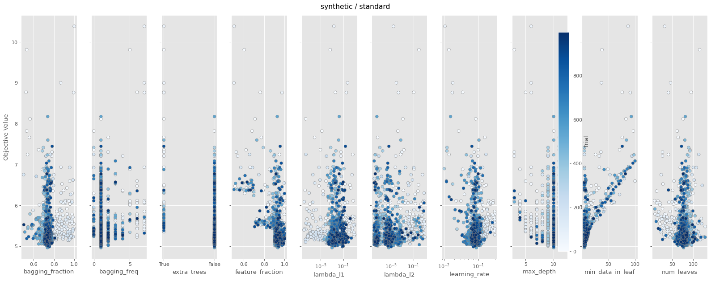
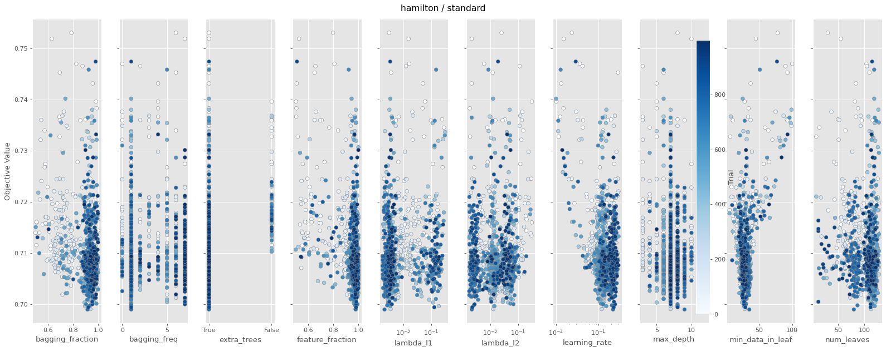
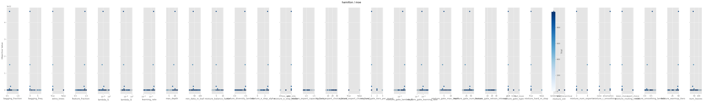
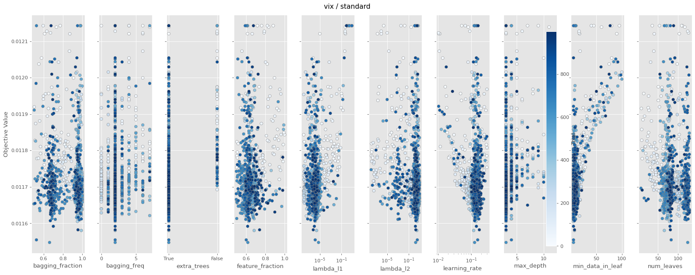

# Comparative Study Report — Standard GBDT vs MoE

- **Trials per (variant × dataset)**: 1000

- **Datasets**: ['synthetic', 'hamilton', 'vix']

- **n_splits**: 5, **rounds**: 100

---

## Headline: which variant wins?

| Dataset | Variant | best RMSE | median RMSE | median train s/fold | wall s |
|---|---|---|---|---|---|
| synthetic | standard | 4.9635 | 5.2951 | 0.231 | 198 |
| synthetic | moe | 3.4106 | 4.2169 | 0.251 | 266 |
| hamilton | standard | 0.6990 | 0.7085 | 0.077 | 73 |
| hamilton | moe | 0.6985 | 0.7090 | 0.138 | 159 |
| vix | standard | 0.0115 | 0.0117 | 0.072 | 70 |
| vix | moe | 0.0115 | 0.0117 | 0.110 | 124 |

---

## synthetic  (X=[2000, 5])

### standard

- best RMSE: **4.9635**, median: 5.2951, p10: 5.0965
- train: median 0.231s/fold, mean 0.228s, p90 0.331s
- finite trials: 1000 / 1000

#### A. fANOVA importance (top 10)

| param | importance |
|---|---|
| `min_data_in_leaf` | 0.495 |
| `learning_rate` | 0.247 |
| `extra_trees` | 0.117 |
| `feature_fraction` | 0.096 |
| `bagging_fraction` | 0.023 |
| `bagging_freq` | 0.009 |
| `max_depth` | 0.008 |
| `num_leaves` | 0.004 |
| `lambda_l1` | 0.002 |
| `lambda_l2` | 0.000 |

All categorical breakdowns

**`extra_trees`**
| value | n | mean RMSE | std | min |
|---|---|---|---|---|
| False | 939 | 5.4439 | 0.4505 | 4.9635 |
| True | 61 | 6.2860 | 1.1370 | 5.3542 |

#### D. Numeric: quartile mean RMSE (sweet spot)

| param | Q1 | Q2 | Q3 | Q4 | best Q (range) |
|---|---|---|---|---|---|
| `learning_rate` | 5.6198 | 5.3849 | 5.4274 | 5.5489 | **Q2** [0.0695, 0.081] |
| `num_leaves` | 5.5792 | 5.4613 | 5.4166 | 5.5160 | **Q3** [79.0, 85.0] |
| `max_depth` | 5.7373 | 5.5123 | — | 5.4291 | **Q4** [10.0, ∞) |
| `min_data_in_leaf` | — | 5.3341 | 5.3514 | 5.8884 | **Q2** [5.0, 7.0] |
| `lambda_l1` | 5.5176 | 5.4502 | 5.4520 | 5.5613 | **Q2** [0.0009, 0.0038] |
| `lambda_l2` | 5.4616 | 5.4783 | 5.4179 | 5.6232 | **Q3** [0.0, 0.0002] |
| `feature_fraction` | 5.8843 | 5.3500 | 5.3389 | 5.4079 | **Q3** [0.9253, 0.9457] |
| `bagging_fraction` | 5.5170 | 5.4304 | 5.4428 | 5.5909 | **Q2** [0.7186, 0.7381] |

#### E. Slice plot

### moe

- best RMSE: **3.4106**, median: 4.2169, p10: 3.7407
- train: median 0.251s/fold, mean 0.299s, p90 0.383s
- finite trials: 1000 / 1000

#### A. fANOVA importance (top 10)

| param | importance |
|---|---|
| `min_data_in_leaf` | 0.868 |
| `mixture_gate_type` | 0.034 |
| `mixture_diversity_lambda` | 0.017 |
| `mixture_num_experts` | 0.015 |
| `max_depth` | 0.015 |
| `num_leaves` | 0.009 |
| `learning_rate` | 0.008 |
| `feature_fraction` | 0.007 |
| `mixture_routing_mode` | 0.007 |
| `mixture_init` | 0.006 |

All categorical breakdowns

**`mixture_gate_type`**
| value | n | mean RMSE | std | min |
|---|---|---|---|---|
| leaf_reuse | 51 | 6.9983 | 1.2457 | 5.8152 |
| gbdt | 893 | 8.7625 | 90.3901 | 3.4106 |
| none | 56 | 9.8264 | 2.6797 | 5.7152 |

**`mixture_routing_mode`**
| value | n | mean RMSE | std | min |
|---|---|---|---|---|
| expert_choice | 84 | 6.1791 | 1.6566 | 3.7792 |
| token_choice | 916 | 8.9662 | 89.2473 | 3.4106 |

**`mixture_e_step_mode`**
| value | n | mean RMSE | std | min |
|---|---|---|---|---|
| loss_only | 144 | 4.9534 | 1.7495 | 3.7681 |
| gate_only | 128 | 5.1170 | 1.1838 | 3.9697 |
| em | 728 | 10.1152 | 100.0762 | 3.4106 |

**`mixture_init`**
| value | n | mean RMSE | std | min |
|---|---|---|---|---|
| tree_hierarchical | 139 | 5.7101 | 2.2601 | 3.6531 |
| random | 51 | 6.2121 | 0.6742 | 5.4224 |
| gmm | 810 | 9.4094 | 94.8953 | 3.4106 |

**`mixture_r_smoothing`**
| value | n | mean RMSE | std | min |
|---|---|---|---|---|
| ema | 152 | 5.0924 | 1.5542 | 3.8768 |
| none | 66 | 5.6501 | 2.1875 | 3.7824 |
| markov | 782 | 9.6997 | 96.5702 | 3.4106 |

**`mixture_hard_m_step`**
| value | n | mean RMSE | std | min |
|---|---|---|---|---|
| False | 84 | 7.4244 | 1.8293 | 5.0617 |
| True | 916 | 8.8520 | 89.2497 | 3.4106 |

**`extra_trees`**
| value | n | mean RMSE | std | min |
|---|---|---|---|---|
| False | 134 | 5.3277 | 1.2891 | 4.0392 |
| True | 866 | 9.2589 | 91.7801 | 3.4106 |

#### D. Numeric: quartile mean RMSE (sweet spot)

| param | Q1 | Q2 | Q3 | Q4 | best Q (range) |
|---|---|---|---|---|---|
| `mixture_num_experts` | — | — | — | 8.7321 | **Q4** [2.0, ∞) |
| `mixture_e_step_alpha` | 5.3275 | 4.9651 | 19.3166 | 5.3192 | **Q2** [0.189, 0.2775] |
| `mixture_diversity_lambda` | 4.8746 | 5.1875 | 19.2981 | 5.5682 | **Q1** [None, 0.2005] |
| `mixture_warmup_iters` | 5.6678 | 22.2821 | 4.9441 | 5.0691 | **Q3** [18.0, 23.0] |
| `mixture_balance_factor` | 5.1857 | 5.0715 | 16.8534 | 4.7785 | **Q4** [9.0, ∞) |
| `learning_rate` | 5.2498 | 4.8080 | 10.2880 | 14.5825 | **Q2** [0.2042, 0.2421] |
| `num_leaves` | 15.3536 | 4.9668 | 9.8763 | 5.2422 | **Q2** [23.0, 38.0] |
| `max_depth` | 6.3156 | 11.8531 | 11.4533 | 4.9004 | **Q4** [12.0, ∞) |
| `min_data_in_leaf` | 4.8687 | 4.5903 | 5.4854 | 18.1959 | **Q2** [7.0, 9.0] |

#### E. Slice plot

---

## hamilton  (X=[500, 12])

### standard

- best RMSE: **0.6990**, median: 0.7085, p10: 0.7035
- train: median 0.077s/fold, mean 0.078s, p90 0.097s
- finite trials: 1000 / 1000

#### A. fANOVA importance (top 10)

| param | importance |
|---|---|
| `min_data_in_leaf` | 0.798 |
| `learning_rate` | 0.114 |
| `feature_fraction` | 0.028 |
| `extra_trees` | 0.019 |
| `bagging_fraction` | 0.018 |
| `lambda_l1` | 0.014 |
| `max_depth` | 0.003 |
| `bagging_freq` | 0.003 |
| `num_leaves` | 0.002 |
| `lambda_l2` | 0.001 |

All categorical breakdowns

**`extra_trees`**
| value | n | mean RMSE | std | min |
|---|---|---|---|---|
| True | 932 | 0.7098 | 0.0073 | 0.6990 |
| False | 68 | 0.7205 | 0.0075 | 0.7102 |

#### D. Numeric: quartile mean RMSE (sweet spot)

| param | Q1 | Q2 | Q3 | Q4 | best Q (range) |
|---|---|---|---|---|---|
| `learning_rate` | 0.7132 | 0.7091 | 0.7095 | 0.7104 | **Q2** [0.1071, 0.131] |
| `num_leaves` | 0.7128 | 0.7102 | 0.7089 | 0.7102 | **Q3** [110.0, 116.0] |
| `max_depth` | 0.7119 | — | 0.7093 | 0.7113 | **Q3** [7.0, 8.0] |
| `min_data_in_leaf` | 0.7122 | 0.7082 | 0.7077 | 0.7149 | **Q3** [28.0, 32.0] |
| `lambda_l1` | 0.7095 | 0.7096 | 0.7111 | 0.7120 | **Q1** [None, 0.0] |
| `lambda_l2` | 0.7104 | 0.7106 | 0.7093 | 0.7119 | **Q3** [0.0, 0.0026] |
| `feature_fraction` | 0.7150 | 0.7099 | 0.7087 | 0.7085 | **Q4** [0.9819, ∞) |
| `bagging_fraction` | 0.7143 | 0.7092 | 0.7088 | 0.7098 | **Q3** [0.931, 0.9563] |

#### E. Slice plot

### moe

- best RMSE: **0.6985**, median: 0.7090, p10: 0.7037
- train: median 0.138s/fold, mean 0.171s, p90 0.282s
- finite trials: 1000 / 1000

#### A. fANOVA importance (top 10)

| param | importance |
|---|---|
| `learning_rate` | 0.529 |
| `mixture_diversity_lambda` | 0.163 |
| `bagging_fraction` | 0.077 |
| `lambda_l1` | 0.066 |
| `mixture_warmup_iters` | 0.063 |
| `min_data_in_leaf` | 0.040 |
| `feature_fraction` | 0.034 |
| `mixture_e_step_alpha` | 0.014 |
| `mixture_num_experts` | 0.011 |
| `max_depth` | 0.003 |

All categorical breakdowns

**`mixture_gate_type`**
| value | n | mean RMSE | std | min |
|---|---|---|---|---|
| none | 60 | 0.7147 | 0.0115 | 0.7037 |
| leaf_reuse | 189 | 35.7200 | 433.3245 | 0.7042 |
| gbdt | 751 | 8571925924.7641 | 178248149100.8036 | 0.6985 |

**`mixture_routing_mode`**
| value | n | mean RMSE | std | min |
|---|---|---|---|---|
| expert_choice | 92 | 0.7157 | 0.0113 | 0.7023 |
| token_choice | 908 | 7089775744.7422 | 162139521423.8254 | 0.6985 |

**`mixture_e_step_mode`**
| value | n | mean RMSE | std | min |
|---|---|---|---|---|
| loss_only | 79 | 0.7158 | 0.0121 | 0.7037 |
| em | 108 | 61.9760 | 571.8296 | 0.7055 |
| gate_only | 813 | 7918224316.7796 | 171331815951.5767 | 0.6985 |

**`mixture_init`**
| value | n | mean RMSE | std | min |
|---|---|---|---|---|
| gmm | 99 | 7.4657 | 66.8241 | 0.7042 |
| tree_hierarchical | 57 | 104.9222 | 779.7267 | 0.7057 |
| random | 844 | 7627389063.4741 | 168162479499.2248 | 0.6985 |

**`mixture_r_smoothing`**
| value | n | mean RMSE | std | min |
|---|---|---|---|---|
| ema | 327 | 20.9465 | 329.8888 | 0.7016 |
| none | 187 | 1168396470.5627 | 15932302012.8752 | 0.6993 |
| markov | 486 | 12796350266.3520 | 221242992663.8492 | 0.6985 |

**`mixture_hard_m_step`**
| value | n | mean RMSE | std | min |
|---|---|---|---|---|
| False | 424 | 16.3200 | 289.8312 | 0.7008 |
| True | 576 | 11176243696.8266 | 203460978794.3539 | 0.6985 |

**`extra_trees`**
| value | n | mean RMSE | std | min |
|---|---|---|---|---|
| False | 63 | 0.7199 | 0.0125 | 0.7078 |
| True | 937 | 6870348320.4338 | 159615427398.1370 | 0.6985 |

#### D. Numeric: quartile mean RMSE (sweet spot)

| param | Q1 | Q2 | Q3 | Q4 | best Q (range) |
|---|---|---|---|---|---|
| `mixture_num_experts` | — | — | 9029835089.2729 | 3307277223.9724 | **Q4** [3.0, ∞) |
| `mixture_e_step_alpha` | 3.4313 | 284878390.9501 | 19472396086.7820 | 5992791024.0037 | **Q1** [None, 2.3962] |
| `mixture_diversity_lambda` | 3.4006 | 284701635.5120 | 24591231541.4841 | 874132324.7705 | **Q1** [None, 0.3934] |
| `mixture_warmup_iters` | 28.4026 | 0.7136 | 1485667643.7122 | 16221137675.0561 | **Q2** [34.0, 46.0] |
| `mixture_balance_factor` | 6.3771 | 40.3677 | 14370806479.6772 | 246536674.6961 | **Q1** [None, 4.0] |
| `learning_rate` | 3.4254 | 24.4804 | 17879.5842 | 25750047597.6771 | **Q1** [None, 0.1002] |
| `num_leaves` | 950124397.8090 | 23205173797.2380 | 4702.5509 | 27.0743 | **Q4** [98.0, ∞) |
| `max_depth` | 4.5395 | 1126068462.8065 | 4802158850.3778 | 14892067925.5078 | **Q1** [None, 7.0] |
| `min_data_in_leaf` | 194367.5992 | 0.7538 | 5369880221.0039 | 18092584882.8576 | **Q2** [28.0, 32.0] |

#### E. Slice plot

---

## vix  (X=[1000, 5])

### standard

- best RMSE: **0.0115**, median: 0.0117, p10: 0.0117
- train: median 0.072s/fold, mean 0.075s, p90 0.098s
- finite trials: 1000 / 1000

#### A. fANOVA importance (top 10)

| param | importance |
|---|---|
| `min_data_in_leaf` | 0.479 |
| `lambda_l1` | 0.476 |
| `learning_rate` | 0.014 |
| `num_leaves` | 0.009 |
| `feature_fraction` | 0.009 |
| `bagging_fraction` | 0.005 |
| `lambda_l2` | 0.004 |
| `bagging_freq` | 0.003 |
| `max_depth` | 0.001 |
| `extra_trees` | 0.000 |

All categorical breakdowns

**`extra_trees`**
| value | n | mean RMSE | std | min |
|---|---|---|---|---|
| True | 897 | 0.0117 | 0.0001 | 0.0115 |
| False | 103 | 0.0118 | 0.0001 | 0.0117 |

#### D. Numeric: quartile mean RMSE (sweet spot)

| param | Q1 | Q2 | Q3 | Q4 | best Q (range) |
|---|---|---|---|---|---|
| `learning_rate` | 0.0118 | 0.0117 | 0.0117 | 0.0117 | **Q2** [0.1109, 0.1304] |
| `num_leaves` | 0.0118 | 0.0117 | 0.0117 | 0.0117 | **Q2** [71.0, 80.0] |
| `max_depth` | — | — | 0.0117 | 0.0118 | **Q3** [3.0, 4.0] |
| `min_data_in_leaf` | 0.0117 | 0.0117 | 0.0117 | 0.0118 | **Q1** [None, 7.0] |
| `lambda_l1` | 0.0117 | 0.0117 | 0.0117 | 0.0118 | **Q1** [None, 0.0] |
| `lambda_l2` | 0.0118 | 0.0117 | 0.0117 | 0.0117 | **Q2** [0.1356, 1.6057] |
| `feature_fraction` | 0.0117 | 0.0117 | 0.0117 | 0.0118 | **Q1** [None, 0.6072] |
| `bagging_fraction` | 0.0118 | 0.0118 | 0.0117 | 0.0117 | **Q3** [0.9486, 0.9756] |

#### E. Slice plot

### moe

- best RMSE: **0.0115**, median: 0.0117, p10: 0.0116
- train: median 0.110s/fold, mean 0.131s, p90 0.219s
- finite trials: 1000 / 1000

#### A. fANOVA importance (top 10)

| param | importance |
|---|---|
| `lambda_l1` | 0.442 |
| `mixture_diversity_lambda` | 0.198 |
| `mixture_gate_type` | 0.088 |
| `lambda_l2` | 0.075 |
| `min_data_in_leaf` | 0.036 |
| `bagging_fraction` | 0.034 |
| `mixture_warmup_iters` | 0.033 |
| `learning_rate` | 0.028 |
| `num_leaves` | 0.015 |
| `mixture_init` | 0.014 |

All categorical breakdowns

**`mixture_gate_type`**
| value | n | mean RMSE | std | min |
|---|---|---|---|---|
| none | 739 | 0.0121 | 0.0022 | 0.0115 |
| gbdt | 110 | 0.0127 | 0.0031 | 0.0115 |
| leaf_reuse | 151 | 0.0132 | 0.0057 | 0.0116 |

**`mixture_routing_mode`**
| value | n | mean RMSE | std | min |
|---|---|---|---|---|
| token_choice | 654 | 0.0123 | 0.0025 | 0.0115 |
| expert_choice | 346 | 0.0125 | 0.0040 | 0.0116 |

**`mixture_e_step_mode`**
| value | n | mean RMSE | std | min |
|---|---|---|---|---|
| gate_only | 644 | 0.0123 | 0.0026 | 0.0115 |
| loss_only | 92 | 0.0125 | 0.0027 | 0.0116 |
| em | 264 | 0.0125 | 0.0042 | 0.0116 |

**`mixture_init`**
| value | n | mean RMSE | std | min |
|---|---|---|---|---|
| gmm | 645 | 0.0122 | 0.0024 | 0.0115 |
| random | 287 | 0.0124 | 0.0024 | 0.0116 |
| tree_hierarchical | 68 | 0.0142 | 0.0077 | 0.0115 |

**`mixture_r_smoothing`**
| value | n | mean RMSE | std | min |
|---|---|---|---|---|
| none | 383 | 0.0123 | 0.0035 | 0.0116 |
| ema | 553 | 0.0124 | 0.0028 | 0.0115 |
| markov | 64 | 0.0126 | 0.0029 | 0.0116 |

**`mixture_hard_m_step`**
| value | n | mean RMSE | std | min |
|---|---|---|---|---|
| False | 723 | 0.0123 | 0.0026 | 0.0115 |
| True | 277 | 0.0126 | 0.0042 | 0.0116 |

**`extra_trees`**
| value | n | mean RMSE | std | min |
|---|---|---|---|---|
| True | 927 | 0.0122 | 0.0029 | 0.0115 |
| False | 73 | 0.0146 | 0.0048 | 0.0116 |

#### D. Numeric: quartile mean RMSE (sweet spot)

| param | Q1 | Q2 | Q3 | Q4 | best Q (range) |
|---|---|---|---|---|---|
| `mixture_num_experts` | 0.0133 | — | — | 0.0122 | **Q4** [3.0, ∞) |
| `mixture_e_step_alpha` | 0.0124 | 0.0120 | 0.0124 | 0.0127 | **Q2** [0.7554, 1.0635] |
| `mixture_diversity_lambda` | 0.0128 | 0.0125 | 0.0122 | 0.0120 | **Q4** [0.473, ∞) |
| `mixture_warmup_iters` | 0.0131 | 0.0121 | 0.0121 | 0.0123 | **Q2** [28.0, 31.0] |
| `mixture_balance_factor` | 0.0126 | — | 0.0121 | 0.0127 | **Q3** [7.0, 8.0] |
| `learning_rate` | 0.0127 | 0.0124 | 0.0122 | 0.0120 | **Q4** [0.2628, ∞) |
| `num_leaves` | 0.0129 | 0.0121 | 0.0122 | 0.0123 | **Q2** [85.0, 102.0] |
| `max_depth` | — | — | 0.0123 | 0.0126 | **Q3** [3.0, 3.25] |
| `min_data_in_leaf` | 0.0122 | 0.0122 | 0.0120 | 0.0130 | **Q3** [11.0, 15.0] |

#### E. Slice plot

---

## Overall recommendations

(no categorical settings were universally significant — see per-dataset breakdown)

