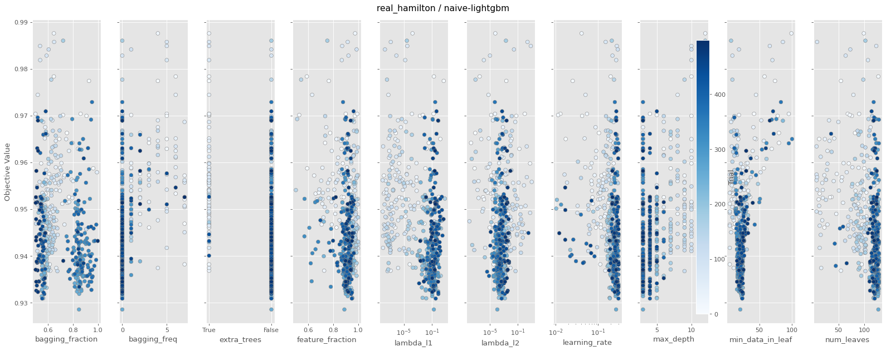
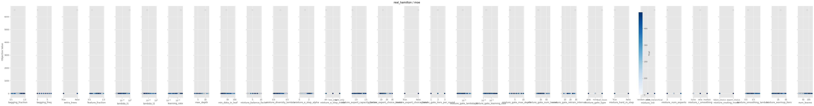
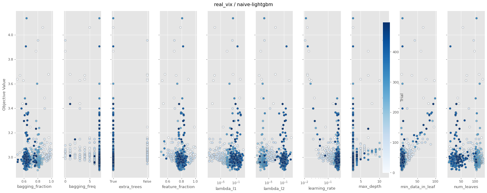
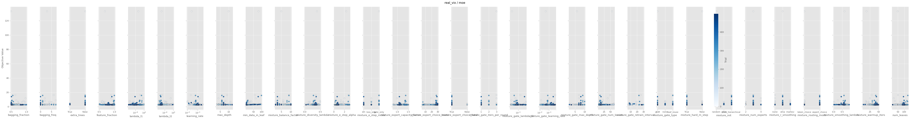

# Comparative Study Report — Standard GBDT vs MoE

- **Trials per (variant × dataset)**: 500

- **Datasets**: ['synthetic', 'real_hamilton', 'sp500', 'real_vix', 'hmm']

- **n_splits**: 5, **rounds**: 100

---

## Headline: which variant wins?

| Dataset | Variant | best RMSE | median RMSE | median train s/fold | wall s |
|---|---|---|---|---|---|
| synthetic | naive-lightgbm | 4.9765 | 5.2912 | 0.240 | 104 |
| synthetic | moe | 4.6651 | 5.3076 | 0.663 | 352 |
| real_hamilton | naive-lightgbm | 0.9286 | 0.9447 | 0.055 | 27 |
| real_hamilton | moe | 0.9128 | 0.9577 | 0.122 | 67 |
| sp500 | naive-lightgbm | 0.0100 | 0.0101 | 0.091 | 47 |
| sp500 | moe | 0.0100 | 0.0101 | 0.136 | 78 |
| real_vix | naive-lightgbm | 2.8942 | 2.9881 | 0.081 | 43 |
| real_vix | moe | 2.4574 | 2.7548 | 0.386 | 204 |
| hmm | naive-lightgbm | 2.1893 | 2.2050 | 0.074 | 35 |
| hmm | moe | 2.1096 | 2.1423 | 0.126 | 75 |

---

## synthetic  (X=[2000, 5])

### naive-lightgbm

- best RMSE: **4.9765**, median: 5.2912, p10: 5.0788
- train: median 0.240s/fold, mean 0.239s, p90 0.371s
- finite trials: 500 / 500

#### A. fANOVA importance (top 10)

| param | importance |
|---|---|
| `learning_rate` | 0.557 |
| `min_data_in_leaf` | 0.387 |
| `feature_fraction` | 0.044 |
| `bagging_fraction` | 0.004 |
| `num_leaves` | 0.003 |
| `max_depth` | 0.003 |
| `extra_trees` | 0.001 |
| `lambda_l1` | 0.001 |
| `bagging_freq` | 0.001 |
| `lambda_l2` | 0.000 |

All categorical breakdowns

**`extra_trees`**
| value | n | mean RMSE | std | min |
|---|---|---|---|---|
| False | 466 | 5.4425 | 0.4985 | 4.9765 |
| True | 34 | 6.4464 | 1.2350 | 5.4468 |

#### D. Numeric: quartile mean RMSE (sweet spot)

| param | Q1 | Q2 | Q3 | Q4 | best Q (range) |
|---|---|---|---|---|---|
| `learning_rate` | 5.7990 | 5.3438 | 5.3896 | 5.5107 | **Q2** [0.0704, 0.0808] |
| `num_leaves` | 5.7467 | 5.4234 | 5.3927 | 5.4791 | **Q3** [93.0, 102.0] |
| `max_depth` | 5.8960 | 5.5671 | 5.4174 | 5.4110 | **Q4** [11.0, ∞) |
| `min_data_in_leaf` | — | 5.2793 | 5.3417 | 6.0692 | **Q2** [5.0, 7.0] |
| `lambda_l1` | 5.5802 | 5.5437 | 5.3884 | 5.5307 | **Q3** [0.0026, 0.0394] |
| `lambda_l2` | 5.4412 | 5.3764 | 5.4482 | 5.7773 | **Q2** [0.0, 0.0] |
| `feature_fraction` | 5.9511 | 5.3431 | 5.4176 | 5.3313 | **Q4** [0.9784, ∞) |
| `bagging_fraction` | 5.6010 | 5.4379 | 5.4503 | 5.5539 | **Q2** [0.7367, 0.7579] |

#### E. Slice plot

### moe

- best RMSE: **4.6651**, median: 5.3076, p10: 4.9462
- train: median 0.663s/fold, mean 0.799s, p90 1.203s
- finite trials: 500 / 500

#### A. fANOVA importance (top 10)

| param | importance |
|---|---|
| `feature_fraction` | 0.659 |
| `mixture_hard_m_step` | 0.164 |
| `mixture_diversity_lambda` | 0.037 |
| `bagging_freq` | 0.022 |
| `mixture_init` | 0.021 |
| `num_leaves` | 0.019 |
| `mixture_r_smoothing` | 0.016 |
| `mixture_e_step_alpha` | 0.013 |
| `mixture_warmup_iters` | 0.012 |
| `mixture_gate_type` | 0.009 |

#### B. Categorical: clearly best values (p<0.01)

| param | best | mean RMSE | runner-up | Δ | p |
|---|---|---|---|---|---|
| `mixture_e_step_mode` | **loss_only** | 5.6080 (n=366) | em | Δ +0.7822 | p=6.02e-03 |
| `mixture_init` | **random** | 6.2068 (n=40) | gmm | Δ +1.2843 | p=1.72e-03 |
| `mixture_r_smoothing` | **ema** | 5.8536 (n=146) | markov | Δ +0.7946 | p=8.13e-03 |

All categorical breakdowns

**`mixture_gate_type`**
| value | n | mean RMSE | std | min |
|---|---|---|---|---|
| none | 34 | 6.2657 | 1.4558 | 4.9934 |
| leaf_reuse | 103 | 6.3152 | 1.6014 | 5.0019 |
| gbdt | 363 | 252563550.7654 | 4805349172.8910 | 4.6651 |

**`mixture_routing_mode`**
| value | n | mean RMSE | std | min |
|---|---|---|---|---|
| expert_choice | 36 | 6.6252 | 1.4847 | 5.0927 |
| token_choice | 464 | 197587434.3811 | 4251574613.4647 | 4.6651 |

**`mixture_e_step_mode`**
| value | n | mean RMSE | std | min |
|---|---|---|---|---|
| loss_only | 366 | 5.6080 | 1.0060 | 4.7346 |
| em | 32 | 6.3902 | 1.4560 | 4.9934 |
| gate_only | 102 | 898829093.4739 | 9033120534.9352 | 4.6651 |

**`mixture_init`**
| value | n | mean RMSE | std | min |
|---|---|---|---|---|
| random | 40 | 6.2068 | 0.9158 | 5.1332 |
| gmm | 26 | 7.4911 | 1.7383 | 5.3074 |
| tree_hierarchical | 434 | 211245551.4938 | 4395735061.7165 | 4.6651 |

**`mixture_r_smoothing`**
| value | n | mean RMSE | std | min |
|---|---|---|---|---|
| ema | 146 | 5.8536 | 1.3266 | 4.8925 |
| markov | 40 | 6.6482 | 1.6679 | 4.9758 |
| none | 314 | 291976333.3465 | 5165588552.1186 | 4.6651 |

**`mixture_hard_m_step`**
| value | n | mean RMSE | std | min |
|---|---|---|---|---|
| False | 466 | 5.5061 | 0.7756 | 4.6651 |
| True | 34 | 2696487271.3380 | 15490140006.1246 | 5.5212 |

**`extra_trees`**
| value | n | mean RMSE | std | min |
|---|---|---|---|---|
| True | 33 | 6.8015 | 1.3689 | 5.3525 |
| False | 467 | 196318136.1176 | 4237925989.6381 | 4.6651 |

#### D. Numeric: quartile mean RMSE (sweet spot)

| param | Q1 | Q2 | Q3 | Q4 | best Q (range) |
|---|---|---|---|---|---|
| `mixture_num_experts` | 6.6442 | — | — | 204644128.2273 | **Q1** [None, 4.0] |
| `mixture_e_step_alpha` | 733444541.4518 | 5.6369 | 5.4792 | 5.7630 | **Q3** [2.5929, 2.7035] |
| `mixture_diversity_lambda` | 5.6469 | 5.5104 | 5.6602 | 733444541.5134 | **Q2** [0.243, 0.2829] |
| `mixture_warmup_iters` | 6.4032 | 5.4398 | 5.5781 | 689327576.3948 | **Q2** [43.0, 45.0] |
| `mixture_balance_factor` | 1580699436.0863 | — | 5.5126 | 6.0029 | **Q3** [6.0, 7.0] |
| `learning_rate` | 5.8121 | 5.5199 | 5.6255 | 733444541.3733 | **Q2** [0.0399, 0.0458] |
| `num_leaves` | 5.9845 | 797222327.2530 | 5.3888 | 5.4537 | **Q3** [111.0, 118.25] |
| `max_depth` | 6.3022 | 916805674.8790 | — | 5.5312 | **Q4** [12.0, ∞) |
| `min_data_in_leaf` | 5.6239 | 5.3966 | 5.6322 | 694549755.6736 | **Q2** [9.0, 12.0] |

#### E. Slice plot

---

## real_hamilton  (X=[311, 12])

### naive-lightgbm

- best RMSE: **0.9286**, median: 0.9447, p10: 0.9354
- train: median 0.055s/fold, mean 0.057s, p90 0.076s
- finite trials: 500 / 500

#### A. fANOVA importance (top 10)

| param | importance |
|---|---|
| `min_data_in_leaf` | 0.796 |
| `max_depth` | 0.043 |
| `learning_rate` | 0.032 |
| `extra_trees` | 0.030 |
| `bagging_freq` | 0.029 |
| `lambda_l2` | 0.023 |
| `bagging_fraction` | 0.021 |
| `feature_fraction` | 0.017 |
| `num_leaves` | 0.009 |
| `lambda_l1` | 0.002 |

All categorical breakdowns

**`extra_trees`**
| value | n | mean RMSE | std | min |
|---|---|---|---|---|
| False | 419 | 0.9452 | 0.0098 | 0.9286 |
| True | 81 | 0.9561 | 0.0109 | 0.9369 |

#### D. Numeric: quartile mean RMSE (sweet spot)

| param | Q1 | Q2 | Q3 | Q4 | best Q (range) |
|---|---|---|---|---|---|
| `learning_rate` | 0.9527 | 0.9462 | 0.9437 | 0.9455 | **Q3** [0.2295, 0.2635] |
| `num_leaves` | 0.9532 | 0.9487 | 0.9448 | 0.9419 | **Q4** [124.0, ∞) |
| `max_depth` | — | 0.9433 | 0.9454 | 0.9542 | **Q2** [3.0, 4.0] |
| `min_data_in_leaf` | 0.9516 | 0.9414 | 0.9411 | 0.9527 | **Q3** [22.0, 25.0] |
| `lambda_l1` | 0.9533 | 0.9469 | 0.9429 | 0.9450 | **Q3** [0.0364, 0.2078] |
| `lambda_l2` | 0.9501 | 0.9423 | 0.9450 | 0.9505 | **Q2** [0.0001, 0.0004] |
| `feature_fraction` | 0.9512 | 0.9428 | 0.9454 | 0.9485 | **Q2** [0.8861, 0.9158] |
| `bagging_fraction` | 0.9461 | 0.9477 | 0.9510 | 0.9431 | **Q4** [0.8373, ∞) |

#### E. Slice plot

### moe

- best RMSE: **0.9128**, median: 0.9577, p10: 0.9412
- train: median 0.122s/fold, mean 0.144s, p90 0.194s
- finite trials: 500 / 500

#### A. fANOVA importance (top 10)

| param | importance |
|---|---|
| `lambda_l1` | 0.758 |
| `min_data_in_leaf` | 0.108 |
| `mixture_init` | 0.034 |
| `learning_rate` | 0.020 |
| `feature_fraction` | 0.018 |
| `bagging_freq` | 0.013 |
| `mixture_e_step_alpha` | 0.013 |
| `max_depth` | 0.013 |
| `mixture_diversity_lambda` | 0.012 |
| `mixture_warmup_iters` | 0.011 |

#### B. Categorical: clearly best values (p<0.01)

| param | best | mean RMSE | runner-up | Δ | p |
|---|---|---|---|---|---|
| `mixture_init` | **gmm** | 0.9708 (n=417) | random | Δ +0.0276 | p=1.48e-04 |

All categorical breakdowns

**`mixture_gate_type`**
| value | n | mean RMSE | std | min |
|---|---|---|---|---|
| gbdt | 367 | 0.9735 | 0.0511 | 0.9128 |
| none | 94 | 0.9881 | 0.0501 | 0.9394 |
| leaf_reuse | 39 | 168.3754 | 1031.4691 | 0.9371 |

**`mixture_routing_mode`**
| value | n | mean RMSE | std | min |
|---|---|---|---|---|
| token_choice | 56 | 0.9910 | 0.0608 | 0.9370 |
| expert_choice | 444 | 15.6786 | 309.3517 | 0.9128 |

**`mixture_e_step_mode`**
| value | n | mean RMSE | std | min |
|---|---|---|---|---|
| gate_only | 317 | 0.9733 | 0.0511 | 0.9264 |
| loss_only | 72 | 0.9843 | 0.0674 | 0.9128 |
| em | 111 | 59.7964 | 616.6025 | 0.9306 |

**`mixture_init`**
| value | n | mean RMSE | std | min |
|---|---|---|---|---|
| gmm | 417 | 0.9708 | 0.0470 | 0.9128 |
| random | 55 | 0.9984 | 0.0474 | 0.9474 |
| tree_hierarchical | 28 | 234.1808 | 1211.0108 | 0.9399 |

**`mixture_r_smoothing`**
| value | n | mean RMSE | std | min |
|---|---|---|---|---|
| markov | 62 | 0.9886 | 0.0549 | 0.9368 |
| none | 58 | 0.9986 | 0.0610 | 0.9458 |
| ema | 380 | 18.1516 | 334.3257 | 0.9128 |

**`mixture_hard_m_step`**
| value | n | mean RMSE | std | min |
|---|---|---|---|---|
| False | 447 | 0.9729 | 0.0504 | 0.9128 |
| True | 53 | 124.1875 | 887.8795 | 0.9474 |

**`extra_trees`**
| value | n | mean RMSE | std | min |
|---|---|---|---|---|
| True | 445 | 0.9728 | 0.0498 | 0.9128 |
| False | 55 | 119.7078 | 871.8918 | 0.9474 |

#### D. Numeric: quartile mean RMSE (sweet spot)

| param | Q1 | Q2 | Q3 | Q4 | best Q (range) |
|---|---|---|---|---|---|
| `mixture_num_experts` | — | — | — | 14.0336 | **Q4** [2.0, ∞) |
| `mixture_e_step_alpha` | 53.2242 | 0.9688 | 0.9673 | 0.9742 | **Q3** [2.1809, 2.3162] |
| `mixture_diversity_lambda` | 0.9761 | 0.9616 | 0.9970 | 53.1998 | **Q2** [0.145, 0.1883] |
| `mixture_warmup_iters` | 0.9807 | 0.9755 | 0.9638 | 45.7022 | **Q3** [24.0, 27.0] |
| `mixture_balance_factor` | 0.9916 | 126.5398 | — | 0.9711 | **Q4** [6.0, ∞) |
| `learning_rate` | 0.9993 | 53.1976 | 0.9717 | 0.9659 | **Q4** [0.271, ∞) |
| `num_leaves` | 0.9840 | 0.9793 | 58.7495 | 0.9687 | **Q4** [99.0, ∞) |
| `max_depth` | 0.9904 | 0.9824 | 0.9709 | 36.0742 | **Q3** [6.0, 7.0] |
| `min_data_in_leaf` | 0.9609 | 0.9501 | 0.9588 | 51.6408 | **Q2** [19.0, 22.0] |

#### E. Slice plot

---

## sp500  (X=[3761, 13])

### naive-lightgbm

- best RMSE: **0.0100**, median: 0.0101, p10: 0.0100
- train: median 0.091s/fold, mean 0.106s, p90 0.159s
- finite trials: 500 / 500

#### A. fANOVA importance (top 10)

| param | importance |
|---|---|
| `extra_trees` | 0.470 |
| `learning_rate` | 0.270 |
| `max_depth` | 0.131 |
| `min_data_in_leaf` | 0.042 |
| `num_leaves` | 0.028 |
| `feature_fraction` | 0.024 |
| `bagging_fraction` | 0.019 |
| `lambda_l1` | 0.011 |
| `bagging_freq` | 0.003 |
| `lambda_l2` | 0.003 |

All categorical breakdowns

**`extra_trees`**
| value | n | mean RMSE | std | min |
|---|---|---|---|---|
| True | 468 | 0.0101 | 0.0000 | 0.0100 |
| False | 32 | 0.0101 | 0.0000 | 0.0100 |

#### D. Numeric: quartile mean RMSE (sweet spot)

| param | Q1 | Q2 | Q3 | Q4 | best Q (range) |
|---|---|---|---|---|---|
| `learning_rate` | 0.0101 | 0.0101 | 0.0101 | 0.0101 | **Q1** [None, 0.0842] |
| `num_leaves` | 0.0101 | 0.0101 | 0.0101 | 0.0101 | **Q1** [None, 48.0] |
| `max_depth` | 0.0101 | 0.0101 | 0.0101 | 0.0101 | **Q1** [None, 5.0] |
| `min_data_in_leaf` | 0.0101 | 0.0101 | 0.0101 | 0.0101 | **Q1** [None, 14.0] |
| `lambda_l1` | 0.0101 | 0.0101 | 0.0101 | 0.0101 | **Q1** [None, 0.0001] |
| `lambda_l2` | 0.0101 | 0.0101 | 0.0101 | 0.0101 | **Q1** [None, 0.0] |
| `feature_fraction` | 0.0101 | 0.0101 | 0.0101 | 0.0101 | **Q1** [None, 0.5678] |
| `bagging_fraction` | 0.0101 | 0.0101 | 0.0101 | 0.0101 | **Q1** [None, 0.6425] |

#### E. Slice plot

### moe

- best RMSE: **0.0100**, median: 0.0101, p10: 0.0100
- train: median 0.136s/fold, mean 0.173s, p90 0.254s
- finite trials: 500 / 500

#### A. fANOVA importance (top 10)

| param | importance |
|---|---|
| `mixture_init` | 0.624 |
| `learning_rate` | 0.348 |
| `feature_fraction` | 0.006 |
| `mixture_e_step_alpha` | 0.004 |
| `mixture_diversity_lambda` | 0.003 |
| `num_leaves` | 0.003 |
| `min_data_in_leaf` | 0.002 |
| `extra_trees` | 0.002 |
| `mixture_warmup_iters` | 0.002 |
| `mixture_gate_type` | 0.002 |

#### B. Categorical: clearly best values (p<0.01)

| param | best | mean RMSE | runner-up | Δ | p |
|---|---|---|---|---|---|
| `mixture_gate_type` | **leaf_reuse** | 0.0101 (n=72) | gbdt | Δ +0.0000 | p=2.71e-03 |
| `mixture_init` | **random** | 0.0101 (n=438) | gmm | Δ +0.0000 | p=0.00e+00 |

All categorical breakdowns

**`mixture_gate_type`**
| value | n | mean RMSE | std | min |
|---|---|---|---|---|
| leaf_reuse | 72 | 0.0101 | 0.0000 | 0.0100 |
| gbdt | 102 | 0.0101 | 0.0000 | 0.0100 |
| none | 326 | 0.0101 | 0.0000 | 0.0100 |

**`mixture_routing_mode`**
| value | n | mean RMSE | std | min |
|---|---|---|---|---|
| expert_choice | 389 | 0.0101 | 0.0000 | 0.0100 |
| token_choice | 111 | 0.0101 | 0.0000 | 0.0100 |

**`mixture_e_step_mode`**
| value | n | mean RMSE | std | min |
|---|---|---|---|---|
| gate_only | 331 | 0.0101 | 0.0000 | 0.0100 |
| loss_only | 136 | 0.0101 | 0.0000 | 0.0100 |
| em | 33 | 0.0101 | 0.0000 | 0.0101 |

**`mixture_init`**
| value | n | mean RMSE | std | min |
|---|---|---|---|---|
| random | 438 | 0.0101 | 0.0000 | 0.0100 |
| gmm | 32 | 0.0101 | 0.0000 | 0.0101 |
| tree_hierarchical | 30 | 0.0101 | 0.0001 | 0.0101 |

**`mixture_r_smoothing`**
| value | n | mean RMSE | std | min |
|---|---|---|---|---|
| ema | 298 | 0.0101 | 0.0000 | 0.0100 |
| markov | 48 | 0.0101 | 0.0000 | 0.0100 |
| none | 154 | 0.0101 | 0.0000 | 0.0100 |

**`mixture_hard_m_step`**
| value | n | mean RMSE | std | min |
|---|---|---|---|---|
| True | 109 | 0.0101 | 0.0000 | 0.0100 |
| False | 391 | 0.0101 | 0.0000 | 0.0100 |

**`extra_trees`**
| value | n | mean RMSE | std | min |
|---|---|---|---|---|
| True | 463 | 0.0101 | 0.0000 | 0.0100 |
| False | 37 | 0.0101 | 0.0000 | 0.0101 |

#### D. Numeric: quartile mean RMSE (sweet spot)

| param | Q1 | Q2 | Q3 | Q4 | best Q (range) |
|---|---|---|---|---|---|
| `mixture_num_experts` | — | — | — | 0.0101 | **Q4** [2.0, ∞) |
| `mixture_e_step_alpha` | 0.0101 | 0.0101 | 0.0101 | 0.0101 | **Q1** [None, 1.146] |
| `mixture_diversity_lambda` | 0.0101 | 0.0101 | 0.0101 | 0.0101 | **Q1** [None, 0.1355] |
| `mixture_warmup_iters` | 0.0101 | 0.0101 | 0.0101 | 0.0101 | **Q1** [None, 15.0] |
| `mixture_balance_factor` | 0.0101 | 0.0101 | — | 0.0101 | **Q1** [None, 5.0] |
| `learning_rate` | 0.0101 | 0.0101 | 0.0101 | 0.0101 | **Q1** [None, 0.1179] |
| `num_leaves` | 0.0101 | 0.0101 | 0.0101 | 0.0101 | **Q1** [None, 96.0] |
| `max_depth` | 0.0101 | — | 0.0101 | 0.0101 | **Q1** [None, 5.0] |
| `min_data_in_leaf` | 0.0101 | 0.0101 | 0.0101 | 0.0101 | **Q1** [None, 77.0] |

#### E. Slice plot

---

## real_vix  (X=[3762, 13])

### naive-lightgbm

- best RMSE: **2.8942**, median: 2.9881, p10: 2.9395
- train: median 0.081s/fold, mean 0.095s, p90 0.122s
- finite trials: 500 / 500

#### A. fANOVA importance (top 10)

| param | importance |
|---|---|
| `learning_rate` | 0.582 |
| `min_data_in_leaf` | 0.372 |
| `bagging_fraction` | 0.027 |
| `extra_trees` | 0.009 |
| `max_depth` | 0.003 |
| `feature_fraction` | 0.003 |
| `num_leaves` | 0.003 |
| `lambda_l1` | 0.001 |
| `bagging_freq` | 0.001 |
| `lambda_l2` | 0.000 |

All categorical breakdowns

**`extra_trees`**
| value | n | mean RMSE | std | min |
|---|---|---|---|---|
| True | 387 | 3.0118 | 0.1398 | 2.8942 |
| False | 113 | 3.0596 | 0.1504 | 2.9452 |

#### D. Numeric: quartile mean RMSE (sweet spot)

| param | Q1 | Q2 | Q3 | Q4 | best Q (range) |
|---|---|---|---|---|---|
| `learning_rate` | 3.0995 | 2.9979 | 2.9997 | 2.9934 | **Q4** [0.2667, ∞) |
| `num_leaves` | 3.0261 | 3.0405 | 3.0260 | 2.9980 | **Q4** [111.0, ∞) |
| `max_depth` | — | — | 3.0047 | 3.0732 | **Q3** [3.0, 4.0] |
| `min_data_in_leaf` | 2.9792 | 3.0028 | 2.9877 | 3.1103 | **Q1** [None, 8.0] |
| `lambda_l1` | 3.0360 | 2.9996 | 3.0281 | 3.0268 | **Q2** [0.0004, 0.0078] |
| `lambda_l2` | 3.0066 | 3.0199 | 3.0395 | 3.0246 | **Q1** [None, 0.0] |
| `feature_fraction` | 3.0542 | 2.9997 | 3.0011 | 3.0355 | **Q2** [0.7537, 0.7861] |
| `bagging_fraction` | 3.0314 | 3.0197 | 3.0099 | 3.0295 | **Q3** [0.752, 0.8247] |

#### E. Slice plot

### moe

- best RMSE: **2.4574**, median: 2.7548, p10: 2.6176
- train: median 0.386s/fold, mean 0.473s, p90 0.739s
- finite trials: 500 / 500

#### A. fANOVA importance (top 10)

| param | importance |
|---|---|
| `bagging_fraction` | 0.253 |
| `mixture_init` | 0.194 |
| `min_data_in_leaf` | 0.163 |
| `learning_rate` | 0.151 |
| `feature_fraction` | 0.126 |
| `mixture_e_step_alpha` | 0.039 |
| `mixture_diversity_lambda` | 0.021 |
| `mixture_warmup_iters` | 0.016 |
| `bagging_freq` | 0.009 |
| `mixture_gate_type` | 0.008 |

All categorical breakdowns

**`mixture_gate_type`**
| value | n | mean RMSE | std | min |
|---|---|---|---|---|
| gbdt | 429 | 3.1811 | 6.3463 | 2.4574 |
| none | 45 | 3.2790 | 1.0998 | 2.6501 |
| leaf_reuse | 26 | 4.4608 | 3.5246 | 2.6428 |

**`mixture_routing_mode`**
| value | n | mean RMSE | std | min |
|---|---|---|---|---|
| expert_choice | 434 | 2.9204 | 1.0802 | 2.4574 |
| token_choice | 66 | 5.4665 | 15.9631 | 2.5632 |

**`mixture_e_step_mode`**
| value | n | mean RMSE | std | min |
|---|---|---|---|---|
| em | 175 | 2.9265 | 0.9830 | 2.4929 |
| gate_only | 281 | 3.4318 | 7.8606 | 2.4574 |
| loss_only | 44 | 3.4489 | 1.7495 | 2.5350 |

**`mixture_init`**
| value | n | mean RMSE | std | min |
|---|---|---|---|---|
| random | 428 | 3.0930 | 6.3301 | 2.4574 |
| gmm | 28 | 3.5074 | 0.7718 | 2.9093 |
| tree_hierarchical | 44 | 4.6864 | 3.1117 | 2.8184 |

**`mixture_r_smoothing`**
| value | n | mean RMSE | std | min |
|---|---|---|---|---|
| ema | 420 | 3.1975 | 6.4266 | 2.4574 |
| markov | 26 | 3.4743 | 1.3737 | 2.7850 |
| none | 54 | 3.6103 | 2.3205 | 2.7667 |

**`mixture_hard_m_step`**
| value | n | mean RMSE | std | min |
|---|---|---|---|---|
| True | 445 | 2.9617 | 1.2729 | 2.4574 |
| False | 55 | 5.6416 | 17.3851 | 2.7761 |

**`extra_trees`**
| value | n | mean RMSE | std | min |
|---|---|---|---|---|
| True | 33 | 3.1005 | 0.4167 | 2.7685 |
| False | 467 | 3.2675 | 6.1546 | 2.4574 |

#### D. Numeric: quartile mean RMSE (sweet spot)

| param | Q1 | Q2 | Q3 | Q4 | best Q (range) |
|---|---|---|---|---|---|
| `mixture_num_experts` | 3.2638 | — | — | 3.2558 | **Q4** [3.0, ∞) |
| `mixture_e_step_alpha` | 2.8620 | 2.8916 | 2.9219 | 4.3504 | **Q1** [None, 0.4799] |
| `mixture_diversity_lambda` | 2.9122 | 2.9620 | 2.9626 | 4.1890 | **Q1** [None, 0.2628] |
| `mixture_warmup_iters` | 4.1706 | 2.9661 | 2.8255 | 3.0501 | **Q3** [37.0, 41.0] |
| `mixture_balance_factor` | 3.1034 | 3.8979 | 2.8541 | 2.9254 | **Q3** [7.0, 8.0] |
| `learning_rate` | 4.3475 | 2.9096 | 2.7518 | 3.0170 | **Q3** [0.0844, 0.1025] |
| `num_leaves` | 4.2487 | 2.9105 | 2.8969 | 2.9772 | **Q3** [96.0, 105.0] |
| `max_depth` | 3.0034 | 2.8223 | 3.0230 | 3.6336 | **Q2** [5.0, 6.0] |
| `min_data_in_leaf` | 2.8148 | 2.8001 | 2.8329 | 4.4750 | **Q2** [7.0, 10.0] |

#### E. Slice plot

---

## hmm  (X=[2000, 5])

### naive-lightgbm

- best RMSE: **2.1893**, median: 2.2050, p10: 2.1980
- train: median 0.074s/fold, mean 0.076s, p90 0.096s
- finite trials: 500 / 500

#### A. fANOVA importance (top 10)

| param | importance |
|---|---|
| `learning_rate` | 0.416 |
| `extra_trees` | 0.406 |
| `min_data_in_leaf` | 0.159 |
| `max_depth` | 0.008 |
| `feature_fraction` | 0.006 |
| `lambda_l2` | 0.003 |
| `bagging_fraction` | 0.001 |
| `num_leaves` | 0.001 |
| `bagging_freq` | 0.000 |
| `lambda_l1` | 0.000 |

All categorical breakdowns

**`extra_trees`**
| value | n | mean RMSE | std | min |
|---|---|---|---|---|
| True | 464 | 2.2081 | 0.0164 | 2.1893 |
| False | 36 | 2.2442 | 0.0154 | 2.2202 |

#### D. Numeric: quartile mean RMSE (sweet spot)

| param | Q1 | Q2 | Q3 | Q4 | best Q (range) |
|---|---|---|---|---|---|
| `learning_rate` | 2.2226 | 2.2056 | 2.2066 | 2.2081 | **Q2** [0.1766, 0.2166] |
| `num_leaves` | 2.2111 | 2.2109 | 2.2069 | 2.2137 | **Q3** [100.0, 109.0] |
| `max_depth` | 2.2143 | 2.2079 | 2.2077 | 2.2128 | **Q3** [8.0, 9.0] |
| `min_data_in_leaf` | 2.2179 | 2.2075 | 2.2049 | 2.2126 | **Q3** [46.0, 50.0] |
| `lambda_l1` | 2.2064 | 2.2166 | 2.2114 | 2.2085 | **Q1** [None, 0.0] |
| `lambda_l2` | 2.2190 | 2.2131 | 2.2063 | 2.2045 | **Q4** [5.1688, ∞) |
| `feature_fraction` | 2.2114 | 2.2079 | 2.2056 | 2.2180 | **Q3** [0.6065, 0.6332] |
| `bagging_fraction` | 2.2170 | 2.2078 | 2.2041 | 2.2141 | **Q3** [0.7538, 0.7796] |

#### E. Slice plot

### moe

- best RMSE: **2.1096**, median: 2.1423, p10: 2.1180
- train: median 0.126s/fold, mean 0.162s, p90 0.266s
- finite trials: 500 / 500

#### A. fANOVA importance (top 10)

| param | importance |
|---|---|
| `lambda_l1` | 0.545 |
| `mixture_warmup_iters` | 0.071 |
| `mixture_hard_m_step` | 0.070 |
| `min_data_in_leaf` | 0.055 |
| `mixture_routing_mode` | 0.043 |
| `num_leaves` | 0.042 |
| `mixture_e_step_mode` | 0.029 |
| `max_depth` | 0.028 |
| `mixture_num_experts` | 0.023 |
| `learning_rate` | 0.023 |

All categorical breakdowns

**`mixture_gate_type`**
| value | n | mean RMSE | std | min |
|---|---|---|---|---|
| leaf_reuse | 63 | 2.2247 | 0.0591 | 2.1789 |
| none | 45 | 10.6547 | 55.9079 | 2.1716 |
| gbdt | 392 | 15879048186298.0918 | 313987851642924.7500 | 2.1096 |

**`mixture_routing_mode`**
| value | n | mean RMSE | std | min |
|---|---|---|---|---|
| expert_choice | 466 | 2.9803 | 17.5538 | 2.1096 |
| token_choice | 34 | 183076084971414.2500 | 1051692039201088.0000 | 2.1475 |

**`mixture_e_step_mode`**
| value | n | mean RMSE | std | min |
|---|---|---|---|---|
| loss_only | 75 | 2.2223 | 0.0325 | 2.1645 |
| em | 54 | 9.2463 | 51.1338 | 2.1198 |
| gate_only | 371 | 16777862234578.9883 | 322728623815864.8750 | 2.1096 |

**`mixture_init`**
| value | n | mean RMSE | std | min |
|---|---|---|---|---|
| random | 28 | 2.2357 | 0.0725 | 2.1927 |
| tree_hierarchical | 34 | 13.3971 | 64.0795 | 2.1894 |
| gmm | 438 | 14211385591390.3008 | 297082549044253.9375 | 2.1096 |

**`mixture_r_smoothing`**
| value | n | mean RMSE | std | min |
|---|---|---|---|---|
| ema | 119 | 5.3962 | 34.6237 | 2.1127 |
| none | 182 | 5.5145 | 45.2479 | 2.1117 |
| markov | 199 | 31279331100642.3320 | 440139202653533.1250 | 2.1096 |

**`mixture_hard_m_step`**
| value | n | mean RMSE | std | min |
|---|---|---|---|---|
| False | 133 | 2.2191 | 0.0306 | 2.1607 |
| True | 367 | 16960727218063.1465 | 324477817426908.3750 | 2.1096 |

**`extra_trees`**
| value | n | mean RMSE | std | min |
|---|---|---|---|---|
| False | 44 | 24.8234 | 106.1708 | 2.1301 |
| True | 456 | 13650409844360.4805 | 291173193234068.5000 | 2.1096 |

#### D. Numeric: quartile mean RMSE (sweet spot)

| param | Q1 | Q2 | Q3 | Q4 | best Q (range) |
|---|---|---|---|---|---|
| `mixture_num_experts` | — | — | 16914638285404.3398 | 5.0998 | **Q4** [3.0, ∞) |
| `mixture_e_step_alpha` | 10.1195 | 2.1535 | 2.1661 | 49796695112221.3281 | **Q2** [0.9707, 1.166] |
| `mixture_diversity_lambda` | 7.0686 | 2.1436 | 2.1946 | 49796695112224.3516 | **Q2** [0.0443, 0.0737] |
| `mixture_warmup_iters` | 2.1739 | 7.5412 | 2.1837 | 42928185441573.0156 | **Q1** [None, 20.0] |
| `mixture_balance_factor` | 2.1529 | — | 23313059509471.7656 | 2.2156 | **Q1** [None, 4.0] |
| `learning_rate` | 2.2222 | 2.1747 | 49796695112224.3203 | 7.0489 | **Q2** [0.1345, 0.1946] |
| `num_leaves` | 5.4766 | 2.1599 | 45434940795822.5469 | 7.0761 | **Q2** [77.0, 86.0] |
| `max_depth` | 6.9713 | 2.1699 | 5.7604 | 35980271034842.5781 | **Q2** [8.0, 9.0] |
| `min_data_in_leaf` | 5.2995 | 2.1647 | 7.3382 | 43226297840470.1641 | **Q2** [61.0, 80.0] |

#### E. Slice plot

---

## Overall recommendations

**Categorical settings that are statistically significant winners (p<0.01):**

| dataset | param | best value | Δ vs runner-up | p |
|---|---|---|---|---|
| synthetic | `mixture_e_step_mode` | **loss_only** | +0.7822 | 6.02e-03 |
| synthetic | `mixture_init` | **random** | +1.2843 | 1.72e-03 |
| synthetic | `mixture_r_smoothing` | **ema** | +0.7946 | 8.13e-03 |
| real_hamilton | `mixture_init` | **gmm** | +0.0276 | 1.48e-04 |
| sp500 | `mixture_gate_type` | **leaf_reuse** | +0.0000 | 2.71e-03 |
| sp500 | `mixture_init` | **random** | +0.0000 | 0.00e+00 |
