# Comparative Study Report — naive vs naive-ensemble vs MoE

- **Trials per (variant × dataset)**: 500

- **Datasets**: ['synthetic', 'fred_gdp', 'sp500_basic', 'sp500', 'vix', 'hmm']

- **n_splits**: 5, **rounds**: 100

---

## Headline: which variant wins?

| Dataset | Variant | best RMSE | median RMSE | median train s/fold | wall s |
|---|---|---|---|---|---|
| synthetic | naive-lightgbm | 5.0233 | 5.3109 | 0.033 | 87 |
| synthetic | naive-ensemble | 4.8899 | 5.1641 | 0.083 | 203 |
| synthetic | moe | 3.6779 | 4.4032 | 0.044 | 134 |
| fred_gdp | naive-lightgbm | 0.9311 | 0.9442 | 0.003 | 14 |
| fred_gdp | naive-ensemble | 0.9094 | 0.9369 | 0.017 | 47 |
| fred_gdp | moe | 0.9381 | 0.9871 | 0.020 | 67 |
| sp500_basic | naive-lightgbm | 0.0100 | 0.0100 | 0.012 | 37 |
| sp500_basic | naive-ensemble | 0.0100 | 0.0100 | 0.029 | 77 |
| sp500_basic | moe | 0.0100 | 0.0100 | 0.081 | 219 |
| sp500 | naive-lightgbm | 0.0100 | 0.0101 | 0.009 | 30 |
| sp500 | naive-ensemble | 0.0100 | 0.0100 | 0.037 | 90 |
| sp500 | moe | 0.0100 | 0.0101 | 0.055 | 169 |
| vix | naive-lightgbm | 2.8869 | 2.9655 | 0.010 | 34 |
| vix | naive-ensemble | 2.8724 | 2.9391 | 0.035 | 98 |
| vix | moe | 2.6745 | 2.7824 | 0.062 | 176 |
| hmm | naive-lightgbm | 2.1913 | 2.2029 | 0.005 | 21 |
| hmm | naive-ensemble | 2.1818 | 2.1948 | 0.023 | 66 |
| hmm | moe | 2.1465 | 2.2111 | 0.045 | 127 |

---

## synthetic  (X=[2000, 5])

### naive-lightgbm

- best RMSE: **5.0233**, median: 5.3109, p10: 5.1235
- train: median 0.033s/fold, mean 0.032s, p90 0.049s
- finite trials: 500 / 500

#### A. fANOVA importance (top 10)

| param | importance |
|---|---|
| `min_data_in_leaf` | 0.598 |
| `learning_rate` | 0.207 |
| `extra_trees` | 0.092 |
| `bagging_fraction` | 0.039 |
| `feature_fraction` | 0.037 |
| `num_leaves` | 0.013 |
| `max_depth` | 0.008 |
| `bagging_freq` | 0.003 |
| `lambda_l2` | 0.001 |
| `lambda_l1` | 0.001 |

All categorical breakdowns

**`extra_trees`**
| value | n | mean RMSE | std | min |
|---|---|---|---|---|
| False | 468 | 5.4847 | 0.5031 | 5.0233 |
| True | 32 | 6.8211 | 1.2781 | 5.5387 |

#### D. Numeric: quartile mean RMSE (sweet spot)

| param | Q1 | Q2 | Q3 | Q4 | best Q (range) |
|---|---|---|---|---|---|
| `learning_rate` | 5.8476 | 5.4180 | 5.3987 | 5.6168 | **Q3** [0.0465, 0.0577] |
| `num_leaves` | 5.8758 | 5.4600 | 5.4234 | 5.5146 | **Q3** [118.0, 123.0] |
| `max_depth` | 6.0009 | 5.8083 | 5.4172 | 5.4506 | **Q3** [11.0, 12.0] |
| `min_data_in_leaf` | — | 5.2608 | 5.3928 | 6.2223 | **Q2** [5.0, 7.0] |
| `lambda_l1` | 5.4862 | 5.4817 | 5.5279 | 5.7852 | **Q2** [0.0, 0.0] |
| `lambda_l2` | 5.4067 | 5.4733 | 5.4643 | 5.9367 | **Q1** [None, 0.0] |
| `feature_fraction` | 6.0482 | 5.4156 | 5.3855 | 5.4318 | **Q3** [0.9521, 0.9701] |
| `bagging_fraction` | 5.8417 | 5.5188 | 5.3855 | 5.5350 | **Q3** [0.7264, 0.7441] |

#### E. Slice plot

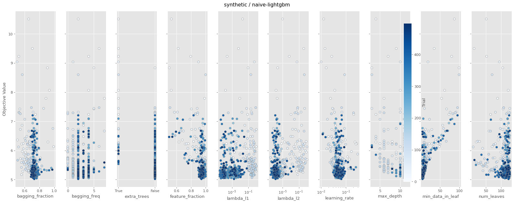

### naive-ensemble

- best RMSE: **4.8899**, median: 5.1641, p10: 4.9623
- train: median 0.083s/fold, mean 0.079s, p90 0.106s
- finite trials: 500 / 500

#### A. fANOVA importance (top 10)

| param | importance |
|---|---|
| `min_data_in_leaf` | 0.636 |
| `learning_rate` | 0.223 |
| `feature_fraction` | 0.056 |
| `extra_trees` | 0.055 |
| `bagging_fraction` | 0.011 |
| `max_depth` | 0.010 |
| `num_leaves` | 0.005 |
| `n_models` | 0.003 |
| `bagging_freq` | 0.001 |
| `lambda_l1` | 0.001 |

All categorical breakdowns

**`extra_trees`**
| value | n | mean RMSE | std | min |
|---|---|---|---|---|
| False | 469 | 5.3341 | 0.5068 | 4.8899 |
| True | 31 | 6.2883 | 1.0759 | 5.3190 |

#### D. Numeric: quartile mean RMSE (sweet spot)

| param | Q1 | Q2 | Q3 | Q4 | best Q (range) |
|---|---|---|---|---|---|
| `learning_rate` | 5.7226 | 5.2776 | 5.2319 | 5.3411 | **Q3** [0.0924, 0.1048] |
| `num_leaves` | 5.4110 | 5.3260 | 5.2698 | 5.5771 | **Q3** [56.0, 64.0] |
| `max_depth` | 5.7394 | 5.4233 | — | 5.2540 | **Q4** [12.0, ∞) |
| `min_data_in_leaf` | — | 5.1190 | 5.2296 | 6.0135 | **Q2** [5.0, 7.0] |
| `lambda_l1` | 5.3733 | 5.2921 | 5.3005 | 5.6073 | **Q2** [0.0, 0.0] |
| `lambda_l2` | 5.2797 | 5.3094 | 5.3289 | 5.6552 | **Q1** [None, 0.0] |
| `feature_fraction` | 5.8056 | 5.1730 | 5.2661 | 5.3285 | **Q2** [0.9031, 0.9215] |
| `bagging_fraction` | 5.4248 | 5.3133 | 5.3256 | 5.5095 | **Q2** [0.6963, 0.734] |

#### E. Slice plot

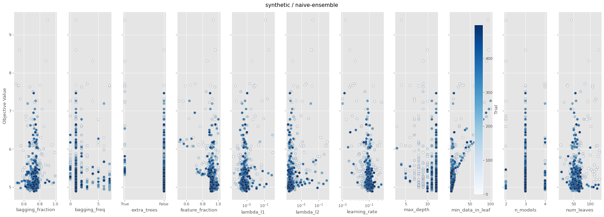

### moe

- best RMSE: **3.6779**, median: 4.4032, p10: 3.9373
- train: median 0.044s/fold, mean 0.048s, p90 0.063s
- finite trials: 500 / 500

#### A. fANOVA importance (top 10)

| param | importance |
|---|---|
| `mixture_gate_type` | 0.631 |
| `mixture_hard_m_step` | 0.125 |
| `mixture_routing_mode` | 0.070 |
| `min_data_in_leaf` | 0.029 |
| `bagging_freq` | 0.028 |
| `learning_rate` | 0.021 |
| `mixture_diversity_lambda` | 0.017 |
| `mixture_e_step_alpha` | 0.017 |
| `mixture_init` | 0.015 |
| `feature_fraction` | 0.011 |

#### B. Categorical: clearly best values (p<0.01)

| param | best | mean RMSE | runner-up | Δ | p |
|---|---|---|---|---|---|
| `mixture_gate_type` | **gbdt** | 4.6223 (n=441) | leaf_reuse | Δ +2.9465 | p=0.00e+00 |
| `mixture_routing_mode` | **token_choice** | 4.9655 (n=433) | expert_choice | Δ +0.9412 | p=0.00e+00 |
| `mixture_e_step_mode` | **em** | 4.8752 (n=368) | gate_only | Δ +0.6080 | p=8.50e-05 |
| `mixture_init` | **tree_hierarchical** | 4.9017 (n=357) | gmm | Δ +0.4436 | p=7.46e-03 |
| `mixture_r_smoothing` | **markov** | 4.8534 (n=370) | none | Δ +0.7409 | p=6.10e-05 |

All categorical breakdowns

**`mixture_gate_type`**
| value | n | mean RMSE | std | min |
|---|---|---|---|---|
| gbdt | 441 | 4.6223 | 0.8963 | 3.6779 |
| leaf_reuse | 34 | 7.5688 | 1.6281 | 5.3077 |
| none | 25 | 10.0018 | 2.2515 | 5.8222 |

**`mixture_routing_mode`**
| value | n | mean RMSE | std | min |
|---|---|---|---|---|
| token_choice | 433 | 4.9655 | 1.7534 | 3.6779 |
| expert_choice | 67 | 5.9067 | 1.2039 | 3.9290 |

**`mixture_e_step_mode`**
| value | n | mean RMSE | std | min |
|---|---|---|---|---|
| em | 368 | 4.8752 | 1.7584 | 3.6779 |
| gate_only | 93 | 5.4832 | 1.1587 | 4.5212 |
| loss_only | 39 | 6.1999 | 1.8782 | 3.9577 |

**`mixture_init`**
| value | n | mean RMSE | std | min |
|---|---|---|---|---|
| tree_hierarchical | 357 | 4.9017 | 1.7658 | 3.6779 |
| gmm | 119 | 5.3453 | 1.4682 | 4.0367 |
| random | 24 | 6.6580 | 1.1297 | 5.7783 |

**`mixture_r_smoothing`**
| value | n | mean RMSE | std | min |
|---|---|---|---|---|
| markov | 370 | 4.8534 | 1.6933 | 3.6779 |
| none | 92 | 5.5943 | 1.4939 | 4.5212 |
| ema | 38 | 6.1939 | 1.7996 | 4.1791 |

**`mixture_hard_m_step`**
| value | n | mean RMSE | std | min |
|---|---|---|---|---|
| True | 386 | 4.9541 | 1.8489 | 3.6779 |
| False | 114 | 5.5573 | 1.0603 | 4.5212 |

**`extra_trees`**
| value | n | mean RMSE | std | min |
|---|---|---|---|---|
| True | 385 | 4.9282 | 1.7967 | 3.6779 |
| False | 115 | 5.6385 | 1.2926 | 4.5212 |

#### D. Numeric: quartile mean RMSE (sweet spot)

| param | Q1 | Q2 | Q3 | Q4 | best Q (range) |
|---|---|---|---|---|---|
| `mixture_num_experts` | — | — | 5.0244 | 5.1662 | **Q3** [2.0, 3.0] |
| `mixture_e_step_alpha` | 4.8303 | 4.8068 | 4.8914 | 5.8380 | **Q2** [0.3196, 0.4888] |
| `mixture_diversity_lambda` | 5.3855 | 4.8673 | 4.8772 | 5.2365 | **Q2** [0.3554, 0.3915] |
| `mixture_warmup_iters` | 5.2614 | 4.9250 | 4.8772 | 5.3305 | **Q3** [34.0, 37.0] |
| `mixture_balance_factor` | 5.6397 | 4.9335 | — | 4.9865 | **Q2** [7.0, 8.0] |
| `learning_rate` | 5.6732 | 4.8333 | 4.8496 | 5.0103 | **Q2** [0.2077, 0.2442] |
| `num_leaves` | 5.2960 | 5.1285 | 4.6774 | 5.2746 | **Q3** [85.0, 102.0] |
| `max_depth` | 5.3064 | 5.0207 | — | 5.0421 | **Q2** [6.0, 8.0] |
| `min_data_in_leaf` | 4.8152 | 4.7362 | 5.1463 | 5.6293 | **Q2** [7.0, 10.0] |

#### E. Slice plot

---

## fred_gdp  (X=[311, 12])

### naive-lightgbm

- best RMSE: **0.9311**, median: 0.9442, p10: 0.9358
- train: median 0.003s/fold, mean 0.003s, p90 0.004s
- finite trials: 500 / 500

#### A. fANOVA importance (top 10)

| param | importance |
|---|---|
| `min_data_in_leaf` | 0.814 |
| `feature_fraction` | 0.055 |
| `learning_rate` | 0.040 |
| `bagging_freq` | 0.032 |
| `bagging_fraction` | 0.025 |
| `num_leaves` | 0.014 |
| `max_depth` | 0.008 |
| `extra_trees` | 0.006 |
| `lambda_l2` | 0.005 |
| `lambda_l1` | 0.000 |

All categorical breakdowns

**`extra_trees`**
| value | n | mean RMSE | std | min |
|---|---|---|---|---|
| False | 459 | 0.9461 | 0.0105 | 0.9311 |
| True | 41 | 0.9545 | 0.0121 | 0.9350 |

#### D. Numeric: quartile mean RMSE (sweet spot)

| param | Q1 | Q2 | Q3 | Q4 | best Q (range) |
|---|---|---|---|---|---|
| `learning_rate` | 0.9481 | 0.9458 | 0.9458 | 0.9473 | **Q2** [0.0826, 0.1848] |
| `num_leaves` | 0.9491 | 0.9452 | 0.9454 | 0.9474 | **Q2** [97.0, 104.0] |
| `max_depth` | 0.9477 | — | 0.9454 | 0.9500 | **Q3** [4.0, 6.0] |
| `min_data_in_leaf` | 0.9513 | 0.9428 | 0.9415 | 0.9528 | **Q3** [21.0, 25.0] |
| `lambda_l1` | 0.9502 | 0.9459 | 0.9436 | 0.9473 | **Q3** [0.0, 0.0003] |
| `lambda_l2` | 0.9510 | 0.9462 | 0.9449 | 0.9448 | **Q4** [1.0751, ∞) |
| `feature_fraction` | 0.9471 | 0.9455 | 0.9458 | 0.9486 | **Q2** [0.8076, 0.8371] |
| `bagging_fraction` | 0.9476 | 0.9439 | 0.9460 | 0.9496 | **Q2** [0.6277, 0.6542] |

#### E. Slice plot

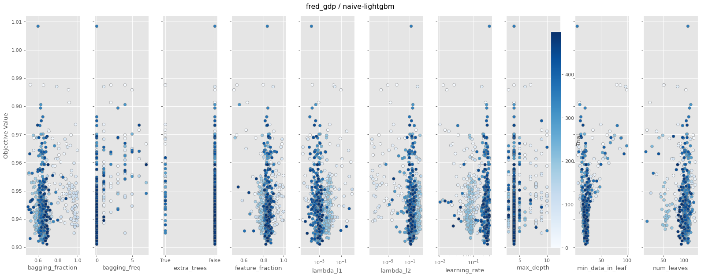

### naive-ensemble

- best RMSE: **0.9094**, median: 0.9369, p10: 0.9263
- train: median 0.017s/fold, mean 0.017s, p90 0.021s
- finite trials: 500 / 500

#### A. fANOVA importance (top 10)

| param | importance |
|---|---|
| `min_data_in_leaf` | 0.948 |
| `bagging_fraction` | 0.021 |
| `learning_rate` | 0.012 |
| `num_leaves` | 0.008 |
| `max_depth` | 0.003 |
| `feature_fraction` | 0.003 |
| `extra_trees` | 0.002 |
| `n_models` | 0.002 |
| `bagging_freq` | 0.001 |
| `lambda_l1` | 0.000 |

All categorical breakdowns

**`extra_trees`**
| value | n | mean RMSE | std | min |
|---|---|---|---|---|
| True | 444 | 0.9377 | 0.0123 | 0.9094 |
| False | 56 | 0.9498 | 0.0102 | 0.9361 |

#### D. Numeric: quartile mean RMSE (sweet spot)

| param | Q1 | Q2 | Q3 | Q4 | best Q (range) |
|---|---|---|---|---|---|
| `learning_rate` | 0.9462 | 0.9372 | 0.9374 | 0.9354 | **Q4** [0.2802, ∞) |
| `num_leaves` | 0.9390 | 0.9368 | 0.9379 | 0.9425 | **Q2** [57.0, 65.0] |
| `max_depth` | 0.9428 | 0.9368 | — | 0.9392 | **Q2** [9.0, 10.0] |
| `min_data_in_leaf` | 0.9319 | 0.9359 | 0.9369 | 0.9503 | **Q1** [None, 6.0] |
| `lambda_l1` | 0.9401 | 0.9383 | 0.9380 | 0.9398 | **Q3** [0.0041, 0.0353] |
| `lambda_l2` | 0.9423 | 0.9381 | 0.9371 | 0.9387 | **Q3** [0.0026, 0.0065] |
| `feature_fraction` | 0.9437 | 0.9374 | 0.9380 | 0.9371 | **Q4** [0.9641, ∞) |
| `bagging_fraction` | 0.9397 | 0.9356 | 0.9368 | 0.9441 | **Q2** [0.5753, 0.601] |

#### E. Slice plot

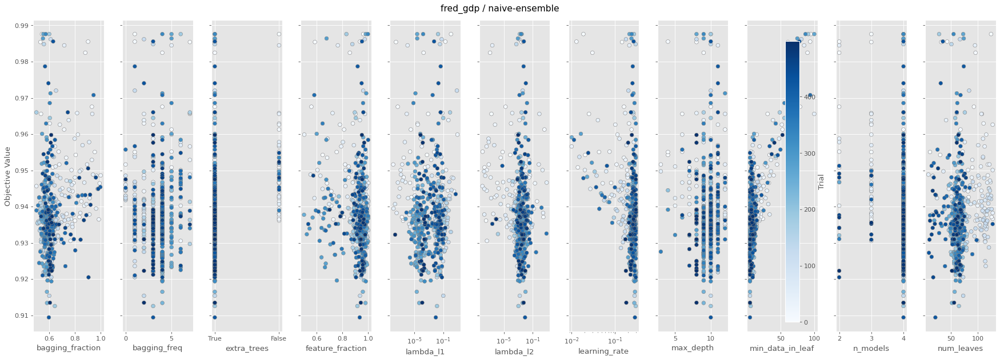

### moe

- best RMSE: **0.9381**, median: 0.9871, p10: 0.9528
- train: median 0.020s/fold, mean 0.021s, p90 0.030s
- finite trials: 500 / 500

#### A. fANOVA importance (top 10)

| param | importance |
|---|---|
| `min_data_in_leaf` | 0.947 |
| `lambda_l1` | 0.024 |
| `feature_fraction` | 0.011 |
| `mixture_init` | 0.005 |
| `lambda_l2` | 0.003 |
| `mixture_diversity_lambda` | 0.002 |
| `bagging_fraction` | 0.002 |
| `mixture_balance_factor` | 0.001 |
| `mixture_warmup_iters` | 0.001 |
| `learning_rate` | 0.001 |

All categorical breakdowns

**`mixture_gate_type`**
| value | n | mean RMSE | std | min |
|---|---|---|---|---|
| leaf_reuse | 411 | 0.9970 | 0.0439 | 0.9381 |
| gbdt | 57 | 1.0053 | 0.0518 | 0.9507 |
| none | 32 | 1.0146 | 0.0677 | 0.9505 |

**`mixture_routing_mode`**
| value | n | mean RMSE | std | min |
|---|---|---|---|---|
| expert_choice | 451 | 0.9976 | 0.0450 | 0.9381 |
| token_choice | 49 | 1.0126 | 0.0605 | 0.9452 |

**`mixture_e_step_mode`**
| value | n | mean RMSE | std | min |
|---|---|---|---|---|
| gate_only | 224 | 0.9965 | 0.0432 | 0.9431 |
| loss_only | 251 | 0.9988 | 0.0476 | 0.9381 |
| em | 25 | 1.0253 | 0.0625 | 0.9588 |

**`mixture_init`**
| value | n | mean RMSE | std | min |
|---|---|---|---|---|
| random | 395 | 0.9950 | 0.0450 | 0.9381 |
| gmm | 26 | 1.0143 | 0.0554 | 0.9541 |
| tree_hierarchical | 79 | 1.0146 | 0.0496 | 0.9386 |

**`mixture_r_smoothing`**
| value | n | mean RMSE | std | min |
|---|---|---|---|---|
| ema | 407 | 0.9965 | 0.0439 | 0.9386 |
| none | 56 | 1.0058 | 0.0523 | 0.9381 |
| markov | 37 | 1.0175 | 0.0632 | 0.9420 |

**`mixture_hard_m_step`**
| value | n | mean RMSE | std | min |
|---|---|---|---|---|
| False | 469 | 0.9967 | 0.0437 | 0.9381 |
| True | 31 | 1.0360 | 0.0723 | 0.9577 |

**`extra_trees`**
| value | n | mean RMSE | std | min |
|---|---|---|---|---|
| True | 166 | 0.9964 | 0.0515 | 0.9454 |
| False | 334 | 1.0004 | 0.0445 | 0.9381 |

#### D. Numeric: quartile mean RMSE (sweet spot)

| param | Q1 | Q2 | Q3 | Q4 | best Q (range) |
|---|---|---|---|---|---|
| `mixture_num_experts` | 1.0237 | — | — | 0.9971 | **Q4** [4.0, ∞) |
| `mixture_e_step_alpha` | 1.0065 | 0.9965 | 0.9938 | 0.9996 | **Q3** [2.3734, 2.5232] |
| `mixture_diversity_lambda` | 0.9926 | 0.9969 | 1.0003 | 1.0066 | **Q1** [None, 0.0418] |
| `mixture_warmup_iters` | 0.9991 | 0.9914 | 1.0015 | 1.0031 | **Q2** [13.0, 16.0] |
| `mixture_balance_factor` | 0.9958 | — | 0.9968 | 1.0054 | **Q1** [None, 5.0] |
| `learning_rate` | 1.0053 | 0.9995 | 0.9982 | 0.9934 | **Q4** [0.1149, ∞) |
| `num_leaves` | 0.9970 | 0.9974 | 0.9969 | 1.0049 | **Q3** [20.0, 37.0] |
| `max_depth` | 1.0015 | 0.9943 | — | 1.0002 | **Q2** [9.0, 10.0] |
| `min_data_in_leaf` | 0.9779 | 0.9716 | 0.9938 | 1.0468 | **Q2** [25.0, 28.0] |

#### E. Slice plot

---

## sp500_basic  (X=[3761, 13])

### naive-lightgbm

- best RMSE: **0.0100**, median: 0.0100, p10: 0.0100
- train: median 0.012s/fold, mean 0.012s, p90 0.016s
- finite trials: 500 / 500

#### A. fANOVA importance (top 10)

| param | importance |
|---|---|
| `learning_rate` | 0.733 |
| `num_leaves` | 0.083 |
| `bagging_fraction` | 0.071 |
| `bagging_freq` | 0.032 |
| `feature_fraction` | 0.020 |
| `min_data_in_leaf` | 0.019 |
| `max_depth` | 0.016 |
| `lambda_l1` | 0.014 |
| `extra_trees` | 0.011 |
| `lambda_l2` | 0.001 |

All categorical breakdowns

**`extra_trees`**
| value | n | mean RMSE | std | min |
|---|---|---|---|---|
| True | 459 | 0.0100 | 0.0000 | 0.0100 |
| False | 41 | 0.0101 | 0.0000 | 0.0100 |

#### D. Numeric: quartile mean RMSE (sweet spot)

| param | Q1 | Q2 | Q3 | Q4 | best Q (range) |
|---|---|---|---|---|---|
| `learning_rate` | 0.0100 | 0.0100 | 0.0100 | 0.0101 | **Q1** [None, 0.0254] |
| `num_leaves` | 0.0101 | 0.0101 | 0.0100 | 0.0100 | **Q3** [109.0, 119.0] |
| `max_depth` | 0.0101 | 0.0101 | 0.0101 | 0.0100 | **Q4** [12.0, ∞) |
| `min_data_in_leaf` | 0.0101 | 0.0100 | 0.0100 | 0.0101 | **Q2** [15.0, 23.0] |
| `lambda_l1` | 0.0101 | 0.0100 | 0.0100 | 0.0101 | **Q2** [0.0, 0.0] |
| `lambda_l2` | 0.0100 | 0.0100 | 0.0101 | 0.0101 | **Q1** [None, 0.0] |
| `feature_fraction` | 0.0100 | 0.0100 | 0.0100 | 0.0101 | **Q1** [None, 0.5158] |
| `bagging_fraction` | 0.0101 | 0.0100 | 0.0100 | 0.0101 | **Q2** [0.5631, 0.5812] |

#### E. Slice plot

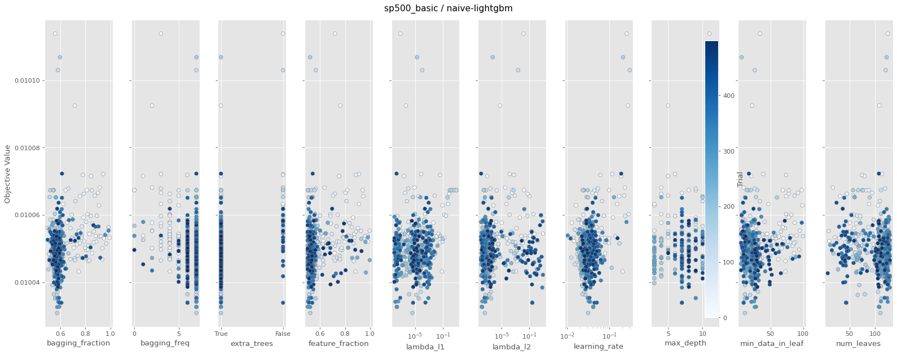

### naive-ensemble

- best RMSE: **0.0100**, median: 0.0100, p10: 0.0100
- train: median 0.029s/fold, mean 0.028s, p90 0.035s
- finite trials: 500 / 500

#### A. fANOVA importance (top 10)

| param | importance |
|---|---|
| `extra_trees` | 0.343 |
| `min_data_in_leaf` | 0.151 |
| `learning_rate` | 0.130 |
| `num_leaves` | 0.130 |
| `lambda_l1` | 0.074 |
| `bagging_fraction` | 0.061 |
| `feature_fraction` | 0.049 |
| `bagging_freq` | 0.035 |
| `max_depth` | 0.017 |
| `n_models` | 0.006 |

All categorical breakdowns

**`extra_trees`**
| value | n | mean RMSE | std | min |
|---|---|---|---|---|
| True | 468 | 0.0100 | 0.0000 | 0.0100 |
| False | 32 | 0.0101 | 0.0000 | 0.0100 |

#### D. Numeric: quartile mean RMSE (sweet spot)

| param | Q1 | Q2 | Q3 | Q4 | best Q (range) |
|---|---|---|---|---|---|
| `learning_rate` | 0.0100 | 0.0100 | 0.0100 | 0.0100 | **Q1** [None, 0.2038] |
| `num_leaves` | 0.0100 | 0.0100 | 0.0100 | 0.0100 | **Q1** [None, 31.0] |
| `max_depth` | 0.0100 | 0.0100 | 0.0100 | 0.0100 | **Q1** [None, 8.0] |
| `min_data_in_leaf` | 0.0100 | 0.0100 | 0.0100 | 0.0100 | **Q1** [None, 64.0] |
| `lambda_l1` | 0.0100 | 0.0100 | 0.0100 | 0.0100 | **Q1** [None, 0.0002] |
| `lambda_l2` | 0.0100 | 0.0100 | 0.0100 | 0.0100 | **Q1** [None, 0.0004] |
| `feature_fraction` | 0.0100 | 0.0100 | 0.0100 | 0.0100 | **Q1** [None, 0.8729] |
| `bagging_fraction` | 0.0100 | 0.0100 | 0.0100 | 0.0100 | **Q1** [None, 0.5168] |

#### E. Slice plot

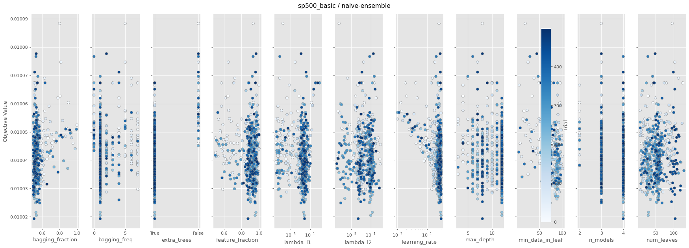

### moe

- best RMSE: **0.0100**, median: 0.0100, p10: 0.0100
- train: median 0.081s/fold, mean 0.082s, p90 0.116s
- finite trials: 500 / 500

#### A. fANOVA importance (top 10)

| param | importance |
|---|---|
| `mixture_init` | 0.322 |
| `min_data_in_leaf` | 0.275 |
| `mixture_gate_type` | 0.102 |
| `num_leaves` | 0.075 |
| `mixture_warmup_iters` | 0.038 |
| `mixture_hard_m_step` | 0.037 |
| `mixture_diversity_lambda` | 0.028 |
| `feature_fraction` | 0.024 |
| `bagging_fraction` | 0.015 |
| `mixture_r_smoothing` | 0.013 |

#### B. Categorical: clearly best values (p<0.01)

| param | best | mean RMSE | runner-up | Δ | p |
|---|---|---|---|---|---|
| `mixture_gate_type` | **gbdt** | 0.0100 (n=433) | leaf_reuse | Δ +0.0001 | p=0.00e+00 |
| `mixture_routing_mode` | **expert_choice** | 0.0100 (n=453) | token_choice | Δ +0.0001 | p=2.00e-06 |
| `mixture_e_step_mode` | **em** | 0.0100 (n=389) | loss_only | Δ +0.0001 | p=1.00e-06 |
| `mixture_init` | **gmm** | 0.0100 (n=433) | random | Δ +0.0001 | p=0.00e+00 |

All categorical breakdowns

**`mixture_gate_type`**
| value | n | mean RMSE | std | min |
|---|---|---|---|---|
| gbdt | 433 | 0.0100 | 0.0000 | 0.0100 |
| leaf_reuse | 41 | 0.0101 | 0.0000 | 0.0100 |
| none | 26 | 0.0101 | 0.0000 | 0.0101 |

**`mixture_routing_mode`**
| value | n | mean RMSE | std | min |
|---|---|---|---|---|
| expert_choice | 453 | 0.0100 | 0.0000 | 0.0100 |
| token_choice | 47 | 0.0101 | 0.0000 | 0.0100 |

**`mixture_e_step_mode`**
| value | n | mean RMSE | std | min |
|---|---|---|---|---|
| em | 389 | 0.0100 | 0.0000 | 0.0100 |
| loss_only | 42 | 0.0101 | 0.0000 | 0.0100 |
| gate_only | 69 | 0.0101 | 0.0000 | 0.0100 |

**`mixture_init`**
| value | n | mean RMSE | std | min |
|---|---|---|---|---|
| gmm | 433 | 0.0100 | 0.0000 | 0.0100 |
| random | 42 | 0.0101 | 0.0000 | 0.0100 |
| tree_hierarchical | 25 | 0.0101 | 0.0000 | 0.0101 |

**`mixture_r_smoothing`**
| value | n | mean RMSE | std | min |
|---|---|---|---|---|
| ema | 284 | 0.0100 | 0.0000 | 0.0100 |
| none | 191 | 0.0100 | 0.0000 | 0.0100 |
| markov | 25 | 0.0101 | 0.0000 | 0.0100 |

**`mixture_hard_m_step`**
| value | n | mean RMSE | std | min |
|---|---|---|---|---|
| False | 452 | 0.0100 | 0.0000 | 0.0100 |
| True | 48 | 0.0101 | 0.0000 | 0.0100 |

**`extra_trees`**
| value | n | mean RMSE | std | min |
|---|---|---|---|---|
| False | 452 | 0.0100 | 0.0000 | 0.0100 |
| True | 48 | 0.0101 | 0.0000 | 0.0100 |

#### D. Numeric: quartile mean RMSE (sweet spot)

| param | Q1 | Q2 | Q3 | Q4 | best Q (range) |
|---|---|---|---|---|---|
| `mixture_num_experts` | 0.0101 | — | — | 0.0100 | **Q4** [4.0, ∞) |
| `mixture_e_step_alpha` | 0.0100 | 0.0100 | 0.0100 | 0.0100 | **Q1** [None, 1.2213] |
| `mixture_diversity_lambda` | 0.0100 | 0.0100 | 0.0100 | 0.0101 | **Q1** [None, 0.1068] |
| `mixture_warmup_iters` | 0.0100 | 0.0100 | 0.0100 | 0.0101 | **Q1** [None, 26.0] |
| `mixture_balance_factor` | 0.0101 | 0.0100 | — | 0.0100 | **Q2** [9.0, 10.0] |
| `learning_rate` | 0.0100 | 0.0100 | 0.0100 | 0.0101 | **Q1** [None, 0.0208] |
| `num_leaves` | 0.0100 | 0.0100 | 0.0100 | 0.0101 | **Q1** [None, 11.0] |
| `max_depth` | 0.0101 | — | 0.0100 | 0.0100 | **Q3** [5.0, 6.0] |
| `min_data_in_leaf` | 0.0100 | 0.0100 | 0.0100 | 0.0101 | **Q1** [None, 21.0] |

#### E. Slice plot

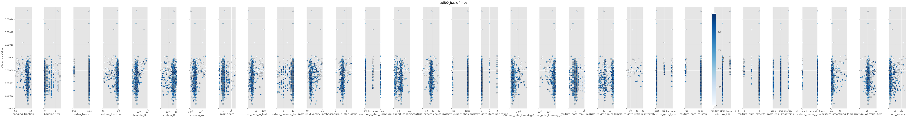

---

## sp500  (X=[3711, 28])

### naive-lightgbm

- best RMSE: **0.0100**, median: 0.0101, p10: 0.0100
- train: median 0.009s/fold, mean 0.009s, p90 0.011s
- finite trials: 500 / 500

#### A. fANOVA importance (top 10)

| param | importance |
|---|---|
| `learning_rate` | 0.409 |
| `min_data_in_leaf` | 0.190 |
| `max_depth` | 0.134 |
| `bagging_fraction` | 0.065 |
| `lambda_l1` | 0.062 |
| `feature_fraction` | 0.059 |
| `num_leaves` | 0.038 |
| `bagging_freq` | 0.036 |
| `extra_trees` | 0.007 |
| `lambda_l2` | 0.000 |

All categorical breakdowns

**`extra_trees`**
| value | n | mean RMSE | std | min |
|---|---|---|---|---|
| True | 147 | 0.0101 | 0.0000 | 0.0100 |
| False | 353 | 0.0101 | 0.0000 | 0.0100 |

#### D. Numeric: quartile mean RMSE (sweet spot)

| param | Q1 | Q2 | Q3 | Q4 | best Q (range) |
|---|---|---|---|---|---|
| `learning_rate` | 0.0101 | 0.0101 | 0.0101 | 0.0101 | **Q1** [None, 0.0936] |
| `num_leaves` | 0.0101 | 0.0101 | 0.0101 | 0.0101 | **Q1** [None, 15.0] |
| `max_depth` | — | — | — | 0.0101 | **Q4** [3.0, ∞) |
| `min_data_in_leaf` | 0.0101 | 0.0101 | 0.0101 | 0.0101 | **Q1** [None, 9.0] |
| `lambda_l1` | 0.0101 | 0.0101 | 0.0101 | 0.0101 | **Q1** [None, 0.0002] |
| `lambda_l2` | 0.0101 | 0.0101 | 0.0101 | 0.0101 | **Q1** [None, 0.0] |
| `feature_fraction` | 0.0101 | 0.0101 | 0.0101 | 0.0101 | **Q1** [None, 0.5997] |
| `bagging_fraction` | 0.0101 | 0.0101 | 0.0101 | 0.0101 | **Q1** [None, 0.563] |

#### E. Slice plot

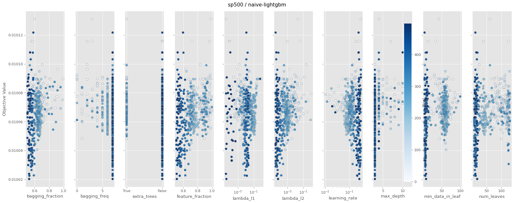

### naive-ensemble

- best RMSE: **0.0100**, median: 0.0100, p10: 0.0100
- train: median 0.037s/fold, mean 0.033s, p90 0.045s
- finite trials: 500 / 500

#### A. fANOVA importance (top 10)

| param | importance |
|---|---|
| `lambda_l1` | 0.521 |
| `num_leaves` | 0.179 |
| `min_data_in_leaf` | 0.133 |
| `learning_rate` | 0.051 |
| `feature_fraction` | 0.045 |
| `bagging_fraction` | 0.034 |
| `n_models` | 0.019 |
| `max_depth` | 0.010 |
| `bagging_freq` | 0.006 |
| `extra_trees` | 0.001 |

All categorical breakdowns

**`extra_trees`**
| value | n | mean RMSE | std | min |
|---|---|---|---|---|
| False | 466 | 0.0100 | 0.0000 | 0.0100 |
| True | 34 | 0.0101 | 0.0000 | 0.0101 |

#### D. Numeric: quartile mean RMSE (sweet spot)

| param | Q1 | Q2 | Q3 | Q4 | best Q (range) |
|---|---|---|---|---|---|
| `learning_rate` | 0.0101 | 0.0101 | 0.0100 | 0.0100 | **Q3** [0.0718, 0.0943] |
| `num_leaves` | 0.0101 | 0.0101 | 0.0100 | 0.0100 | **Q3** [110.5, 120.0] |
| `max_depth` | — | — | 0.0100 | 0.0101 | **Q3** [3.0, 4.0] |
| `min_data_in_leaf` | 0.0101 | 0.0100 | 0.0100 | 0.0101 | **Q2** [13.0, 16.0] |
| `lambda_l1` | 0.0101 | 0.0100 | 0.0100 | 0.0101 | **Q2** [0.0003, 0.0007] |
| `lambda_l2` | 0.0101 | 0.0100 | 0.0100 | 0.0101 | **Q2** [0.0004, 0.0018] |
| `feature_fraction` | 0.0101 | 0.0100 | 0.0101 | 0.0101 | **Q2** [0.7309, 0.7533] |
| `bagging_fraction` | 0.0101 | 0.0101 | 0.0100 | 0.0100 | **Q3** [0.9031, 0.9234] |

#### E. Slice plot

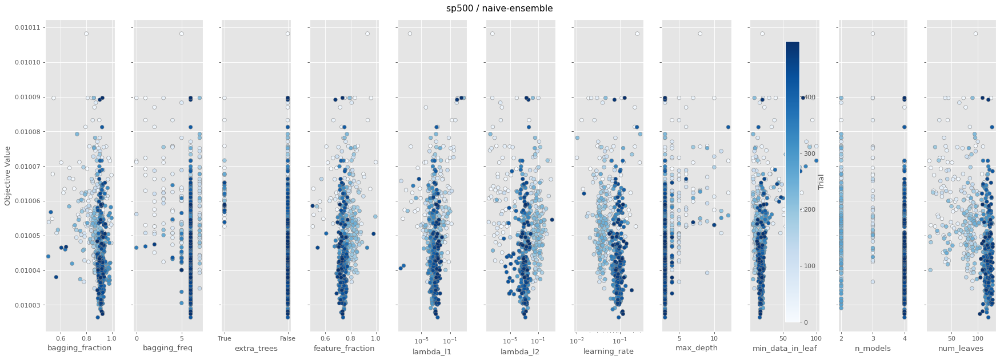

### moe

- best RMSE: **0.0100**, median: 0.0101, p10: 0.0101
- train: median 0.055s/fold, mean 0.062s, p90 0.092s
- finite trials: 500 / 500

#### A. fANOVA importance (top 10)

| param | importance |
|---|---|
| `mixture_r_smoothing` | 0.297 |
| `mixture_diversity_lambda` | 0.160 |
| `learning_rate` | 0.120 |
| `bagging_fraction` | 0.095 |
| `mixture_gate_type` | 0.062 |
| `num_leaves` | 0.060 |
| `min_data_in_leaf` | 0.039 |
| `mixture_e_step_alpha` | 0.024 |
| `feature_fraction` | 0.024 |
| `mixture_init` | 0.021 |

#### B. Categorical: clearly best values (p<0.01)

| param | best | mean RMSE | runner-up | Δ | p |
|---|---|---|---|---|---|
| `mixture_r_smoothing` | **ema** | 0.0101 (n=443) | markov | Δ +0.0000 | p=3.50e-04 |

All categorical breakdowns

**`mixture_gate_type`**
| value | n | mean RMSE | std | min |
|---|---|---|---|---|
| leaf_reuse | 33 | 0.0101 | 0.0000 | 0.0101 |
| none | 26 | 0.0101 | 0.0000 | 0.0101 |
| gbdt | 441 | 0.0101 | 0.0000 | 0.0100 |

**`mixture_routing_mode`**
| value | n | mean RMSE | std | min |
|---|---|---|---|---|
| token_choice | 190 | 0.0101 | 0.0000 | 0.0100 |
| expert_choice | 310 | 0.0101 | 0.0000 | 0.0100 |

**`mixture_e_step_mode`**
| value | n | mean RMSE | std | min |
|---|---|---|---|---|
| loss_only | 107 | 0.0101 | 0.0000 | 0.0100 |
| gate_only | 205 | 0.0101 | 0.0000 | 0.0100 |
| em | 188 | 0.0101 | 0.0000 | 0.0100 |

**`mixture_init`**
| value | n | mean RMSE | std | min |
|---|---|---|---|---|
| random | 32 | 0.0101 | 0.0000 | 0.0101 |
| gmm | 62 | 0.0101 | 0.0000 | 0.0100 |
| tree_hierarchical | 406 | 0.0101 | 0.0000 | 0.0100 |

**`mixture_r_smoothing`**
| value | n | mean RMSE | std | min |
|---|---|---|---|---|
| ema | 443 | 0.0101 | 0.0000 | 0.0100 |
| markov | 31 | 0.0101 | 0.0000 | 0.0101 |
| none | 26 | 0.0101 | 0.0000 | 0.0101 |

**`mixture_hard_m_step`**
| value | n | mean RMSE | std | min |
|---|---|---|---|---|
| True | 106 | 0.0101 | 0.0000 | 0.0100 |
| False | 394 | 0.0101 | 0.0000 | 0.0100 |

**`extra_trees`**
| value | n | mean RMSE | std | min |
|---|---|---|---|---|
| True | 47 | 0.0101 | 0.0000 | 0.0101 |
| False | 453 | 0.0101 | 0.0000 | 0.0100 |

#### D. Numeric: quartile mean RMSE (sweet spot)

| param | Q1 | Q2 | Q3 | Q4 | best Q (range) |
|---|---|---|---|---|---|
| `mixture_num_experts` | 0.0101 | — | — | 0.0101 | **Q1** [None, 4.0] |
| `mixture_e_step_alpha` | 0.0101 | 0.0101 | 0.0101 | 0.0101 | **Q1** [None, 0.4107] |
| `mixture_diversity_lambda` | 0.0101 | 0.0101 | 0.0101 | 0.0101 | **Q1** [None, 0.3178] |
| `mixture_warmup_iters` | 0.0101 | 0.0101 | 0.0101 | 0.0101 | **Q1** [None, 22.0] |
| `mixture_balance_factor` | 0.0101 | 0.0101 | — | 0.0101 | **Q1** [None, 4.0] |
| `learning_rate` | 0.0101 | 0.0101 | 0.0101 | 0.0101 | **Q1** [None, 0.034] |
| `num_leaves` | 0.0101 | 0.0101 | 0.0101 | 0.0101 | **Q1** [None, 78.75] |
| `max_depth` | — | — | 0.0101 | 0.0101 | **Q3** [3.0, 5.0] |
| `min_data_in_leaf` | 0.0101 | 0.0101 | 0.0101 | 0.0101 | **Q1** [None, 43.0] |

#### E. Slice plot

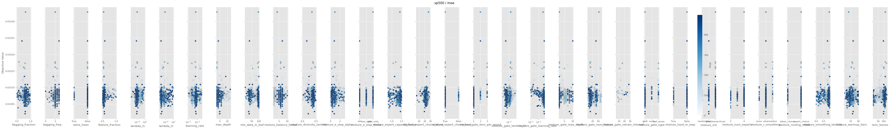

---

## vix  (X=[3762, 13])

### naive-lightgbm

- best RMSE: **2.8869**, median: 2.9655, p10: 2.9263
- train: median 0.010s/fold, mean 0.011s, p90 0.015s
- finite trials: 500 / 500

#### A. fANOVA importance (top 10)

| param | importance |
|---|---|
| `learning_rate` | 0.597 |
| `min_data_in_leaf` | 0.350 |
| `extra_trees` | 0.032 |
| `feature_fraction` | 0.009 |
| `max_depth` | 0.003 |
| `bagging_freq` | 0.003 |
| `bagging_fraction` | 0.003 |
| `num_leaves` | 0.002 |
| `lambda_l1` | 0.000 |
| `lambda_l2` | 0.000 |

All categorical breakdowns

**`extra_trees`**
| value | n | mean RMSE | std | min |
|---|---|---|---|---|
| False | 468 | 2.9884 | 0.1092 | 2.8869 |
| True | 32 | 3.1930 | 0.3074 | 2.9660 |

#### D. Numeric: quartile mean RMSE (sweet spot)

| param | Q1 | Q2 | Q3 | Q4 | best Q (range) |
|---|---|---|---|---|---|
| `learning_rate` | 3.0692 | 2.9704 | 2.9752 | 2.9913 | **Q2** [0.1292, 0.1461] |
| `num_leaves` | 2.9741 | 2.9871 | 2.9879 | 3.0527 | **Q1** [None, 11.0] |
| `max_depth` | — | 3.0067 | 3.0050 | 2.9955 | **Q4** [9.0, ∞) |
| `min_data_in_leaf` | 2.9814 | 2.9655 | 2.9727 | 3.0839 | **Q2** [12.0, 15.0] |
| `lambda_l1` | 2.9945 | 2.9703 | 3.0040 | 3.0373 | **Q2** [0.0, 0.0] |
| `lambda_l2` | 3.0068 | 2.9897 | 2.9782 | 3.0314 | **Q3** [0.0, 0.0005] |
| `feature_fraction` | 3.0412 | 2.9705 | 2.9844 | 3.0099 | **Q2** [0.9007, 0.933] |
| `bagging_fraction` | 2.9892 | 2.9928 | 2.9853 | 3.0387 | **Q3** [0.5387, 0.6003] |

#### E. Slice plot

### naive-ensemble

- best RMSE: **2.8724**, median: 2.9391, p10: 2.9061
- train: median 0.035s/fold, mean 0.037s, p90 0.062s
- finite trials: 500 / 500

#### A. fANOVA importance (top 10)

| param | importance |
|---|---|
| `learning_rate` | 0.791 |
| `min_data_in_leaf` | 0.178 |
| `bagging_fraction` | 0.018 |
| `feature_fraction` | 0.006 |
| `bagging_freq` | 0.002 |
| `max_depth` | 0.002 |
| `num_leaves` | 0.001 |
| `n_models` | 0.001 |
| `extra_trees` | 0.000 |
| `lambda_l1` | 0.000 |

All categorical breakdowns

**`extra_trees`**
| value | n | mean RMSE | std | min |
|---|---|---|---|---|
| True | 454 | 2.9766 | 0.1644 | 2.8724 |
| False | 46 | 3.0557 | 0.1306 | 2.9501 |

#### D. Numeric: quartile mean RMSE (sweet spot)

| param | Q1 | Q2 | Q3 | Q4 | best Q (range) |
|---|---|---|---|---|---|
| `learning_rate` | 3.1064 | 2.9490 | 2.9453 | 2.9349 | **Q4** [0.2793, ∞) |
| `num_leaves` | 2.9514 | 2.9998 | 3.0130 | 2.9721 | **Q1** [None, 22.0] |
| `max_depth` | — | — | 2.9573 | 3.0460 | **Q3** [3.0, 4.0] |
| `min_data_in_leaf` | 2.9708 | 2.9428 | 2.9613 | 3.0615 | **Q2** [7.0, 10.0] |
| `lambda_l1` | 2.9779 | 2.9986 | 2.9906 | 2.9684 | **Q4** [0.0166, ∞) |
| `lambda_l2` | 2.9771 | 2.9766 | 2.9722 | 3.0095 | **Q3** [0.0009, 0.0256] |
| `feature_fraction` | 2.9858 | 2.9426 | 2.9590 | 3.0481 | **Q2** [0.7979, 0.8222] |
| `bagging_fraction` | 2.9935 | 3.0019 | 2.9695 | 2.9705 | **Q3** [0.9154, 0.9476] |

#### E. Slice plot

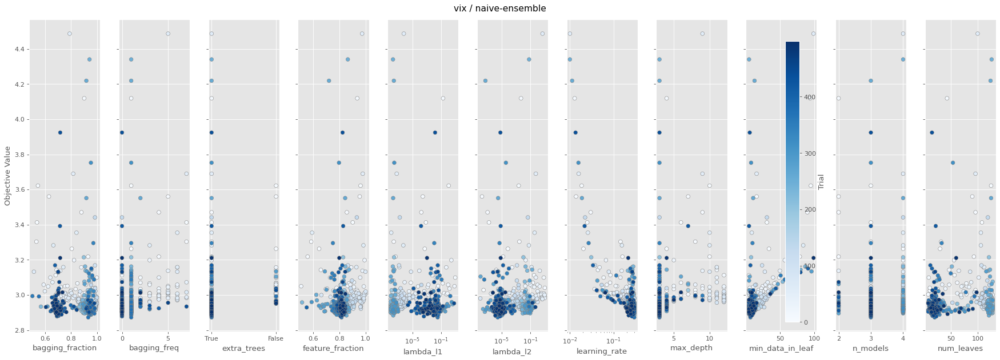

### moe

- best RMSE: **2.6745**, median: 2.7824, p10: 2.7223
- train: median 0.062s/fold, mean 0.064s, p90 0.095s
- finite trials: 500 / 500

#### A. fANOVA importance (top 10)

| param | importance |
|---|---|
| `mixture_init` | 0.398 |
| `mixture_gate_type` | 0.111 |
| `learning_rate` | 0.095 |
| `num_leaves` | 0.066 |
| `lambda_l2` | 0.066 |
| `min_data_in_leaf` | 0.053 |
| `mixture_warmup_iters` | 0.052 |
| `mixture_e_step_alpha` | 0.050 |
| `feature_fraction` | 0.025 |
| `bagging_freq` | 0.023 |

All categorical breakdowns

**`mixture_gate_type`**
| value | n | mean RMSE | std | min |
|---|---|---|---|---|
| gbdt | 248 | 2.8806 | 0.5521 | 2.7021 |
| leaf_reuse | 208 | 2.9375 | 0.6918 | 2.6745 |
| none | 44 | 3.4948 | 1.9864 | 2.7272 |

**`mixture_routing_mode`**
| value | n | mean RMSE | std | min |
|---|---|---|---|---|
| expert_choice | 412 | 2.9169 | 0.6911 | 2.6745 |
| token_choice | 88 | 3.1525 | 1.3576 | 2.7038 |

**`mixture_e_step_mode`**
| value | n | mean RMSE | std | min |
|---|---|---|---|---|
| loss_only | 101 | 2.8930 | 0.4287 | 2.6930 |
| em | 331 | 2.9558 | 0.9168 | 2.6745 |
| gate_only | 68 | 3.0678 | 0.9776 | 2.7272 |

**`mixture_init`**
| value | n | mean RMSE | std | min |
|---|---|---|---|---|
| random | 442 | 2.8427 | 0.5079 | 2.6745 |
| tree_hierarchical | 33 | 3.5556 | 1.8067 | 2.8240 |
| gmm | 25 | 4.2144 | 1.8347 | 2.7891 |

**`mixture_r_smoothing`**
| value | n | mean RMSE | std | min |
|---|---|---|---|---|
| none | 397 | 2.8975 | 0.6437 | 2.6745 |
| ema | 75 | 2.9738 | 0.5319 | 2.7485 |
| markov | 28 | 3.7787 | 2.3679 | 2.7299 |

**`mixture_hard_m_step`**
| value | n | mean RMSE | std | min |
|---|---|---|---|---|
| False | 314 | 2.9042 | 0.6403 | 2.7021 |
| True | 186 | 3.0498 | 1.1164 | 2.6745 |

**`extra_trees`**
| value | n | mean RMSE | std | min |
|---|---|---|---|---|
| False | 469 | 2.9065 | 0.6820 | 2.6745 |
| True | 31 | 3.7418 | 2.0045 | 2.8930 |

#### D. Numeric: quartile mean RMSE (sweet spot)

| param | Q1 | Q2 | Q3 | Q4 | best Q (range) |
|---|---|---|---|---|---|
| `mixture_num_experts` | — | — | — | 2.9583 | **Q4** [2.0, ∞) |
| `mixture_e_step_alpha` | 2.9756 | 2.8739 | 2.8806 | 3.1031 | **Q2** [0.9272, 1.2349] |
| `mixture_diversity_lambda` | 2.9919 | 2.8824 | 2.8951 | 3.0638 | **Q2** [0.2373, 0.297] |
| `mixture_warmup_iters` | 3.2500 | 2.8427 | 2.8343 | 2.9173 | **Q3** [38.0, 40.25] |
| `mixture_balance_factor` | 3.1246 | 2.9509 | 2.8759 | 2.9217 | **Q3** [8.0, 10.0] |
| `learning_rate` | 3.2626 | 2.8391 | 2.8474 | 2.8842 | **Q2** [0.1035, 0.1214] |
| `num_leaves` | 3.1143 | 2.9606 | 2.8595 | 2.9067 | **Q3** [90.0, 113.0] |
| `max_depth` | 2.9056 | 2.9488 | 3.0653 | 2.9447 | **Q1** [None, 4.0] |
| `min_data_in_leaf` | 2.9967 | 2.8475 | 2.8909 | 3.1143 | **Q2** [17.0, 22.5] |

#### E. Slice plot

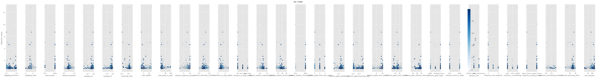

---

## hmm  (X=[2000, 5])

### naive-lightgbm

- best RMSE: **2.1913**, median: 2.2029, p10: 2.1974
- train: median 0.005s/fold, mean 0.006s, p90 0.007s
- finite trials: 500 / 500

#### A. fANOVA importance (top 10)

| param | importance |
|---|---|
| `learning_rate` | 0.489 |
| `extra_trees` | 0.484 |
| `min_data_in_leaf` | 0.011 |
| `bagging_fraction` | 0.005 |
| `feature_fraction` | 0.003 |
| `num_leaves` | 0.003 |
| `bagging_freq` | 0.002 |
| `max_depth` | 0.001 |
| `lambda_l2` | 0.001 |
| `lambda_l1` | 0.000 |

All categorical breakdowns

**`extra_trees`**
| value | n | mean RMSE | std | min |
|---|---|---|---|---|
| True | 470 | 2.2060 | 0.0151 | 2.1913 |
| False | 30 | 2.2409 | 0.0098 | 2.2301 |

#### D. Numeric: quartile mean RMSE (sweet spot)

| param | Q1 | Q2 | Q3 | Q4 | best Q (range) |
|---|---|---|---|---|---|
| `learning_rate` | 2.2193 | 2.2024 | 2.2047 | 2.2061 | **Q2** [0.1696, 0.1962] |
| `num_leaves` | 2.2118 | 2.2077 | 2.2077 | 2.2055 | **Q4** [121.0, ∞) |
| `max_depth` | 2.2088 | — | 2.2055 | 2.2143 | **Q3** [4.0, 5.0] |
| `min_data_in_leaf` | 2.2136 | 2.2053 | 2.2047 | 2.2092 | **Q3** [60.0, 63.0] |
| `lambda_l1` | 2.2083 | 2.2058 | 2.2056 | 2.2127 | **Q3** [0.0, 0.0] |
| `lambda_l2` | 2.2112 | 2.2058 | 2.2078 | 2.2076 | **Q2** [0.0007, 0.0018] |
| `feature_fraction` | 2.2062 | 2.2074 | 2.2048 | 2.2141 | **Q3** [0.5398, 0.5732] |
| `bagging_fraction` | 2.2114 | 2.2045 | 2.2040 | 2.2126 | **Q3** [0.7538, 0.7771] |

#### E. Slice plot

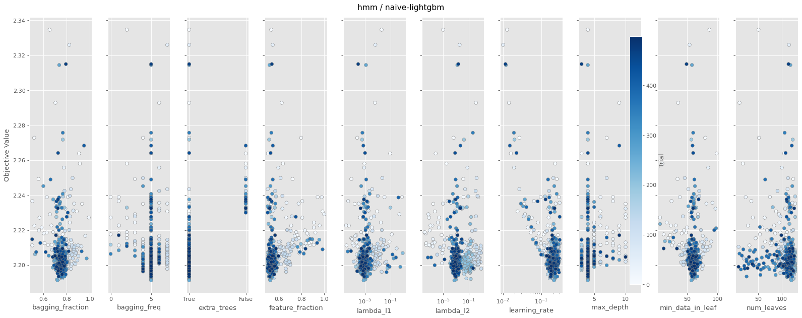

### naive-ensemble

- best RMSE: **2.1818**, median: 2.1948, p10: 2.1886
- train: median 0.023s/fold, mean 0.024s, p90 0.029s
- finite trials: 500 / 500

#### A. fANOVA importance (top 10)

| param | importance |
|---|---|
| `extra_trees` | 0.496 |
| `learning_rate` | 0.317 |
| `min_data_in_leaf` | 0.084 |
| `max_depth` | 0.046 |
| `bagging_fraction` | 0.034 |
| `feature_fraction` | 0.010 |
| `num_leaves` | 0.007 |
| `lambda_l1` | 0.003 |
| `bagging_freq` | 0.001 |
| `n_models` | 0.001 |

All categorical breakdowns

**`extra_trees`**
| value | n | mean RMSE | std | min |
|---|---|---|---|---|
| True | 469 | 2.1977 | 0.0144 | 2.1818 |
| False | 31 | 2.2333 | 0.0185 | 2.2066 |

#### D. Numeric: quartile mean RMSE (sweet spot)

| param | Q1 | Q2 | Q3 | Q4 | best Q (range) |
|---|---|---|---|---|---|
| `learning_rate` | 2.2107 | 2.1967 | 2.1969 | 2.1953 | **Q4** [0.2756, ∞) |
| `num_leaves` | 2.2050 | 2.1997 | 2.1950 | 2.1997 | **Q3** [69.0, 73.0] |
| `max_depth` | — | — | 2.1972 | 2.2060 | **Q3** [3.0, 5.0] |
| `min_data_in_leaf` | 2.1977 | 2.1955 | 2.1993 | 2.2065 | **Q2** [10.0, 14.0] |
| `lambda_l1` | 2.2058 | 2.2007 | 2.1959 | 2.1972 | **Q3** [0.6215, 2.1158] |
| `lambda_l2` | 2.1983 | 2.2041 | 2.1998 | 2.1974 | **Q4** [0.0752, ∞) |
| `feature_fraction` | 2.2031 | 2.1996 | 2.1952 | 2.2016 | **Q3** [0.7111, 0.7334] |
| `bagging_fraction` | 2.1960 | 2.1976 | 2.1978 | 2.2082 | **Q1** [None, 0.5096] |

#### E. Slice plot

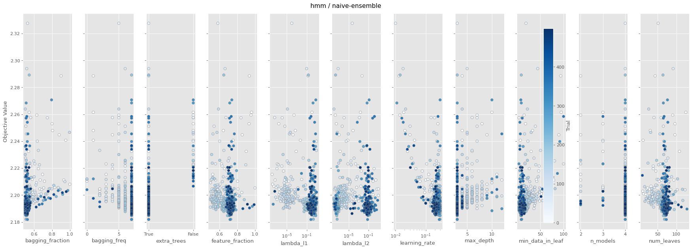

### moe

- best RMSE: **2.1465**, median: 2.2111, p10: 2.1695
- train: median 0.045s/fold, mean 0.045s, p90 0.057s
- finite trials: 500 / 500

#### A. fANOVA importance (top 10)

| param | importance |
|---|---|
| `min_data_in_leaf` | 0.338 |
| `lambda_l1` | 0.130 |
| `mixture_warmup_iters` | 0.112 |
| `mixture_e_step_mode` | 0.087 |
| `mixture_diversity_lambda` | 0.053 |
| `mixture_gate_type` | 0.051 |
| `num_leaves` | 0.040 |
| `learning_rate` | 0.035 |
| `bagging_freq` | 0.035 |
| `mixture_e_step_alpha` | 0.020 |

#### B. Categorical: clearly best values (p<0.01)

| param | best | mean RMSE | runner-up | Δ | p |
|---|---|---|---|---|---|
| `mixture_routing_mode` | **token_choice** | 2.2144 (n=464) | expert_choice | Δ +0.0380 | p=0.00e+00 |
| `mixture_e_step_mode` | **gate_only** | 2.2125 (n=444) | loss_only | Δ +0.0319 | p=8.00e-06 |
| `mixture_init` | **tree_hierarchical** | 2.2139 (n=444) | random | Δ +0.0121 | p=5.17e-03 |

All categorical breakdowns

**`mixture_gate_type`**
| value | n | mean RMSE | std | min |
|---|---|---|---|---|
| leaf_reuse | 162 | 2.2126 | 0.0369 | 2.1614 |
| gbdt | 314 | 2.2157 | 0.0412 | 2.1465 |
| none | 24 | 2.2653 | 0.0559 | 2.1869 |

**`mixture_routing_mode`**
| value | n | mean RMSE | std | min |
|---|---|---|---|---|
| token_choice | 464 | 2.2144 | 0.0417 | 2.1465 |
| expert_choice | 36 | 2.2524 | 0.0308 | 2.2003 |

**`mixture_e_step_mode`**
| value | n | mean RMSE | std | min |
|---|---|---|---|---|
| gate_only | 444 | 2.2125 | 0.0395 | 2.1465 |
| loss_only | 31 | 2.2444 | 0.0319 | 2.1806 |
| em | 25 | 2.2643 | 0.0546 | 2.1952 |

**`mixture_init`**
| value | n | mean RMSE | std | min |
|---|---|---|---|---|
| tree_hierarchical | 444 | 2.2139 | 0.0418 | 2.1465 |
| random | 31 | 2.2260 | 0.0198 | 2.2003 |
| gmm | 25 | 2.2626 | 0.0407 | 2.2143 |

**`mixture_r_smoothing`**
| value | n | mean RMSE | std | min |
|---|---|---|---|---|
| ema | 437 | 2.2147 | 0.0415 | 2.1465 |
| markov | 32 | 2.2296 | 0.0420 | 2.1706 |
| none | 31 | 2.2387 | 0.0429 | 2.1872 |

**`mixture_hard_m_step`**
| value | n | mean RMSE | std | min |
|---|---|---|---|---|
| True | 460 | 2.2164 | 0.0430 | 2.1465 |
| False | 40 | 2.2250 | 0.0287 | 2.1657 |

**`extra_trees`**
| value | n | mean RMSE | std | min |
|---|---|---|---|---|
| False | 460 | 2.2162 | 0.0428 | 2.1465 |
| True | 40 | 2.2275 | 0.0323 | 2.1891 |

#### D. Numeric: quartile mean RMSE (sweet spot)

| param | Q1 | Q2 | Q3 | Q4 | best Q (range) |
|---|---|---|---|---|---|
| `mixture_num_experts` | 2.2630 | — | — | 2.2160 | **Q4** [3.0, ∞) |
| `mixture_e_step_alpha` | 2.2142 | 2.2129 | 2.2113 | 2.2299 | **Q3** [0.2547, 0.5861] |
| `mixture_diversity_lambda` | 2.2218 | 2.2198 | 2.2116 | 2.2152 | **Q3** [0.2856, 0.3138] |
| `mixture_warmup_iters` | 2.2180 | 2.2146 | 2.2120 | 2.2234 | **Q3** [36.0, 38.0] |
| `mixture_balance_factor` | 2.2216 | 2.2182 | 2.2151 | 2.2149 | **Q4** [8.0, ∞) |
| `learning_rate` | 2.2294 | 2.2087 | 2.2164 | 2.2139 | **Q2** [0.0951, 0.1092] |
| `num_leaves` | 2.2142 | 2.2134 | 2.2181 | 2.2224 | **Q2** [75.0, 93.0] |
| `max_depth` | 2.2088 | 2.2277 | 2.2138 | 2.2207 | **Q1** [None, 4.0] |
| `min_data_in_leaf` | 2.2385 | 2.2040 | 2.2149 | 2.2115 | **Q2** [72.0, 75.5] |

#### E. Slice plot

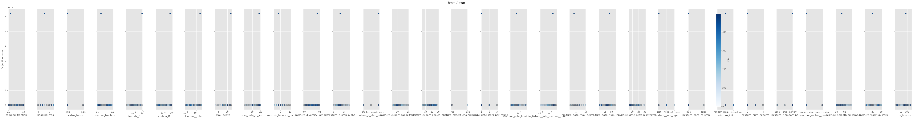

---

## Overall recommendations

**Categorical settings that are statistically significant winners (p<0.01):**

| dataset | param | best value | Δ vs runner-up | p |
|---|---|---|---|---|
| synthetic | `mixture_gate_type` | **gbdt** | +2.9465 | 0.00e+00 |
| synthetic | `mixture_routing_mode` | **token_choice** | +0.9412 | 0.00e+00 |
| synthetic | `mixture_e_step_mode` | **em** | +0.6080 | 8.50e-05 |
| synthetic | `mixture_init` | **tree_hierarchical** | +0.4436 | 7.46e-03 |
| synthetic | `mixture_r_smoothing` | **markov** | +0.7409 | 6.10e-05 |
| sp500_basic | `mixture_gate_type` | **gbdt** | +0.0001 | 0.00e+00 |
| sp500_basic | `mixture_routing_mode` | **expert_choice** | +0.0001 | 2.00e-06 |
| sp500_basic | `mixture_e_step_mode` | **em** | +0.0001 | 1.00e-06 |
| sp500_basic | `mixture_init` | **gmm** | +0.0001 | 0.00e+00 |
| sp500 | `mixture_r_smoothing` | **ema** | +0.0000 | 3.50e-04 |
| hmm | `mixture_routing_mode` | **token_choice** | +0.0380 | 0.00e+00 |
| hmm | `mixture_e_step_mode` | **gate_only** | +0.0319 | 8.00e-06 |
| hmm | `mixture_init` | **tree_hierarchical** | +0.0121 | 5.17e-03 |
